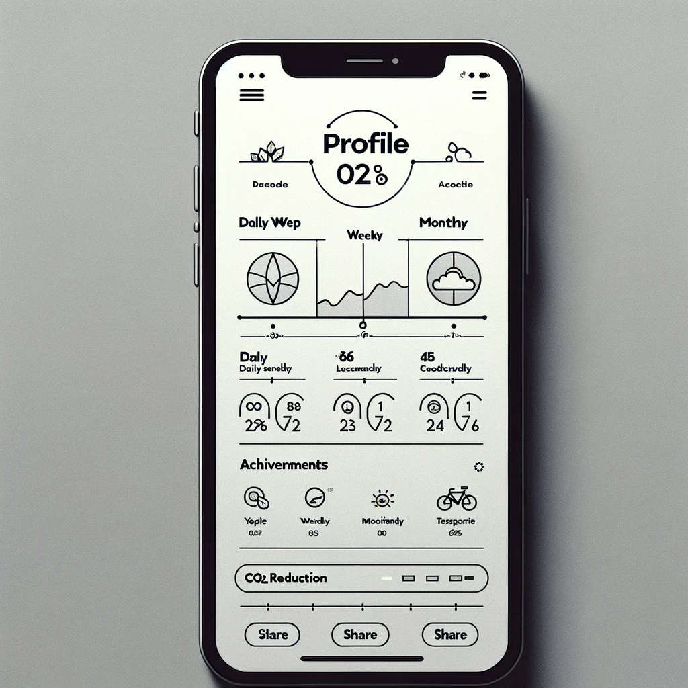
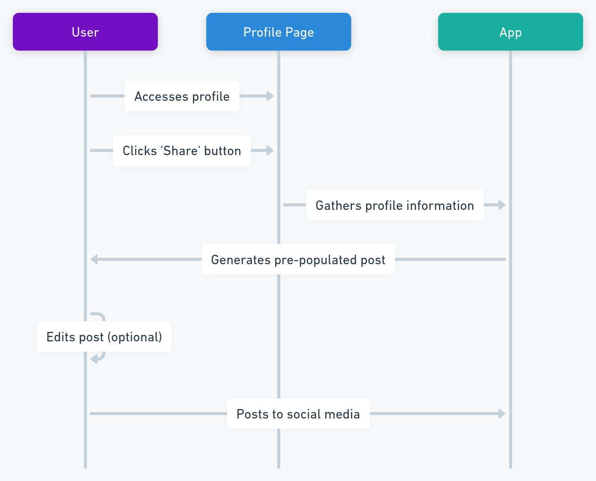
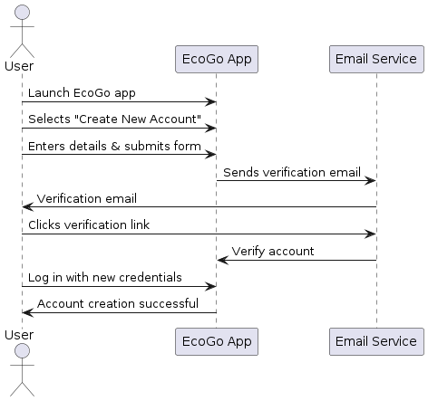
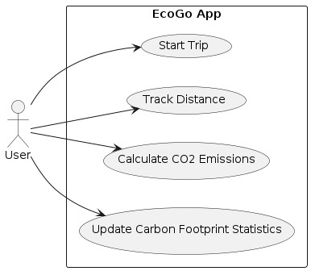
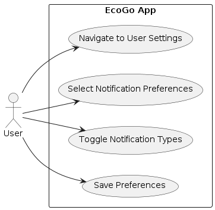
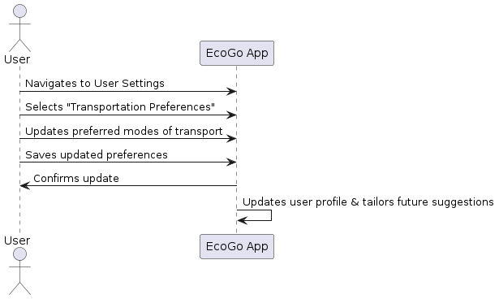
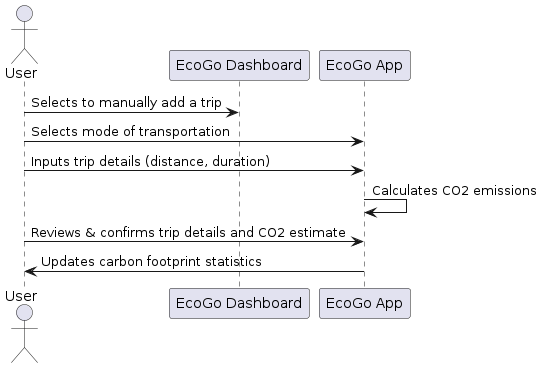
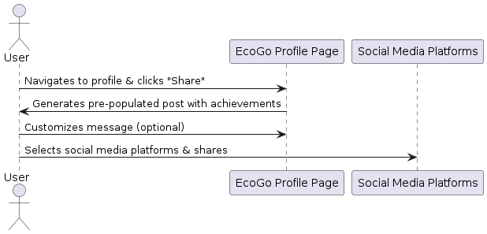
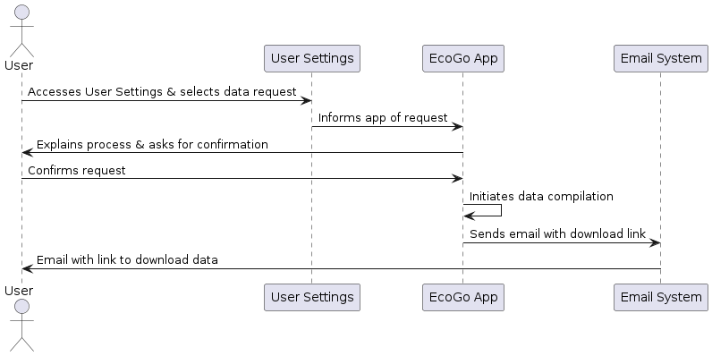
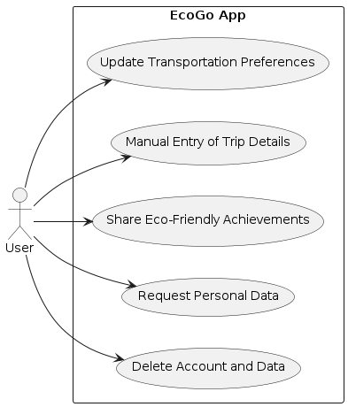

<!-- PROJECT LOGO -->
 

  <h1 align="center">Functional Specification</h1>
  

    <strong>EcoGo</strong>
     
  
  

## 1. Executive Summary

This document specifies the functional requirements of EcoGo, a mobile application designed to empower individuals to track and reduce their carbon dioxide (CO2) emissions through everyday activities.

## 2. Background

The development of EcoGo is driven by the global need for actionable steps towards environmental sustainability. It aims to provide users with real-time data on their emissions, offering a tangible way to measure and reduce their carbon footprint. The development is also motivated by the creation of a project that can be used as a final project for the school.

## 3. Stakeholders
| Role | Description |
|----|----|
| **Project Owner** | Thomas Planchard developing EcoGo as a final project for obtaining a diploma. Responsible for all aspects of the project.|
| **Developers** | Thomas Planchard is responsible for developing the entire source code. |
| **Users** | Individuals who download and use the EcoGo application. |

## 1.2 Scope

 EcoGo is designed to cater to people who are environmentally conscious and seek actionable insights into reducing their carbon footprint. The application leverages real-time data tracking, gamification elements, and a reward system to foster sustainable behaviors among its users.

### Objectives:
- **Carbon Footprint Tracking:** To provide users with accurate, real-time tracking of their CO2 emissions based on their transportation modes, utilizing GPS and accelerometer data.
  
- **User Engagement through Gamification:** To incorporate gamification elements such as earning coins, setting personal goals, and completing challenges to increase user engagement and promote sustained usage of the app.
  
- **Eco-Friendly Store System:** To develop a store system where users can spend virtual coins within the app, redeeming them for discounts and offers from eco-responsible brands and services, thereby incentivizing users to make greener choices.
  
- **Suggestions:** To offer user suggestions on reducing their carbon footprint through their transportation choices, for instance by suggesting carpooling or public transportation options.
  
- **Community and Social Engagement:** To integrate social sharing features that allow users to share their achievements and progress in reducing carbon emissions.

## Target Audience:

EcoGo targets tech-savvy individuals who extensively use their smartphones
for daily activities and are committed to environmental sustainability.
This audience actively seeks mobile solutions to monitor and reduce their 
carbon footprint and values intuitive, seamless app experiences. They are 
motivated by rewards that align with their eco-friendly lifestyle choices 
and are accustomed to integrating new apps into their daily routines. This 
group primarily includes young adults to middle-aged users who are 
environmentally aware and looking for ways to contribute to sustainability 
efforts through technology.

## Exclusions:
- The initial release of EcoGo will focus exclusively on iOS devices, with 
  plans for Android and other platforms considered for future updates. The main reason for that is to develop the app as fast as possible and to be able to present it as a final project for the school.

- The scope will initially concentrate on tracking emissions from 
  one or two primary transportation modes, such as driving and cycling, 

- The application will not support store and social network sharing in its 
  initial version; these features are considered superficial for the first version.

## 4. Functional Requirements

### 4.1 User Roles and Permissions

- **User:** Can create an account, log in, track emissions, view statistics, earn and spend coins, and receive offers.

### 4.2 Features and Functionality

#### 4.2.1 Account Creation and Management
- Users can create an account using their email address, setting up a password and profile information (name, surname, picture).

#### 4.2.2 Dashboard
- Presents current carbon footprint statistics, steps (number), calories burned (kcal), distance traveled (km) and coins earned.
- Displays offers based on user activity and location. Those offers will be in partnership with eco-responsible brands and regional services. The user will be able to see the offers only if he is in the region where the offer is available. Nevertheless, this feature will be simulated in the first version of the app.

- The dashboard will be the first screen that the user will see when he opens the app.

#### 4.2.3 Activity Tracking

Activity Tracking is a core feature of the application, serving as the primary data source for CO2 emission calculations. Two choices will be submitted to the user: automatic detection and manual entry.

- **Automatic Detection:** By granting the app access to the device's GPS and accelerometer, the app can automatically detect and track the user's movement. This feature allows the app to intelligently infer the mode of transportation used and calculate the distance traveled. Automatic tracking is crucial for users who prefer the app to passively monitor their travel and calculate emissions without manual input.

- **Manual Entry:** Users also have the option to manually enter their transportation mode and trip duration. This functionality caters to users who may prefer or need to input their travel details directly, offering flexibility and ensuring that all users can accurately track their carbon footprint regardless of their preference for automatic detection.

Upon detecting a trip, the application generates a pop-up notification the next time the user opens the app. This notification confirms the details of the trip, such as duration (e.g., 20 minutes), distance traveled (e.g., 20 km), and the estimated CO2 emissions (e.g., 30 kg CO2). The user is prompted to confirm these details, ensuring tracking and awareness of their carbon footprint on each trip. 

#### 4.2.4 Emission Calculation
The emission calculation forms the core of the application. This function operates by:

- **Accurate CO2 Emission Estimation**: 
EcoGo calculates CO2 emissions by looking at how users travel and how far they go. To keep things simple and accurate, the app focuses on common ways people get around in cities: subway, bus, bicycle, walking, and car. This choice helps make sure the app's emission calculations are reliable. Whether users let the app automatically track their movement or they enter their travel details by hand, EcoGo sticks to these five modes of transport. This way, the app gives users straightforward and useful information about their carbon footprint.

- **Simplified Vehicle Model Consideration**: The primary goal is to accurately calculate the carbon footprint of your trips, rather than covering every vehicle model available. Therefore, the app will categorize vehicle options into broad types: electric, gasoline, SUV, city car, and saloon. This approach simplifies the process of estimating CO2 emissions based on the type of vehicle used for travel.

##### Calculating System Carbon Emissions (Car)
Calculating System CO2 emissions for car travel involves understanding the amount of fuel the car consumes and then converting that fuel consumption into CO2 emissions. The calculation can vary depending on the type of fuel (e.g., gasoline, diesel, electric) and the vehicle's efficiency. Here's a basic approach for gasoline and diesel vehicles:

---

**Step 1: Determine Fuel Consumption**
First, the app will have to know the car's fuel consumption, typically measured in liters per 100 kilometers (L/100km) or miles per gallon (MPG). This information can often be found in the vehicle's manual or manufacturer's website. The consumption should be asked in the app when the user enters the car's details at the creation of the account.

---

**Step 2: Calculate Fuel Used**
Based on the distance traveled, calculate how much fuel the car used for the trip. For instance, if a car has a fuel efficiency of 8 L/100km and the trip is 100km long, the car used 8 liters of fuel. The formula for this calculation is:  
*Fuel Used (liters) = (Distance Traveled (km) / 100) x Fuel Efficiency (L/100km)*

---

**Step 3: Convert Fuel to CO2 Emissions**
Different types of fuel emit different amounts of CO2 per liter burned. On average, burning 1 liter of gasoline produces about 2.31 kg of CO2, while 1 liter of diesel produces about 2.68 kg of CO2. The app will use these emission factors to convert fuel consumption into CO2 emissions. The formulas for this conversion are:

*CO2 Emissions (kg)=Fuel Used (liters)×CO2 Emission Factor*

- For gasoline: *CO2 Emissions (kg)=Fuel Used (liters)×2.31*
- For diesel: *CO2 Emissions (kg)=Fuel Used (liters)×2.68*

##### Calculating System Carbon Emissions (Electric Car)
For electric vehicles (EVs), the calculation is different and generally involves the following steps:

1. **Electricity Consumption:** Determine how much electricity (in kilowatt-hours, kWh) the vehicle consumes per 100 kilometers or per mile. Same as for gasoline cars, this information should be asked when the user enters the car's details at the creation of the account.
2. **Electricity Source Emissions:** Calculate the CO2 emissions associated with generating the consumed electricity. This varies greatly depending on the energy mix of the grid (coal, natural gas, renewable energy sources, etc.) and can be expressed as kg of CO2 per kWh. As we can't know the exact source of electricity, the app will use the main sources of electricity in the country where the user is located. At first, the app will only focus on France, so it will be the nuclear energy that will be used as the main source of electricity.
   
   Here is the table of the C02 emissions by the factor of electricity source:

   | Electricity Sources | CO2 Emission Factor (g/kWh) 
   | --- | --- 
   | Nuclear | 12g of CO2 by kW|
   |Hydraulics | 24g of CO2 by kWh|
   |Gas| 490g of CO2 by kWh|
   |Wind power | 11g of CO2 by kWh|
   |Solary | 41-48 g of CO2 by kWh|
   |Bioenergy (biomass) | 230g of CO2 by kWh|
   |Coal | 820g of CO2 by kWh|

1. **Total Emissions:** Multiply the electricity consumed by the CO2 emissions factor of the electricity source.
   
   *CO2 Emissions (kg)=Electricity Consumed (kWh)×CO2 Emission Factor of Electricity Source*

---

##### Calculating System Carbon Emissions (Bus, Bicycle, and Subway)

1. **Bus:** The average CO2 emission factor for a bus is approximately **0.101 kg** CO2 per passenger kilometer. This factor can vary based on the bus type, occupancy, and fuel efficiency. However, the average value provides a reasonable estimate for emission calculations.

2. **Regular Bicycle:** Cycling is considered a zero-emission mode of transport. However, considering the food energy required by a cyclist and the carbon intensity of food production, a very small emission factor, such as **0.021 kg** CO2 per kilometer, can be used for a more comprehensive analysis.

3. **Subway:** The average CO2 emission factor for subway transport varies widely based on the electricity generation mix of the region. A general estimate is around **0.06 kg** CO2 per passenger kilometer.

---

#### 4.2.5 Rewards System

Within the app, users accumulate coins as a reward for reducing their carbon footprint. The reward system is structured around several key criteria that directly relate to eco-friendly behaviors and choices:

1. **Eco-Friendly Transportation Choices:** Users earn coins for selecting sustainable transportation methods. Walking, cycling, and using public transit are prioritized over personal gasoline vehicles, with rewards scaled according to the eco-friendliness of the mode chosen.

2. **Travel Distance in Eco-Mode:** Coins are awarded based on the distance traveled using green transportation options. 

3. **CO2 Savings:** The app calculates the CO2 emissions saved by opting for a greener transportation mode instead of a conventional gasoline vehicle. Users receive coins proportional to the amount of CO2 they save, making a direct connection between rewards and environmental benefits.

4. **Completion of Eco-Challenges:** The app introduces daily or weekly eco-challenges, such as avoiding the use of personal gasoline vehicles for a day. Completing these challenges earns users additional coins, promoting engagement and continuous eco-conscious behavior.

5. **Consistent Eco-Friendly Actions:** Bonus coins are awarded for maintaining consistent sustainable behaviors over set periods, such as using public transportation or biking for several consecutive days. This system aims to foster long-term commitment to reducing one’s carbon footprint.

##### Eco-Challenges
Here's a table listing several eco-challenges along with their associated rewards:

| Eco-Challenge                               | Reward (Coins) |
|---------------------------------------------|----------------|
| **No Car Day** - Avoid using a car for a day.                     | 50             |
| **Bike to Work Week** - Use a bicycle for commuting every day for a week. | 100            |
| **Public Transit Pro** - Use public transportation exclusively for a week.  | 70             |
| **Walk-a-Thon** - Walk at least 10,000 steps every day for a week.         | 80             |
| **Zero Emission Day** - Only use zero-emission transportation modes for a day. | 60             |
| **Local Explorer** - Use only walking or cycling for all travel within a 5km radius for a week. | 120           |
| **Eco-Shopper** - Make all shopping trips by foot, bike, or public transit for a month. | 150           |
| **Green Commuter** - Replace car commuting with any eco-friendly transportation for a month. | 200           |
| **Carbon Saver** - Achieve the highest CO2 savings in a month among all users. | 250           |
| **Eco-Warrior** - Complete all other challenges within a specified time frame. | 300           |

The app will display these challenges to users, allowing them to select and participate in the ones that align with their preferences and lifestyles. Completing these challenges will not only earn users coins but also contribute to their overall carbon footprint reduction efforts. Those challenges might be updated regularly to keep the app engaging and motivating for users.

##### Coin Allocation

1. **Eco-Friendly Transportation Choices:**
   - Walking or Cycling: Earn 10 coins for every kilometer.
   - Public Transit: Earn 5 coins for every kilometer.
   - Note: These values incentivize the most sustainable options, with higher rewards for zero-emission choices.

2. **Travel Distance in Eco-Mode:**
   - For every 5 kilometers traveled by eco-friendly transportation in a single trip, users earn an additional 10 bonus coins.

3. **CO2 Savings:**
   - Calculating CO2 savings compared to driving a gasoline car: Earn 1 coin for every kilogram of CO2 saved.
   - Example: If choosing public transit over a personal car for a 10km trip saves 2kg of CO2, the user earns an additional 2 coins.

4. **Completion of Eco-Challenges:**
   - Daily Challenge (e.g., No Car Day): 50 coins.
   - Weekly Challenge (e.g., Use Public Transit 5 times in a week): 100 coins.

5. **Consistent Eco-Friendly Actions:**
   - Consistent use of eco-friendly transportation for a week: 100 bonus coins.
   - Consistent use for a month: 500 bonus coins.

### Adjustments and Flexibility

- The number of coins awarded for each action is designed to encourage the use of the most sustainable transportation options available and to reward users for making significant contributions to reducing their carbon footprint.
- This reward system is subject to adjustments based on user feedback, the app's economic model, and the overarching goal of promoting sustainable behaviors. Future updates may refine coin values to better align with these objectives, ensuring the system remains effective and motivating for users.

#### 4.2.6 EcoGo Store

The EcoGo Store is a virtual marketplace within the app, showcasing offers from eco-conscious brands and restaurants. Users can spend their earned coins to redeem discounts and vouchers, engaging directly with businesses that share EcoGo's commitment to sustainability.

While the implementation of this feature in the current version will be simulated, due to its status as a school project. 

#### 4.2.7 Social Sharing
Within the app, the profile page features a dedicated "Share" button, enabling users to effortlessly create and post content to their social media accounts. Clicking this button generates a pre-populated post that highlights key information from the user's profile, such as the amount of CO2 they've reduced over the day, week, and month, along with their preferred mode of eco-friendly transportation. This feature encourages users to share their environmental achievements, promoting awareness and inspiring others to join in making more sustainable transportation choices.

Above is a wireframe of the social sharing feature. It is only a wireframe, the final version may look different. This wireframe is generated by an AI.  

### 4.2.8 User Settings

- **Account Management:** Users can update their account details. 
  - **Profile Updates:** Users can modify their profile information, such as name, surname, profile picture, and contact details.

  - **Password Changes**: For security purposes, users can change their password directly within the app.
    1. **Initiating Password Change:** When a user decides to change their password, they can start this process directly within the app by navigating to the User Settings section and selecting the option to change their password.

    2. **Email Verification for Identity Confirmation:** To ensure the security of the password change process and confirm the user's identity, the EcoGo app automatically sends an email to the user's registered email address. This email contains a verification link or code as a security measure to prevent unauthorized access to the user’s account.

    3. **Verification Process:** Upon receiving the email, the user must click the verification link or enter the provided code within the app. This step is crucial as it verifies the user's intent to change their password and confirms their identity, adding an extra layer of security.

    4. **Entering the New Password:** Once their identity has been confirmed through the verification process, the user is prompted to enter a new password. The app may also offer guidelines for creating a strong password, such as using a mix of letters, numbers, and special characters.

    5. **Confirmation and Completion:** After the user sets a new password, the app confirms that the password has been successfully changed. The user can now log in to the EcoGo app using their new password.

  - **Email Preferences**: Users have the option to opt-in or opt-out of receiving email notifications in several categories:
  
    1. **New Offers in the Store:** Users can choose to be notified via email when new discounts, vouchers, or partnerships are available in the EcoGo store.

    2. **Challenge Completion:** When users complete a challenge, they can receive an email congratulating them on their achievement and detailing the rewards earned.

    3. **Coin Milestones:** Emails can alert users when they have accumulated a significant amount of coins. This notification will be sent when users reach specific coin thresholds, such as 100, 500, and 1000 coins.
  
    - **Email Notification Example:**
      ---

      **Subject:** EcoGo Update: Congratulations on Completing a Challenge!

      **Body:**

      Hello [User Name],

      You've achieved something amazing! By completing the [Name of Challenge], you've taken another step towards a more sustainable lifestyle. 

      **Rewards Earned:** You've earned [Number] coins! 🎉

      Don't forget to check out the EcoGo store for eco-friendly offers where you can redeem your coins. Plus, new offers have just been added that you won't want to miss.

      Keep up the great work, and let's continue making a difference together!

      Best,
      The EcoGo Team

      ---

     4. **Unsubscribe Option:** Each email includes an easy unsubscribe link, allowing users to adjust their preferences at any time and maintain control over the types of email notifications they wish to receive.

  - **Transportation Preferences**: Given the app's focus on sustainable transportation, users can specify their preferred modes of transport.

    - **Preference Selection:** Users can select their preferred transportation methods from a list that includes options like walking, cycling, public transit, electric vehicles, and more. This selection informs the app about the user's typical modes of transport.

      **Flexible Preference Management:**

    - **Easy Updates:** Recognizing that users' transportation needs and preferences can change over time, EcoGo ensures that updating these preferences is straightforward and intuitive. Users can revisit their settings at any time to adjust their preferred modes of transportation.

    - **Responsive App Experience:** As users modify their preferences, the app immediately responds by updating the content, challenges, and rewards to match the new preferences. 

- **Notification Preferences Detail**

  **Initial Notification Setup:**

  - **Permission Request:** Upon first use of the app, EcoGo requests permission to send notifications to the user's phone.
  
  - **Authorization:** Users have the option to grant or deny this permission based on their comfort and desire to receive notifications. Granting permission is essential for the app to deliver timely updates and information relevant to the user.

  **Customizing Notification Preferences:**

  - **In-App Settings:** Initially, if permission is granted, EcoGo will send notifications based on standard settings. Users can then fine-tune their notification preferences directly within the app, choosing what types of alerts they wish to receive, such as challenge updates, reward notifications, or eco-tips.

  - **Device Settings Adjustment:** Users also have the flexibility to modify EcoGo's notification settings at any time through their phone's system settings.

  - **Opting Out:** Users who prefer not to receive any notifications from EcoGo can opt-out entirely by disabling notifications in their device settings. This option ensures that users have full control over their notification experience.

    
- **Privacy Controls:** In line with GDPR requirements, users can manage their privacy settings, including opting in or out of data-sharing features. This aspect will be developed in the [Security](#52-security) section of this document.
 

### 4.3 Use Cases

- **Use Case 1: User Account Creation**

  **Actors:**
  - User

  **Preconditions:**
  - The user has installed the EcoGo app on their iOS device.

  **Main Flow:**
  1. The user launches the EcoGo app and selects the option to create a new account.
  2. The user enters their email address, name, surname, and chooses a password. Optionally, they can upload a profile picture.
  3. The user submits the account creation form.
  4. The EcoGo app sends a verification email to the user's provided email address.
  5. The user clicks the verification link in the email to activate their account.
  6. The user logs in to the EcoGo app with their new credentials.

  **Postconditions**:
  - The user has successfully created and verified their EcoGo account.

  

---

- **Use Case 2: Carbon Footprint Tracking**

  **Actors:**
  - User

  **Preconditions:**
  - The user has an active EcoGo account.
  - The GPS and accelerometer permissions are granted.

  **Main Flow:**
  1. The user starts a trip using their preferred mode of transportation (e.g., walking, cycling).
  2. The EcoGo app automatically detects the trip start through GPS and accelerometer data (for automatic detection) or the user manually starts the trip in the app (for manual entry).
  3. During the trip, the app continuously tracks the distance traveled.
  4. At the trip's end, the app calculates the CO2 emissions based on the distance and mode of transportation.
  5. The app displays the CO2 emissions for the trip and updates the user's daily, weekly, and monthly statistics.

  **Postconditions:**
  - The user's carbon footprint data is updated based on the latest trip.

  

---

- **Use Case 3: Redeeming Rewards in the EcoGo Store**

  **Actors:**
  - User

  **Preconditions:**
  - The user has accumulated coins through eco-friendly activities.

  **Main Flow:**
  1. The user navigates to the EcoGo Store within the app.
  2. The user browses available offers from eco-responsible brands and restaurants.
  3. The user selects an offer they wish to redeem.
  4. The app displays the cost in coins and asks the user to confirm the redemption.
  5. The user confirms, and the coins are deducted from their account.
  6. The app displays a voucher or discount code for the redeemed offer.

  **Postconditions:**
  - The user has successfully redeemed coins for an offer in the EcoGo Store.

  

--- 

- **Use Case 4: Modifying Notification Preferences**

  **Actors:**
  - User

  **Preconditions:**
  - The user has an active EcoGo account.

  **Main Flow:**
  1. The user navigates to the User Settings section in the EcoGo app.
  2. The user selects Notification Preferences.
  3. The app displays options for various types of notifications (e.g., new store offers, challenge completions, coin milestones).
  4. The user toggles their preferences for each notification type.
  5. The user saves their preferences.

  **Postconditions:**
  - The user's notification preferences are updated according to their selections.

  

---

- **Use Case 5: Updating Transportation Preferences**

  **Actors:**
  - User

  **Preconditions:**
  - The user has an active EcoGo account and is logged into the app.

  **Main Flow:**
  1. The user navigates to the User Settings section and selects "Transportation Preferences."
  2. The user views their current preferences and selects options to update their preferred modes of transport (e.g., electric, gasoline, SUV, city car, saloon).
  3. The user saves their updated preferences, which the app confirms.
  4. EcoGo updates the user's profile and tailors future challenges and rewards based on the new preferences.

  **Postconditions:**
  - The user's transportation preferences are updated, affecting future app interactions and personalized suggestions.

  

---

- **Use Case 6: Manual Entry of Transportation Mode and Trip Details**

  **Actors:**
  - User

  **Preconditions:**
  - The user chooses not to enable automatic detection or wishes to enter a trip not captured by the app.

  **Main Flow:**
  1. The user selects the option to manually add a trip from the dashboard.
  2. The user selects the mode of transportation used and inputs details such as distance traveled and trip duration.
  3. The app calculates the CO2 emissions based on the entered details and updates the user's carbon footprint statistics.
  4. The user reviews and confirms the trip details and CO2 emission estimate.

  **Postconditions:**
  - The app records the manually entered trip, including it in the user's carbon footprint data.

  

---

- **Use Case 7: Sharing Eco-Friendly Achievements on Social Media**

  **Actors:**
  - User

  **Preconditions:**
  - The user has achieved a notable milestone in carbon footprint reduction or completed a challenge.

  **Main Flow:**
  1. The user navigates to their profile page and clicks the "Share" button.
  2. The app generates a pre-populated post highlighting the user's achievements, such as CO2 reduction, preferred transportation mode, or completed challenges.
  3. The user can customize the message if desired and selects the social media platforms where they want to share their achievement.
  4. The user posts the achievement to their selected social media platforms directly from the app.

  **Postconditions:**
  - The user's achievements are shared on social media, increasing awareness and potentially motivating others to join EcoGo.

  

---

- **Use Case 8: Requesting Personal Data**

  **Actors:**
  - User

  **Preconditions:**
  - The user wants to review the personal data EcoGo has collected on them, in compliance with GDPR.

  **Main Flow:**
  1. The user accesses the User Settings menu and selects the option to request their personal data.
  2. The app explains the process and asks the user to confirm their request.
  3. The user confirms, and the app initiates the process to compile the user's personal data.
  4. Once ready, EcoGo sends the user an email with a link to download their data in a machine-readable format.

  **Postconditions:**
  - The user receives access to their personal data collected by EcoGo, enhancing transparency and trust.

  

---

- **Use Case 9: Deleting Account and Associated Data**

  **Actors:**
  - User

  **Preconditions:**
  - The user decides to stop using EcoGo and wants to remove their account and all associated data.

  **Main Flow:**
  1. The user navigates to the User Settings section and selects the option to delete their account.
  2. The app displays a warning about the permanence of this action and asks for confirmation.
  3. The user confirms their decision to delete the account.
  4. EcoGo permanently removes the user's account and all associated personal data from its servers, in compliance with GDPR.

  **Postconditions:**
  - The user's account and all related data are permanently deleted, fulfilling the user's right to erasure.

  

## 5. Non-Functional Requirements

### 5.1 Performance

Performance objectives are structured around responsiveness, efficiency, and reliability to ensure a seamless experience for all users.

#### User Interface (UI) Responsiveness

- **Adaptive UI Scaling:** The goal is to deliver a consistent and accessible experience for users on screens of any size, from small smartphones to large tablets.

    - **Screen Size and Resolution:** The application interface is designed to be responsive to a wide range of screen sizes, from a minimum of 4 inches to over 12 inches for tablets, covering resolutions from 640x1136 (iPhone SE) to 2796 x 1290 pixels (iPhone 15 Pro Max) and equivalent Android devices. 
    
    - **Density Independence:** UI elements are scaled based on screen density (measured in dots per inch, DPI) to ensure that text, icons, and interactive elements maintain their intended size and legibility. The app supports DPI settings from low (120 DPI) to extra-extra-extra-high (640 DPI), accommodating virtually all modern smartphones and tablets.
    
    - **Layout Flexibility:** The app utilizes a flexible grid layout that adapts to the screen size, ensuring that content is presented in an organized manner without overcrowding or truncation. This approach includes dynamic resizing and repositioning of UI components based on the device's aspect ratio and orientation (portrait or landscape).
    
    - **Font Scaling:** Text sizes are dynamically adjusted based on the user's screen size and system font size preferences, ensuring readability across all devices. This includes implementing scalable units (such as 'sp' for fonts in Android and Dynamic Type in iOS) that respond to user and system settings.
    
    - **Touch Target Size:** Interactive elements are designed with ample touch targets, adhering to the minimum recommended size of 44x44 points, to ensure ease of interaction regardless of the device's screen size or the user's finger size.

- **Frame Rate Consistency:** The application is designed to maintain a consistent frame rate that matches the maximum refresh rate of the user's device display.

  - **Target Frame Rates:** The app aims for a standard frame rate of 60 frames per second (FPS) on devices with standard 60Hz screens, which encompasses the majority of smartphones and tablets. For devices equipped with higher refresh rate displays, such as 90Hz, 120Hz, or even 144Hz screens. The app adjusts its frame rate to match the device's capabilities, ensuring a fluid and visually appealing experience.
  
  - **Adaptive Frame Rate Adjustment:** In scenarios where maintaining the maximum frame rate is not feasible due to complex animations or high processing requirements, the app employs adaptive frame rate strategies. This approach adjusts the frame rate dynamically to ensure the smoothest possible experience without compromising device performance or significantly draining the battery.
  
  - **Monitoring and Testing:** Continuous performance monitoring and benchmarking are integral to the app's development process. Real device testing across a diverse range of screen refresh rates and specifications ensures that frame rate consistency is maintained. Adjustments and optimizations are made based on real-world usage data and feedback.
  
  - **User-Centric Design:** Recognizing that a smooth visual experience is crucial to user satisfaction, the app prioritizes frame rate consistency not only as a technical goal but also as a core aspect of user-centric design. This commitment to performance ensures that users experience the benefits of a responsive interface, regardless of their device's specifications.
   

#### Scalability

- **Objective:** Strategically scale the application to efficiently manage an expanding user base and increasing data volumes. Initially targeting a smaller audience for product testing, the system is architected to transition to accommodate larger user groups as adoption grows.

  - **Initial User and Data Volume Projections:** The app is initially designed to support up to 1,000 active users, with the expectation of handling data transactions and interactions typical of a user base engaged in daily activity tracking, emissions calculations, and interaction with the rewards system.

  - **Data Management Strategies:** Implementing efficient data storage and retrieval mechanisms, such as indexing and caching, is crucial for handling growing volumes of user-generated data. For the initial phase, a NoSQL database provides flexibility and scalability to accommodate the varied data types and structures inherent to activity tracking and user profiles.

  - **Load Balancing:** A load balancer is deployed to distribute incoming app traffic and data processing requests across multiple servers, preventing any single server from becoming a bottleneck. This is essential for maintaining application responsiveness as the number of simultaneous users increases.

### 5.2 Security

 Implementing robust security measures to protect user information from unauthorized access, alteration, and destruction. Our approach encompasses secure authentication practices, data encryption, compliance with GDPR standards, and regular security assessments.

#### Secure Authentication

- **Authentication Mechanisms:** EcoGo integrates Firebase Authentication to manage user sign-ins and identity verification efficiently. This service supports various authentication methods, including email and password, social media accounts, and phone authentication, providing flexibility and ease of use for our users. For the initial version, email and password authentication will be the primary method.
- **Password Management:** Through Firebase Authentication, passwords are securely hashed and salted using industry-standard cryptographic algorithms, ensuring they are never stored in plaintext. Firebase enforces strong password practices, requiring passwords to meet specific length and complexity criteria. Additionally, users can reset their passwords securely through email verification.
- **Two-Factor Authentication (2FA):** For users seeking additional security, EcoGo, via Firebase, offers the option to enable two-factor authentication. This added security layer requires users to verify their identity through a secondary method upon login, significantly reducing the risk of unauthorized access.

#### Data Encryption

- **Data In Transit:** EcoGo ensures that all data transmitted between the user's device and Firebase servers is encrypted using TLS (Transport Layer Security). This encryption protects users' data from being intercepted by unauthorized parties.
  
- **Data At Rest:** Firebase securely encrypts sensitive data at rest, including personal information and usage data stored within Firebase's databases. Utilizing advanced encryption algorithms, Firebase provides a secure storage solution that protects against data breaches and unauthorized access.

#### Compliance and Data Protection

- **Firebase and GDPR:** Firebase's infrastructure and services are designed to comply with the General Data Protection Regulation (GDPR) and other relevant privacy laws. EcoGo benefits from Firebase's commitment to data protection and privacy, ensuring that user data is handled in compliance with legal standards.
- **User Data Management:** Users can manage their data directly within the app. This includes options to access, update, or delete their personal information, in line with GDPR rights. All user data management actions are facilitated through Firebase's secure backend services, ensuring transparent and secure data handling practices.
- **Data Processing Agreement (DPA):** Firebase includes data processing terms that detail the obligations and responsibilities regarding data protection and security. This ensures that data processing on behalf of EcoGo adheres to GDPR standards, with Google acting as a data processor.
- **Compliance with Data Transfer Regulations:** Firebase uses Standard Contractual Clauses (SCCs) for international data transfers, aligning with GDPR requirements. This ensures that user data is protected according to European Union standards, even when data is transferred outside the EU.

#### GDPR Compliance

EcoGo is fully committed to complying with the General Data Protection Regulation (GDPR) to protect the privacy and security of our users within the European Union and beyond. Key aspects include:

- **Data Minimization:** We collect only the data necessary for the purposes stated in our Privacy Policy.
- **User Consent:** Explicit consent is obtained for the collection and processing of personal data, with clear options for users to opt-in or opt-out.
- **Right to Access and Erasure:** Users have the right to access their data and request its deletion. EcoGo provides mechanisms for users to exercise these rights easily.
- **Data Portability:** Users can request a copy of their data in a structured, commonly used, and machine-readable format.
- **Privacy by Design:** EcoGo incorporates privacy into the development and operation of our services, ensuring that user data protection is a core consideration.

#### Privacy Policy for EcoGo

Welcome to EcoGo! We are committed to protecting your privacy and ensuring you have a positive experience on our app. This Privacy Policy outlines how we collect, use, share, and protect your information when you use our services.

###### 1. Information We Collect

**a. Personal Information:** When you create an account with EcoGo, we collect personal information such as your name, email address, and profile picture. This information is essential for providing you with personalized services.

**b. Usage Data:** We collect data about how you use our app, including your transportation modes, distances traveled, and interactions with the app. This helps us improve EcoGo and tailor it to your needs.

**c. Location Data:** With your permission, we collect precise location data from your device to accurately track your transportation activities and calculate your carbon footprint.

###### 2. How We Use Your Information

We use the information we collect to:

- Provide, maintain, and improve our services.
- Personalize your experience and tailor recommendations.
- Communicate with you about updates, support, and promotional offers.
- Monitor and analyze trends, usage, and activities.
- Ensure the security and integrity of our app.

###### 3. Sharing Your Information

We do not share your personal information with third parties except in the following circumstances:

- **Service Providers:** We may share information with vendors and service providers who support our business, such as cloud hosting and analytics services.
- **Compliance and Protection:** If required by law or to protect our rights, we may disclose information about you. This includes responding to legal processes or to prevent fraud and abuse.
- **With Your Consent:** We may share information with other parties when we have your explicit consent to do so.

###### 4. Data Security

EcoGo employs a range of security measures designed to protect your personal information from unauthorized access and disclosure. While we strive to use commercially acceptable means to protect your information, please be aware that no security measures are entirely foolproof.

###### 5. Your Rights

You have the right to access, correct, delete, or transfer your personal information. You can also object to or restrict certain processing of your data. These rights can be exercised through the app's settings or by contacting us directly.

###### 6. International Data Transfers

EcoGo is based on Firebase, a Google service, which means your information may be processed on servers located outside of your country. We ensure that international data transfers comply with applicable laws and regulations, including GDPR.

###### 7. Changes to This Privacy Policy

We may update our Privacy Policy from time to time. We will notify you of any changes by posting the new Privacy Policy on this page and updating the "Effective Date" at the top.

###### 8. Contact Us

If you have any questions or concerns about this Privacy Policy or our data practices, please contact us at:

- Email: ecogo@gmail.com

Your privacy is of utmost importance to us, and we are committed to protecting it as we empower you to reduce your carbon footprint with EcoGo.

## 5. Competitors and Differentiators

### 5.1 Competing Solutions
- No direct competitors identified in the individual carbon footprint tracking and gamification space.

### 5.2 Unique Selling Proposition
- Gamified approach to individual carbon footprint reduction.
- Integration of eco-friendly offers for a holistic approach.

## 6. Preliminary Design
- The main app design and user interfaces have been conceptualized, focusing on simplicity and user engagement.

## 7. Technical Requirements

- **Development Platform:** The application will be developed using React Native and TypeScript, utilizing the Expo framework. This choice supports cross-platform compatibility and streamlines development.
- **Backend Services:** Firebase will be used for authentication and data storage, offering scalability and security.

### 2.2 Risks and Assumptions

| Name | Risk | Mitigation Strategy |
| --- | --- | --- |
| **1. User Engagement Risk** | Users may not find the application interesting or may not actively use it. | Implement a captivating gamification strategy with rewards and challenges. Regularly update content to keep users engaged. |
| **2. Store Offers Interest Risk** | Users might not be interested in the offers provided by eco-friendly stores. | Conduct market research to align offers with user preferences. Regularly update and diversify store offerings. |
| **3. Utility Perception Risk** | Users may not perceive the utility of tracking their carbon footprint. | Educate users on the environmental impact of transportation choices. Clearly communicate the benefits of carbon footprint reduction. |
| **4. User Adoption Risk** | Users might not adopt the application for daily use. | Offer an intuitive and user-friendly interface. Provide incentives for daily tracking and participation in challenges. |
| **5. Lack of Similar Applications Risk** | The absence of similar applications might indicate a lack of market demand. | Conduct thorough market analysis to identify potential competitors or gaps in the market. Highlight the unique aspects of EcoGo. |

#### Assumptions

| Assumptions | Validation |
| --- | --- |
| **1. Interest in Eco-Friendly Offers:** Users are interested in eco-friendly offers and discounts. | Monitor user engagement with store offerings and conduct surveys to understand preferences. |
| **2. User Awareness:** Users are not fully aware of their carbon footprint and its impact. | Track user engagement with educational content. Monitor changes in behavior and carbon footprint reduction. |
| **3. Effectiveness of Gamification:** Gamifying the application will enhance user engagement. | Track user participation in challenges and observe trends in app usage. |
| **4. Market Gap:** There is a gap in the market for a user-centric carbon footprint tracking application. | Analyze user reviews, feedback, and adoption rates compared to any potential competitors that may emerge. |
| **5. React Native Suitability:** React Native is a suitable framework for developing the application. | Conduct a thorough analysis of React Native's capabilities and limitations. |
| **6. User Privacy:** Users are concerned about their privacy and data collection. | Implement privacy controls and ensure GDPR compliance. |
| **7. Effectiveness of Social Sharing:** Users will be interested in sharing their achievements on social media. | Monitor user engagement with social sharing features. Conduct surveys to understand preferences. |

## 8. Milestones and Timeline

- **Functional Specification Completion:** [Specify Date]
- **Technical Specification Completion:** [Specify Date]
- **Test Plan Development:** [Specify Date]
- **Minimum Viable Product (MVP) Launch:** June 2024

## 9. Appendices

- Detailed design mockups and wireframes.
  
| Term | Definition |
|----|----|
|CO2 (Carbon Dioxide)| A greenhouse gas emitted through fossil fuel consumption and other activities, contributing to global warming.|
|GPS (Global Positioning System)|A satellite-based navigation system used to determine the device's precise location.
|UI (User Interface)| The graphical layout of an application.
|MVP (Minimum Viable Product)| The version of a product with just enough features to be usable by early customers.|

<!-- - React Native for cross-platform development.
- GPS and accelerometer integration.

### 7.2 Development Phases
1. Visual/UX Design.
2. Algorithm Development.

## 8. Business Model -->

<!-- ### 8.1 Revenue Model
- Stores pay for placement in the application.

### 8.2 Monetization Strategy
- Revenue generated through store partnerships.

## 9. Risk Management

### 9.1 Identified Risks
1. User disinterest.
2. Lack of interest in store offers.

### 9.2 Mitigation Strategies
1. Continuous UX/UI improvement based on user feedback.
2. Diverse and appealing store offers based on user preferences.

## 10. Timeline

### 10.1 Development Phases Timeline
1. Visual/UX Design: 1 month.
2. Algorithm Development: 2 months.
3. Store Integration: 1 month.
4. Social Aspect Implementation: 1 month. --> -->