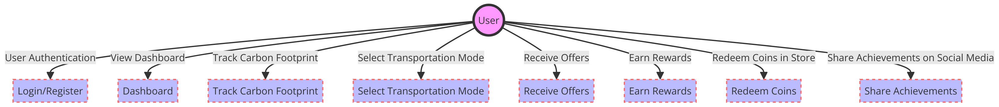
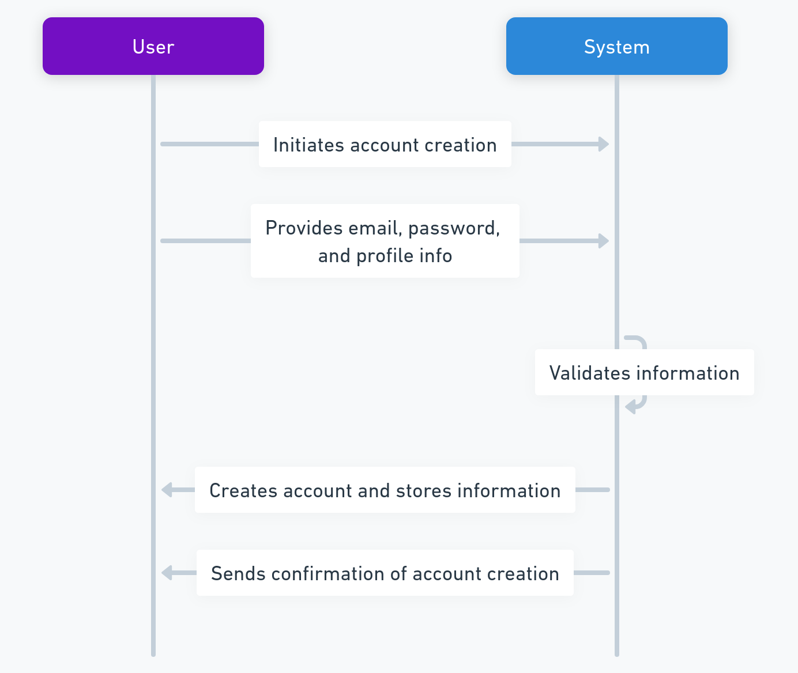
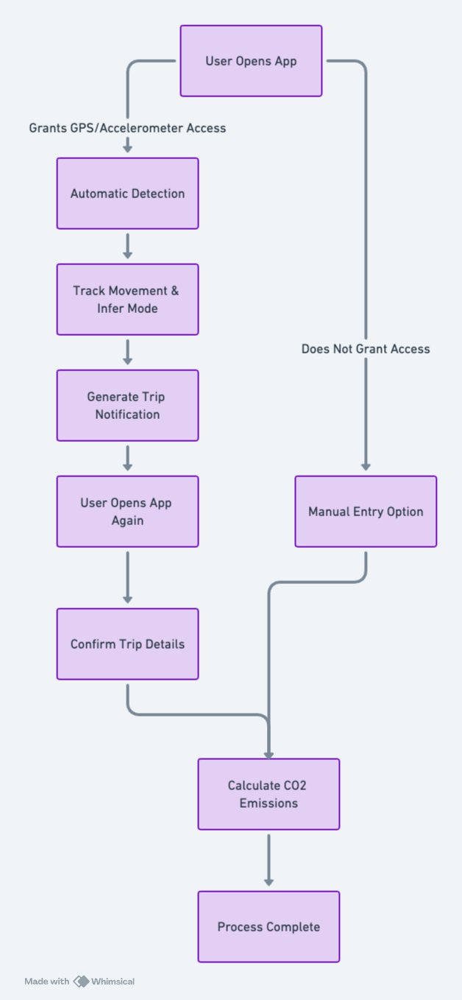
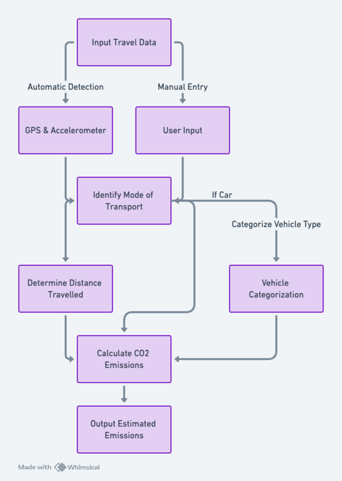
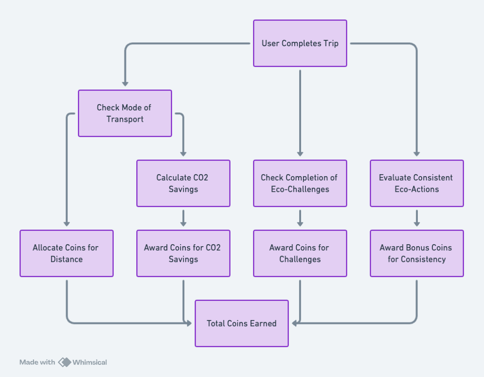

<!-- PROJECT LOGO -->
 

  <h1 align="center">Functional Specification</h1>
  

    <strong>EcoGo</strong>
     
  
  

## 1. Executive Summary

This document specifies the functional requirements of EcoGo, a mobile application designed to empower individuals to track and reduce their carbon dioxide (CO2) emissions through everyday activities. By integrating real-time tracking, gamification, and rewards, EcoGo encourages environmentally responsible behaviors.

## 2. Background

The development of EcoGo is driven by the global need for actionable steps towards environmental sustainability. It aims to provide users with real-time data on their emissions, offering a tangible way to measure and reduce their carbon footprint. The development is also motivated by the creation of a project that can be used as a final project for the school.

## 3. Stakeholders
| Role | Description |
|----|----|
| **Project Owner** | Thomas Planchard developing EcoGo as a final project for obtaining a diploma. Responsible for all aspects of the project.|
| **Developers** | Thomas Planchard is responsible for developing the entire source code. |
| **Users** | Individuals who download and use the EcoGo application. |

## 1.2 Scope

 EcoGo is designed to cater to people who are environmentally conscious and seek actionable insights into reducing their carbon footprint. The application leverages real-time data tracking, gamification elements, and a reward system to foster sustainable behaviors among its users.

### Objectives:
- **Carbon Footprint Tracking:** To provide users with accurate, real-time tracking of their CO2 emissions based on their transportation modes, utilizing GPS and accelerometer data.
  
- **User Engagement through Gamification:** To incorporate gamification elements such as earning coins, setting personal goals, and completing challenges to increase user engagement and promote sustained usage of the app.
  
- **Eco-Friendly Store System:** To develop a store system where users can spend virtual coins within the app, redeeming them for discounts and offers from eco-responsible brands and services, thereby incentivizing users to make greener choices.
  
- **Suggestions:** To offer user suggestions on reducing their carbon footprint through their transportation choices, for instance by suggesting carpooling or public transportation options.
  
- **Community and Social Engagement:** To integrate social sharing features that allow users to share their achievements and progress in reducing carbon emissions.

## Target Audience:

EcoGo targets tech-savvy individuals who extensively use their smartphones
for daily activities and are committed to environmental sustainability.
This audience actively seeks mobile solutions to monitor and reduce their 
carbon footprint and values intuitive, seamless app experiences. They are 
motivated by rewards that align with their eco-friendly lifestyle choices 
and are accustomed to integrating new apps into their daily routines. This 
group primarily includes young adults to middle-aged users who are 
environmentally aware and looking for ways to contribute to sustainability 
efforts through technology.

## Exclusions:
- The initial release of EcoGo will focus exclusively on iOS devices, with 
  plans for Android and other platforms considered for future updates. The main reason for that is to develop the app as fast as possible and to be able to present it as a final project for the school.

- The scope will initially concentrate on tracking emissions from 
  one or two primary transportation modes, such as driving and cycling, 

- The application will not support store and social network sharing in its 
  initial version; these features are considered superficial for the first version.

## 4. Functional Requirements

### 4.1 User Roles and Permissions

- **User:** Can create an account, log in, track emissions, view statistics, earn and spend coins, and receive offers.

### 4.2 Features and Functionality

#### 4.2.1 Account Creation and Management
- Users can create an account using their email address, setting up a password and profile information (name, surname, picture).

#### 4.2.2 Dashboard
- Presents current carbon footprint statistics, steps (number), calories burned (kcal), distance traveled (km) and coins earned.
- Displays offers based on user activity and location. Those offers will be in partnership with eco-responsible brands and regional services. The user will be able to see the offers only if he is in the region where the offer is available. Nevertheless, this feature will be simulated in the first version of the app.

- The dashboard will be the first screen that the user will see when he opens the app.

#### 4.2.3 Activity Tracking

Activity Tracking is a core feature of the application, serving as the primary data source for CO2 emission calculations. Two choices will be submitted to the user: automatic detection and manual entry.

- **Automatic Detection:** By granting the app access to the device's GPS and accelerometer, the app can automatically detect and track the user's movement. This feature allows the app to intelligently infer the mode of transportation used and calculate the distance traveled. Automatic tracking is crucial for users who prefer the app to passively monitor their travel and calculate emissions without manual input.

- **Manual Entry:** Users also have the option to manually enter their transportation mode and trip duration. This functionality caters to users who may prefer or need to input their travel details directly, offering flexibility and ensuring that all users can accurately track their carbon footprint regardless of their preference for automatic detection.

Upon detecting a trip, the application generates a pop-up notification the next time the user opens the app. This notification confirms the details of the trip, such as duration (e.g., 20 minutes), distance traveled (e.g., 20 km), and the estimated CO2 emissions (e.g., 30 kg CO2). The user is prompted to confirm these details, ensuring tracking and awareness of their carbon footprint on each trip. 

#### 4.2.4 Emission Calculation
The emission calculation forms the core of the application. This function operates by:

- **Accurate CO2 Emission Estimation**: 
EcoGo calculates CO2 emissions by looking at how users travel and how far they go. To keep things simple and accurate, the app focuses on common ways people get around in cities: subway, bus, bicycle, walking, and car. This choice helps make sure the app's emission calculations are reliable. Whether users let the app automatically track their movement or they enter their travel details by hand, EcoGo sticks to these five modes of transport. This way, the app gives users straightforward and useful information about their carbon footprint.

- **Simplified Vehicle Model Consideration**: The primary goal is to accurately calculate the carbon footprint of your trips, rather than covering every vehicle model available. Therefore, the app will categorize vehicle options into broad types: electric, gasoline, SUV, city car, and saloon. This approach simplifies the process of estimating CO2 emissions based on the type of vehicle used for travel.

##### Calculating System Carbon Emissions (Car)
Calculating System CO2 emissions for car travel involves understanding the amount of fuel the car consumes and then converting that fuel consumption into CO2 emissions. The calculation can vary depending on the type of fuel (e.g., gasoline, diesel, electric) and the vehicle's efficiency. Here's a basic approach for gasoline and diesel vehicles:

---

**Step 1: Determine Fuel Consumption**
First, the app will have to know the car's fuel consumption, typically measured in liters per 100 kilometers (L/100km) or miles per gallon (MPG). This information can often be found in the vehicle's manual or manufacturer's website. The consumption should be asked in the app when the user enters the car's details at the creation of the account.

---

**Step 2: Calculate Fuel Used**
Based on the distance traveled, calculate how much fuel the car used for the trip. For instance, if a car has a fuel efficiency of 8 L/100km and the trip is 100km long, the car used 8 liters of fuel. The formula for this calculation is:  
*Fuel Used (liters) = (Distance Traveled (km) / 100) x Fuel Efficiency (L/100km)*

---

**Step 3: Convert Fuel to CO2 Emissions**
Different types of fuel emit different amounts of CO2 per liter burned. On average, burning 1 liter of gasoline produces about 2.31 kg of CO2, while 1 liter of diesel produces about 2.68 kg of CO2. The app will use these emission factors to convert fuel consumption into CO2 emissions. The formulas for this conversion are:

*CO2 Emissions (kg)=Fuel Used (liters)×CO2 Emission Factor*

- For gasoline: *CO2 Emissions (kg)=Fuel Used (liters)×2.31*
- For diesel: *CO2 Emissions (kg)=Fuel Used (liters)×2.68*

##### Calculating System Carbon Emissions (Electric Car)
For electric vehicles (EVs), the calculation is different and generally involves the following steps:

1. **Electricity Consumption:** Determine how much electricity (in kilowatt-hours, kWh) the vehicle consumes per 100 kilometers or per mile. Same as for gasoline cars, this information should be asked when the user enters the car's details at the creation of the account.
2. **Electricity Source Emissions:** Calculate the CO2 emissions associated with generating the consumed electricity. This varies greatly depending on the energy mix of the grid (coal, natural gas, renewable energy sources, etc.) and can be expressed as kg of CO2 per kWh. As we can't know the exact source of electricity, the app will use the main sources of electricity in the country where the user is located. At first, the app will only focus on France, so it will be the nuclear energy that will be used as the main source of electricity.
   
   Here is the table of the C02 emissions by the factor of electricity source:

   | Electricity Source | CO2 Emission Factor (g/kWh) 
   | --- | --- 
   | Nuclear | 12g of CO2 by kW|
   |Hydraulics | 24g of CO2 by kWh|
   |Gas| 490g of CO2 by kWh|
   |Wind power | 11g of CO2 by kWh|
   |Solary | 41-48 g of CO2 by kWh|
   |Bioenergy (biomass) | 230g of CO2 by kWh|
   |Coal | 820g of CO2 by kWh|

1. **Total Emissions:** Multiply the electricity consumed by the CO2 emissions factor of the electricity source.
   
   *CO2 Emissions (kg)=Electricity Consumed (kWh)×CO2 Emission Factor of Electricity Source*

---

##### Calculating System Carbon Emissions (Bus, Bicycle, and Subway)

1. **Bus:** The average CO2 emission factor for a bus is approximately **0.101 kg** CO2 per passenger kilometer. This factor can vary based on the bus type, occupancy, and fuel efficiency. However, the average value provides a reasonable estimate for emission calculations.

2. **Regular Bicycle:** Cycling is considered a zero-emission mode of transport. However, considering the food energy required by a cyclist and the carbon intensity of food production, a very small emission factor, such as **0.021 kg** CO2 per kilometer, can be used for a more comprehensive analysis.

3. **Subway:** The average CO2 emission factor for subway transport varies widely based on the electricity generation mix of the region. A general estimate is around **0.06 kg** CO2 per passenger kilometer.

---

#### 4.2.5 Rewards System

Within the app, users accumulate coins as a reward for reducing their carbon footprint. The reward system is structured around several key criteria that directly relate to eco-friendly behaviors and choices:

1. **Eco-Friendly Transportation Choices:** Users earn coins for selecting sustainable transportation methods. Walking, cycling, and using public transit are prioritized over personal gasoline vehicles, with rewards scaled according to the eco-friendliness of the mode chosen.

2. **Travel Distance in Eco-Mode:** Coins are awarded based on the distance traveled using green transportation options. 

3. **CO2 Savings:** The app calculates the CO2 emissions saved by opting for a greener transportation mode instead of a conventional gasoline vehicle. Users receive coins proportional to the amount of CO2 they save, making a direct connection between rewards and environmental benefits.

4. **Completion of Eco-Challenges:** The app introduces daily or weekly eco-challenges, such as avoiding the use of personal gasoline vehicles for a day. Completing these challenges earns users additional coins, promoting engagement and continuous eco-conscious behavior.

5. **Consistent Eco-Friendly Actions:** Bonus coins are awarded for maintaining consistent sustainable behaviors over set periods, such as using public transportation or biking for several consecutive days. This system aims to foster long-term commitment to reducing one’s carbon footprint.

##### Eco-Challenges
Here's a table listing several eco-challenges along with their associated rewards:

| Eco-Challenge                               | Reward (Coins) |
|---------------------------------------------|----------------|
| **No Car Day** - Avoid using a car for a day.                     | 50             |
| **Bike to Work Week** - Use a bicycle for commuting every day for a week. | 100            |
| **Public Transit Pro** - Use public transportation exclusively for a week.  | 70             |
| **Walk-a-Thon** - Walk at least 10,000 steps every day for a week.         | 80             |
| **Zero Emission Day** - Only use zero-emission transportation modes for a day. | 60             |
| **Local Explorer** - Use only walking or cycling for all travel within a 5km radius for a week. | 120           |
| **Eco-Shopper** - Make all shopping trips by foot, bike, or public transit for a month. | 150           |
| **Green Commuter** - Replace car commuting with any eco-friendly transportation for a month. | 200           |
| **Carbon Saver** - Achieve the highest CO2 savings in a month among all users. | 250           |
| **Eco-Warrior** - Complete all other challenges within a specified time frame. | 300           |

The app will display these challenges to users, allowing them to select and participate in the ones that align with their preferences and lifestyles. Completing these challenges will not only earn users coins but also contribute to their overall carbon footprint reduction efforts. Those challenges might be updated regularly to keep the app engaging and motivating for users.

##### Coin Allocation

1. **Eco-Friendly Transportation Choices:**
   - Walking or Cycling: Earn 10 coins for every kilometer.
   - Public Transit: Earn 5 coins for every kilometer.
   - Note: These values incentivize the most sustainable options, with higher rewards for zero-emission choices.

2. **Travel Distance in Eco-Mode:**
   - For every 5 kilometers traveled by eco-friendly transportation in a single trip, users earn an additional 10 bonus coins.

3. **CO2 Savings:**
   - Calculating CO2 savings compared to driving a gasoline car: Earn 1 coin for every kilogram of CO2 saved.
   - Example: If choosing public transit over a personal car for a 10km trip saves 2kg of CO2, the user earns an additional 2 coins.

4. **Completion of Eco-Challenges:**
   - Daily Challenge (e.g., No Car Day): 50 coins.
   - Weekly Challenge (e.g., Use Public Transit 5 times in a week): 100 coins.

5. **Consistent Eco-Friendly Actions:**
   - Consistent use of eco-friendly transportation for a week: 100 bonus coins.
   - Consistent use for a month: 500 bonus coins.

### Adjustments and Flexibility

- The number of coins awarded for each action is designed to encourage the use of the most sustainable transportation options available and to reward users for making significant contributions to reducing their carbon footprint.
- This reward system is subject to adjustments based on user feedback, the app's economic model, and the overarching goal of promoting sustainable behaviors. Future updates may refine coin values to better align with these objectives, ensuring the system remains effective and motivating for users.

#### 4.2.6 EcoGo Store

The EcoGo Store is a virtual marketplace within the app, showcasing offers from eco-conscious brands and restaurants. Users can spend their earned coins to redeem discounts and vouchers, engaging directly with businesses that share EcoGo's commitment to sustainability.

While the implementation of this feature in the current version will be simulated, due to its status as a school project. 

#### 4.2.7 Social Sharing
- Enables users to share achievements and purchases on social media.

#### 4.2.8 User Settings
- Allows users to manage their account, notifications, and privacy settings.
- Provides access to the app's help and support resources.
- Offers the ability to delete the account and associated data.
- Allows users to manage

### 4.3 Use Cases

The primary use case involves tracking carbon emissions, earning rewards, and utilizing the in-app store, as detailed in the provided use case scenarios.

## 5. Non-Functional Requirements

### 5.1 Performance
- The application should be responsive and efficient in tracking activities and calculating emissions in real-time.

### 5.2 Security
- User data protection is crucial, employing secure authentication and data storage practices.

### 5.3 Scalability
- Designed to accommodate an increasing number of users and data volume.

### 5.4 Usability
- The app should be user-friendly, with intuitive navigation and accessible information.

## 6. Preliminary Design
- The main app design and user interfaces have been conceptualized, focusing on simplicity and user engagement.

## 7. Technical Requirements

- **Development Platform:** The application will be developed using React Native and TypeScript, utilizing the Expo framework. This choice supports cross-platform compatibility and streamlines development.
- **Backend Services:** Firebase will be used for authentication and data storage, offering scalability and security.

### 2.2 Risks and Assumptions

| Name | Risk | Mitigation Strategy |
| --- | --- | --- |
| **1. User Engagement Risk** | Users may not find the application interesting or may not actively use it. | Implement a captivating gamification strategy with rewards and challenges. Regularly update content to keep users engaged. |
| **2. Store Offers Interest Risk** | Users might not be interested in the offers provided by eco-friendly stores. | Conduct market research to align offers with user preferences. Regularly update and diversify store offerings. |
| **3. Utility Perception Risk** | Users may not perceive the utility of tracking their carbon footprint. | Educate users on the environmental impact of transportation choices. Clearly communicate the benefits of carbon footprint reduction. |
| **4. User Adoption Risk** | Users might not adopt the application for daily use. | Offer an intuitive and user-friendly interface. Provide incentives for daily tracking and participation in challenges. |
| **5. Lack of Similar Applications Risk** | The absence of similar applications might indicate a lack of market demand. | Conduct thorough market analysis to identify potential competitors or gaps in the market. Highlight the unique aspects of EcoGo. |

#### Assumptions

| Assumptions | Validation |
| --- | --- |
| **1. Interest in Eco-Friendly Offers:** Users are interested in eco-friendly offers and discounts. | Monitor user engagement with store offerings and conduct surveys to understand preferences. |
| **2. User Awareness:** Users are not fully aware of their carbon footprint and its impact. | Track user engagement with educational content. Monitor changes in behavior and carbon footprint reduction. |
| **3. Effectiveness of Gamification:** Gamifying the application will enhance user engagement. | Track user participation in challenges and observe trends in app usage. |
| **4. Market Gap:** There is a gap in the market for a user-centric carbon footprint tracking application. | Analyze user reviews, feedback, and adoption rates compared to any potential competitors that may emerge. |
| **5. React Native Suitability:** React Native is a suitable framework for developing the application. | Conduct a thorough analysis of React Native's capabilities and limitations. |
| **6. User Privacy:** Users are concerned about their privacy and data collection. | Implement privacy controls and ensure GDPR compliance. |
| **7. Effectiveness of Social Sharing:** Users will be interested in sharing their achievements on social media. | Monitor user engagement with social sharing features. Conduct surveys to understand preferences. |

## 8. Milestones and Timeline

- **Functional Specification Completion:** [Specify Date]
- **Technical Specification Completion:** [Specify Date]
- **Test Plan Development:** [Specify Date]
- **Minimum Viable Product (MVP) Launch:** June 2024

## 9. Appendices

- Detailed design mockups and wireframes.
  
| Term | Definition |
|----|----|
|CO2 (Carbon Dioxide)| A greenhouse gas emitted through fossil fuel consumption and other activities, contributing to global warming.|
|GPS (Global Positioning System)|A satellite-based navigation system used to determine the device's precise location.
|UI (User Interface)| The graphical layout of an application.
|MVP (Minimum Viable Product)| The version of a product with just enough features to be usable by early customers.

<!-- //## 5. Competitors and Differentiators

### 5.1 Competing Solutions
- No direct competitors identified in the individual carbon footprint tracking and gamification space.

### 5.2 Unique Selling Proposition
- Gamified approach to individual carbon footprint reduction.
- Integration of eco-friendly offers for a holistic approach.

## 6. Compatibility

### 6.1 Platform Compatibility
- Initial release on iOS, followed by Android.

### 6.2 Language Support
- English and French language support.

## 7. Development Tools and Technologies

### 7.1 Technology Stack
<!-- - React Native for cross-platform development.
- GPS and accelerometer integration.

### 7.2 Development Phases
1. Visual/UX Design.
2. Algorithm Development.

## 8. Business Model -->

<!-- ### 8.1 Revenue Model
- Stores pay for placement in the application.

### 8.2 Monetization Strategy
- Revenue generated through store partnerships.

## 9. Risk Management

### 9.1 Identified Risks
1. User disinterest.
2. Lack of interest in store offers.

### 9.2 Mitigation Strategies
1. Continuous UX/UI improvement based on user feedback.
2. Diverse and appealing store offers based on user preferences.

## 10. Timeline

### 10.1 Development Phases Timeline
1. Visual/UX Design: 1 month.
2. Algorithm Development: 2 months.
3. Store Integration: 1 month.
4. Social Aspect Implementation: 1 month. --> -->