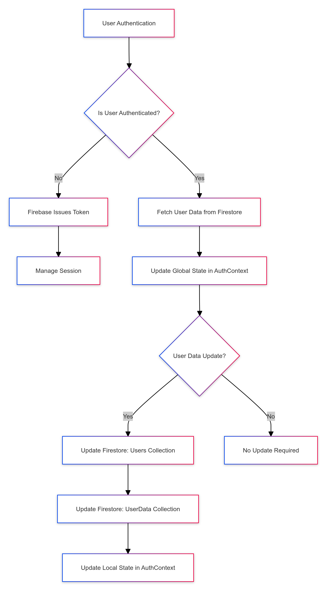
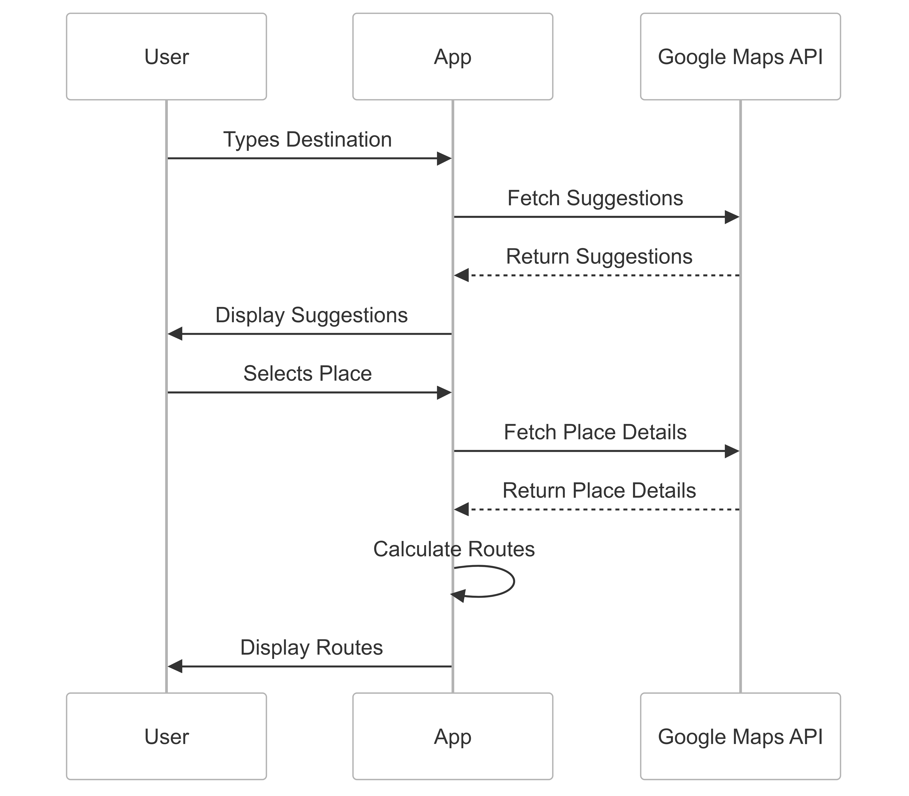
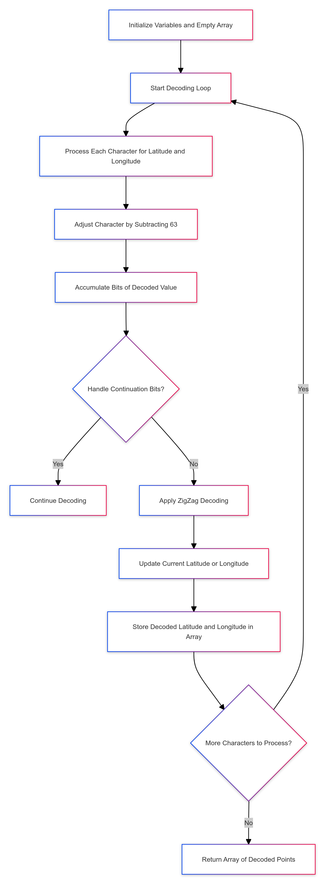

<!-- PROJECT LOGO -->
<br />
<div align="center">
  <h1 align="center">Technical Specification</h1>
  <p align="center">
    <strong>EcoGo</strong>
    <br />
  </p>
</div>

<details>

- [1. Introduction](#1-introduction)
  - [1.1. Audience](#11-audience)
  - [1.2. Overview](#12-overview)
  - [1.3. Glossary](#13-glossary)
  - [1.4. Objectives](#14-objectives)
  - [1.5. Scope](#15-scope)
  - [1.6. Potential Technical Risks and Challenges](#16-potential-technical-risks-and-challenges)
- [2. Requirements](#2-requirements)
  - [2.1. Functional Requirements](#21-functional-requirements)
  - [2.2. Non-Functional Requirements](#22-non-functional-requirements)
  - [2.3. User Stories](#23-user-stories)
- [3. Technical Stack](#3-technical-stack)
  - [3.1. Front-End Technologies](#31-front-end-technologies)
  - [3.2. Back-End Technologies](#32-back-end-technologies)
  - [3.3 APIs](#33-apis)
- [4. System Architecture](#4-system-architecture)
  - [4.1. File Structure](#41-file-structure)
  - [4.2. File and Directory Purposes](#42-file-and-directory-purposes)
  - [4.3. Step-by-Step Project Setup and Development](#43-step-by-step-project-setup-and-development)
    - [4.3.1 Create the Project](#431-create-the-project)
    - [4.3.2. Install npm and Set Up TypeScript](#432-install-npm-and-set-up-typescript)
    - [4.3.3. Front End](#433-front-end)
    - [4.3.4 Common Setup Issues and Debugging](#434-common-setup-issues-and-debugging)
    - [4.3.5 Authentication and User Management](#435-authentication-and-user-management)
      - [➭ Authentication Context (`AuthContext.tsx`)](#-authentication-context-authcontexttsx)
      - [➭ Sign-In Page (`SignIn.tsx`)](#-sign-in-page-signintsx)
      - [➭ Sign-Up Component (`SignUp.tsx`)](#-sign-up-component-signuptsx)
    - [4.3.6 GPS Navigation and Transportation Mode Selection](#436-gps-navigation-and-transportation-mode-selection)
      - [➭ Install `react-native-maps`](#-install-react-native-maps)
      - [➭ Google Maps API Setup](#-google-maps-api-setup)
      - [➭Display the Map](#display-the-map)
      - [➭ Fetch User Location](#-fetch-user-location)
      - [➭ Get Destination Input](#-get-destination-input)
      - [➭ Route Calculation](#-route-calculation)
    - [7. **Real-Time Navigation and Instructions**](#7-real-time-navigation-and-instructions)

</details>


## 1. Introduction

### 1.1. Audience

This document is primarily intended for:

- Software developer: to understand the user and technical requirements, and to guide decision-making and planning. Help them understand risks and challenges, customer requirements, additional technical requirements and choices made.

Secondary audiences:

- Program manager: to validate against the functional specification and the client's expectations.

- QA: to assist in preparing the Test Plan and to use it for validating issues.

- Project manager: to help identify risks and dependencies

### 1.2. Overview

EcoGo is a native mobile application designed exclusively for iOS, aimed at helping individuals track and reduce their carbon dioxide (CO2) emissions from everyday activities, with a particular focus on transportation. The app provides users with real-time data on their emissions and incentivizes eco-friendly behaviors through gamification and rewards.


### 1.3. Glossary

| Term              | Definition                                                                 |
|-------------------|----------------------------------------------------------------------------|
| Firebase          | A mobile and web application development platform developed by Firebase, Inc. in 2011, then acquired by Google in 2014. |


### 1.4. Objectives 

**Carbon Footprint Tracking**
Users can track their carbon emissions from various transportation modes, including walking, cycling, public transport, and driving.

**Real-time Emission Calculation**
The app calculates carbon emissions in real-time based on GPS data, distance traveled, and transportation mode.

**GPS Navigation and Transportation Mode Selection**
Users can utilize GPS within the app to select a destination, choose their preferred mode of transportation, and receive guided directions to reach their destination.

**Graphical Representation**
Users can visualize their carbon footprint over time through interactive graphs, providing insights into their environmental impact.

As mentioned in the [functional specification](../Functional/FunctionalSpecification.md), the following features will be implemented in a future version of the app as they are not considered essential for the initial release:

-	Gamification: EcoGo will make carbon footprint tracking playful by rewarding users with virtual coins when they reduce their emissions, but this feature will be deferred to a later version.
- In-App Store: The ability for users to redeem coins for discounts and offers on eco-friendly products, carpooling services, and public transportation.
- Multi-language Support: EcoGo will initially support English, with plans to add additional languages in future releases.


### 1.5. Scope

This document will detail all technical aspects of the project, including technical decisions such as the architecture of the app and the technologies used. It will not cover design aspects or user experience considerations, as those decisions are addressed in the functional specification. Additionally, all test strategies and quality assurance details will be included in the separate test plan.

### 1.6. Potential Technical Risks and Challenges

1. **Real-Time Data Accuracy**:
   - The accuracy of real-time CO2 emission calculations heavily relies on the precision of GPS data and the correct detection of the user's transportation mode. Inaccurate or delayed data could lead to incorrect emission estimates.

2. **Battery Consumption**:
   - Continuous use of GPS for real-time tracking and updates can significantly impact battery life. This could lead to a poor user experience, especially during long journeys. Optimizing the app to balance data accuracy with battery efficiency is critical.

3. **GPS Signal Availability**:
   - GPS signal strength can be inconsistent, particularly in urban areas with tall buildings, underground locations, or remote regions. This variability could lead to gaps in data, impacting the accuracy of emission tracking and navigation services.

4. **Internet Connectivity**:
   - The app requires a stable internet connection to communicate with APIs for fetching route data, calculating emissions, and updating the user interface. Poor connectivity could hinder the app’s performance, leading to delays or failure in providing real-time updates.

5. **API Limitations and Costs**:
   - Relying on external APIs (e.g., Google Maps API) introduces dependencies on their availability, limits, and potential costs. Exceeding API request limits or experiencing service outages could impact the app's functionality.

6. **User Privacy Concerns**:
   - Continuous tracking of user location and transportation habits could raise privacy concerns. Ensuring that user data is securely handled and providing clear information about data usage is essential to maintain user trust.


## 2. Requirements

### 2.1. Functional Requirements

**Carbon Footprint Tracking:** 
- Implement a background system that continuously runs within the app to detect the user’s transportation mode, even when the app is not actively in use.
- Develop a tracking mechanism that records the time and distance traveled by the user in various transportation modes, including walking, cycling, public transport, and driving.

**Real-Time Emission Calculation:**
- Create an algorithm that calculates the carbon footprint in real-time. The calculation should be based on the user’s speed and selected transportation mode, ensuring accurate emission data.
- The algorithm should dynamically adjust its calculations based on the detected transportation mode and GPS data.

**GPS Navigation and Transportation Mode Selection:**
- Integrate a navigation system using the Google Maps API, allowing users to select a destination and receive guided directions.
- Provide functionality for users to choose their preferred mode of transportation and display real-time navigation and emission data accordingly.
- Implement detailed and guided navigation, offering step-by-step directions and real-time updates throughout the journey.
-	Develop a system to mimic user movement, allowing for simulated navigation and testing of transportation modes and emission calculations.

**User Interface and Core Application Features:**
- Develop the front-end components of the app, including:
  - **Sign-Up/Sign-In**: User registration and authentication.
  - **Home**: Dashboard displaying carbon footprint stats and relevant user information.
  - **GPS**: Interface for navigation and transportation mode selection.
  - **Store**: (Future version) In-app store for redeeming rewards.
  - **Settings**: User account management, including modifying personal information and preferences.
  - **Profile**: User profile displaying cumulative statistics and achievements.

**Account Management:**
- Implement a system for user account creation, login, and logout.
- Provide features for modifying personal information, such as name, email, password, profile picture, and car information.

**Database Management:**
- Design and manage a database with two primary collections:
  - **User Collection**: Stores user-specific information, including account details.
  - **User Data Collection**: Records data related to users' cars, transportation modes, and carbon emissions.

### 2.2. Non-Functional Requirements

**Performance:**
- The app will utilize background operations and continuous location updates, which are battery-intensive features. The goal is to optimize battery usage and performance to align with industry standards of similar apps like Google Maps or Waze, ensuring that battery consumption remains within a comparable range of approximately 10% relative to those apps.

- In terms of responsiveness, the app will adhere to the following benchmarks as outlined by Robert B. Miller in 1968:
  - **0.1 seconds**: The system should respond within 0.1 seconds to give the user the impression of an instant reaction, with no need for additional feedback.
  - **1 second**: The system should maintain fluidity, with any delays between 0.1 and 1 second being noticeable but not disruptive to the user experience.
  - **10 seconds**: The system should ensure that any operation taking up to 10 seconds provides progress feedback to keep the user engaged. Beyond this threshold, the user may lose focus and shift to other tasks.

**Security:**
- Implement secure user authentication using Google’s Firebase service, which provides built-in protection. Ensure that at no point within the app are Firebase credentials exposed, to protect against potential vulnerabilities.

**Usability:**
- The app will adhere to the design outlined in the functional specification, which has been specifically crafted to keep users engaged and facilitate smooth workflow.

### 2.3. User Stories

1. **As a user, I want to automatically track my transportation activities without manually starting the app, so I can accurately monitor my carbon emissions.**
2. **As a user, I want to receive real-time updates on my carbon footprint while navigating to a destination, so I can make environmentally conscious travel decisions.**
3. **As a user, I want to create an account and manage my personal information within the app, so I can securely use all features and update my profile as needed.**
4. **As a user, I want to see a detailed summary of my transportation habits and carbon emissions over time, so I can assess my environmental impact.**
5. **As a user, I want to select my preferred transportation mode and receive directions via the app, so I can efficiently reach my destination while minimizing my carbon footprint.**


## 3. Technical Stack

### 3.1. Front-End Technologies

The project will be developed using **React Native**. React Native offers several advantages, including:

- **Cross-Platform Development**: Write once, and run on both iOS and Android platforms, significantly reducing development time and effort.
- **Performance**: Near-native performance by using native components directly, which is crucial for mobile applications.
- **Large Ecosystem and Community Support**: Access to a wide range of libraries and tools, along with an active community for support.

**Comparison with Flutter**:
- **React Native** uses JavaScript or TypeScript, which many developers are already familiar with, while **Flutter** uses Dart, a language that may require a learning curve for developers.
- **React Native** allows the use of native components and modules, whereas **Flutter** uses its own rendering engine, which can result in larger app sizes.
- **React Native** benefits from integration with a larger ecosystem of JavaScript libraries, while **Flutter** provides more customizable UI components and smoother animations.

The app will be co-developed using the **Expo** framework, which offers additional advantages:

- **Simplified Development**: Expo provides a set of tools and services that simplify the development process, a fast refresh feature, and built-in support for common features like push notifications and camera access.
- **No Need for Native Code**: With Expo, developers can build and deploy applications without writing native code, which speeds up the development process.
- **Seamless Integration with React Native**: Expo works seamlessly with React Native, allowing developers to start with Expo and "eject" to plain React Native if more customization is needed.

**TypeScript vs. JavaScript**:
- **JavaScript** is a dynamically typed language, meaning that type-checking is done at runtime, which can lead to runtime errors if not carefully managed.
- **TypeScript** is a statically typed superset of JavaScript that allows developers to define types explicitly. This reduces bugs by catching type errors at compile time, improves code readability, and provides better tooling support, such as autocompletion and refactoring.

Given these benefits, **TypeScript** was chosen for the project to ensure a more robust and maintainable codebase.

### 3.2. Back-End Technologies

The back-end will be managed using **Firestore Database** and **Firestore Storage**:

- **Firestore Database** will store all user-related data. It is a NoSQL database that offers real-time data synchronization and scalability, making it ideal for mobile applications.
- **Firestore Storage** will handle the storage of user profile images. Profile images are not stored directly in the Firestore Database due to its limitations in handling large binary data. Instead, image URLs will be stored in the database, with the actual image files stored in Firestore Storage.

**Database Structure**:
- **Users Collection**:
  - **Document ID**: The user’s ID.
  - **Fields**: `email`, `profileImageUrl`, `userId`, `username`.

- **UserData Collection**:
  - **Document ID**: The same as the user’s ID.
  - **Fields**: `carSize`, `carType`, `totalCarbonFootprint`, `vehicleConsumption`, `userId`.
  


### 3.3 APIs

The choice to use Google Maps APIs is based on several key factors. Firstly, they are well-documented, which significantly streamlines development and reduces potential issues. Being provided by Google, ensures the assurance of long-term support and stability, minimizing the risk of sudden deprecation. Additionally, Google Maps APIs are highly efficient and reliable, making them an ideal choice for location-based services. Lastly, Google offers a $300 credit for these services, which is particularly beneficial for a school project without revenue, allowing for extensive testing and development without incurring costs.

The app will communicate with these Google Maps APIs:

- **Google Maps Place API**
- **Google Maps Directions v2 API**
- **Google Maps SDK for iOS**

Their usage will be described in detail in their respective section.


## 4. System Architecture


### 4.1. File Structure

```
├── .env
├── .gitignore
├── .watchmanconfig
├── FirebaseConfig.ts
├── app.json
├── babel.config.js
├── global.css
├── metro.config.js
├── package-lock.json
├── package.json
├── tailwind.config.js
├── tsconfig.json
│
├── app/
│   ├── SignIn.tsx
│   ├── SignUp.tsx
│   ├── _layout.tsx
│   ├── index.tsx
│   ├── (tabs)/
│   │   ├── Challenges.tsx
│   │   ├── Gps.tsx
│   │   ├── Profile.tsx
│   │   ├── Store.tsx
│   │   ├── _layout.tsx
│   │   └── home/
│   │       ├── _layout.tsx
│   │       └── index.tsx
│   └── screens/
│       ├── InfoUser.tsx
│       ├── _layout.tsx
│
├── assets/
│   ├── icon.png
│   ├── animation/
│   ├── icons/
│   └── images/
│
├── components/
│   ├── index.ts
│   ├── common/
│   │   ├── CheckConnection.tsx
│   │   ├── CustomKeyboardView.tsx
│   │   ├── Loading.tsx
│   │   ├── LoadingMap.tsx
│   │   ├── ProfilImage.tsx
│   │   └── footer/
│   │       └── footer.style.ts
│   ├── home/
│   │   ├── activities/
│   │   │   ├── Activities.tsx
│   │   │   └── activities.style.ts
│   │   ├── dashboard/
│   │   │   ├── Dashboard.tsx
│   │   │   └── dashboard.style.ts
│   │   └── recommendation/
│   │       ├── Recommendation.tsx
│   │       └── recommendation.style.ts
│   ├── home/whitebackground/
│   │   └── whitebackground.style.ts
│   ├── map/
│   │   ├── Map.tsx
│   │   ├── map.style.ts
│   │   ├── carbonFootprintContainer/
│   │   │   ├── CarbonFootprintDisplay.tsx
│   │   │   └── carbonfootprintcontainer.style.ts
│   │   ├── footer/
│   │   │   ├── FooterMap.tsx
│   │   │   └── footer.style.ts
│   │   ├── instructions/
│   │   │   ├── Instructions.tsx
│   │   │   └── instructions.style.ts
│   │   └── modalTransportationChoice/
│   │       ├── TransportationModal.tsx
│   │       └── transportationmodal.style.ts
│   ├── profil/
│   │   ├── friendsnumber/
│   │   │   ├── FriendsNumber.tsx
│   │   │   └── friendsnumber.style.ts
│   │   ├── graphique/
│   │   │   ├── Graphique.tsx
│   │   │   └── graphique.style.ts
│   │   ├── nameandprofile/
│   │   │   ├── NameAndProfile.tsx
│   │   │   └── nameandprofile.style.ts
│   │   └── totaldata/
│   │       ├── TotalData.tsx
│   │       └── totaldata.style.ts
│   └── screens/infoUser/
│       ├── infoUser.style.ts
│       ├── editProfileModal/
│       │   ├── EditProfileComponent.tsx
│       │   └── editProfile.style.ts
│       ├── personalInfo/
│       │   └── PersonalInfo.tsx
│       └── policies/
│           ├── Policies.tsx
│           └── policies.style.ts
│   ├── store/
│   │   ├── popularcategories/
│   │   │   ├── PopularCategories.tsx
│   │   │   └── popularcategories.style.ts
│   │   ├── sales/
│   │   │   ├── Sales.tsx
│   │   │   └── sales.style.ts
│   │   └── spotlight/
│   │       ├── Spotlight.tsx
│   │       └── spotlight.style.ts
│
├── constants/
│   ├── data.ts
│   ├── icons.ts
│   ├── index.ts
│   └── theme.ts
│
├── context/
│   └── AuthContext.tsx
│
├── ios/
│
└── utils/
    ├── CalculateCarbonFootprint.ts
    ├── MapUtils.ts
    ├── UploadImageToFirebase.ts
    └── UploadModal.tsx
```

### 4.2. File and Directory Purposes

//TODO: Add descriptions for each file and directory

- **`app/`**: Contains all the principal pages of the app. Pages outside of tabs (e.g., `SignIn.tsx`, `SignUp.tsx`) are accessible without authentication, while pages within the tabs (e.g., `Challenges.tsx`, `Gps.tsx`) are protected by the `AuthContext` and require the user to be logged in.

- **`assets/`**: Stores all the static assets used in the app, including images, icons, and animations. These are used to provide visual content within the app.

- **`constants/`**: Contains data that should remain constant throughout the app, such as paths to icons, theme settings, and standard data related to carbon emissions. These constants help ensure consistency across the app.

- **`context/`**: Contains the `AuthContext.tsx` file, which is responsible for managing the authentication state, including login and logout functionality. 

- **`ios/`**: Contains all the files related to building the iOS version of the app. This includes configuration files, project settings, and other necessary components for compiling the app for iOS devices.


### 4.3. Step-by-Step Project Setup and Development

#### 4.3.1 Create the Project

To start developing the app, the first step is to create a new project using Expo.
**How to Create an Expo Project**:

1. **Install Expo CLI**: If you haven't already installed Expo CLI, you can do so by running the following command in your terminal:
   ```bash
   npm install -g expo-cli
   ```

2. **Create a New Project**: Once Expo CLI is installed, you can create a new project by running:
   ```bash
   expo init EcoGo
   ```
   During this process, you'll be prompted to choose a template. Select the "blank (TypeScript)" template to start with a basic setup that includes TypeScript support.

3. **Navigate to the Project Directory**:
   ```bash
   cd EcoGo
   ```

#### 4.3.2. Install npm and Set Up TypeScript

**Install npm**:

npm (Node Package Manager) will be used to manage dependencies for the project. It is installed automatically when you install Node.js. If you need to install npm separately, you can do so by following the instructions on the [official npm website](https://www.npmjs.com/get-npm).

To verify if npm is installed, run:
```
npm -v
```

if you need to update npm to the latest version, you can do so by running:
```
npm install -g npm
```

**Configure typescript**

After creating the project with the "blank (TypeScript)" template you'll find a 'tsconfig.json' file in your project root. Customize it to suit your project's need. Here's what we are going to use in our project:

```json
{
  "extends": "expo/tsconfig.base",
  "compilerOptions": {
    "strict": true,
    "paths": {
      "@/*": [
        "./*"
      ],
      "@firebase/auth": ["./node_modules/@firebase/auth/dist/index.rn.d.ts"]
    }
  },
  "include": [
    "**/*.ts",
    "**/*.tsx",
    ".expo/types/**/*.ts",
    "expo-env.d.ts"
,   "context/authContext.tsx"  ]
}
```

This configuration ensures that TypeScript is properly set up to work with React Native and Expo.

**Install Required Dependencies:**

Before starting development, make sure to install the necessary dependencies. Here are some you absolutely need

```
npm install @react-navigation/native @react-navigation/stack
npm install @reduxjs/toolkit react-redux
npm install react-native-maps
```


#### 4.3.3. Front End

The front-end development of the app will be the most time-consuming part of the project. It involves creating all the pages and components as per the design specifications provided in the functional requirements.

**Important Code Principles**:

- **Folder Naming**: Folder names should be in **lowercase**.
- **Page and Component Naming**: Page and component names should follow the **PascalCase** convention (e.g., `SignIn.tsx`, `SignUp.tsx`).
- **Function Naming**: Function names should use **camelCase** (e.g., `handleLogin`).
- **Constant Naming**: Constants should be named using **UPPERCASE** (e.g., `API_KEY`).

**Developing Pages**:

Each page in the `app` folder should be developed according to the design. For example, the pages within the `(tabs)` folder are protected by the `AuthContext` and should contain the necessary components. Here is an example of how a page should be structured:

```typescript
import React from 'react';
import { View, ScrollView } from 'react-native';
import Dashboard from '../components/home/dashboard/Dashboard';
import Activities from '../components/home/activities/Activities';
import Recommendation from '../components/home/recommendation/Recommendation';

export default function Home() {
  return (
    <View>
      <ScrollView>
        <Dashboard />
        <Activities />
        <Recommendation />
      </ScrollView>
    </View>
  );
}
```

**Breakdown**:

- The `Dashboard`, `Activities`, and `Recommendation` components are each responsible for a section of the screen and should be developed in isolation with their respective directories.
- Ensure each component has its corresponding stylesheet (e.g., `Dashboard.style.ts`) for better modularity and separation of concerns.

**Styling components**:

- Use a centralized theme where possible, and avoid inline styles for better maintainability. Each component should have its own stylesheet file to keep styles modular and reusable.

#### 4.3.4 Common Setup Issues and Debugging

Common Setup Issues and Debugging:

- Expo Not Starting: If Expo fails to start, try clearing the cache with:

``` bash
expo start -c
```

- TypeScript Errors: Ensure that your tsconfig.json is properly set up and matches the project structure. If you encounter type errors, double-check your import paths and module resolutions.
- Dependency Issues: If you encounter issues with dependencies, try reinstalling them or clearing npm's cache:

```bash
npm cache clean --force
npm install
```


#### 4.3.5 Authentication and User Management

The authentication and user management system in the app relies on Firebase services to handle user sign-up, sign-in, and data management. The following components are involved in this process:


##### ➭ Authentication Context (`AuthContext.tsx`)

`AuthContext` serves as the central point for managing user authentication and profile data. It interacts with Firebase services to handle user sign-up, sign-in, and session management. Additionally, it provides methods for updating user data and managing the authentication state across the app.


**Functions and Their Purpose**

1. **`login(email: string, password: string)`**:
   - **Purpose**: Authenticates a user using their email and password.
   - **Implementation**: Uses Firebase's `signInWithEmailAndPassword` function to log the user in. Upon successful login, it updates the global authentication state. Handles errors such as invalid email, user not found, and incorrect password.

2. **`logout()`**:
   - **Purpose**: Logs the user out of the app.
   - **Implementation**: Uses Firebase's `signOut` function to end the user's session. The global authentication state is reset.
  
3. **`register(email: string, password: string, username: string, image: any, userData: any)`**:
   - **Purpose**: Registers a new user and sets up their profile in the database.
   - **Implementation**: 
     - Creates a new user with Firebase Authentication using `createUserWithEmailAndPassword`.
     - Uploads the user's profile image to Firebase Storage and retrieves the image URL.
     - Stores the user’s profile data in the `users` collection and additional data (like car type and size) in the `userData` collection in Firestore.
     - Manages errors such as invalid email format or an email already in use.

4. **`updateUser(newUserData: Partial<User>)`**:
   - **Purpose**: Updates the current user's profile information in Firestore.
   - **Implementation**: 
     - Modifies the relevant fields in both `users` and `userData` collections based on the input provided.
     - Ensures the global state is updated to reflect the latest changes.


5. **`updateUserData(userId: string)`**:
   - **Purpose**: Fetches and updates the user’s data from Firestore after authentication.
   - **Implementation**: 
     - Retrieves documents from the `users` and `userData` collections using `getDoc`.
     - Updates the global state with the retrieved user data.


6. **`onAuthStateChanged`**:
   - **Purpose**: Listens for changes in the user’s authentication state.
   - **Implementation**: 
     - Automatically updates the app’s state when the user signs in or out, ensuring the correct data is loaded or cleared as needed.
     - This function is set up in the `useEffect` hook to monitor authentication state changes and update the `AuthContext` accordingly.

**Error Handling**

**Login Errors**

- **Invalid Email**:
  - If the email format provided by the user is incorrect, the `login` function catches this error, which is returned by Firebase as `auth/invalid-email`. The user is then alerted with the message: `"Invalid email format. Please check your email and try again."`

- **User Not Found**:
  - If the email entered by the user does not correspond to any registered account, Firebase returns an `auth/user-not-found` error. The application will display the following message: `"No account found with this email. Please check your email or sign up for a new account."`

- **Wrong Password**:
  - If the password entered is incorrect, Firebase returns an `auth/wrong-password` error. The user is informed with this message: `"Incorrect password. Please try again or reset your password if you've forgotten it."`

**Registration Errors**

- **Invalid Email**:
  - During the registration process, if the email format is incorrect, the `register` function captures this `auth/invalid-email` error. The user is notified with the message: `"Invalid email format. Please enter a valid email address."`

- **Email Already in Use**:
  - If the email provided during registration is already associated with an existing account, Firebase triggers an `auth/email-already-in-use` error. The application will return this message to the user: `"This email is already in use. Please use a different email or sign in to your existing account."`

**Data Retrieval and Update Errors**

- **Data Retrieval**:
  - If there is an issue retrieving user data from Firestore (e.g., due to network issues or missing documents), the `updateUserData` function will log the error and notify the user with a generic message such as: `"Error fetching your data. Please check your connection and try again."`

- **Data Update**:
  - When updating user data in Firestore, if an error occurs (e.g., permission issues or network errors), the `updateUser` function logs the error and provides feedback to the user. The message could be: `"Failed to update your profile. Please try again later."`
  - If the issue is related to a specific field (e.g., a required field is missing), the error handling will inform the user specifically: `"Failed to update your profile. Please ensure all required fields are filled correctly."`

**Data Flow**

- **User Authentication**:
  - When a user logs in or registers, Firebase Authentication creates or validates the user's credentials. If successful, a session token is generated, and the app uses this token to manage the user's session.
  - The user's data is then fetched from Firestore, updating the `AuthContext` state with the user’s profile and additional data.

- **Data Storage**:
  - **Profile Image**: Uploaded to Firebase Storage and the URL is stored in the `users` collection.
  - **User Data**: Stored in two Firestore collections:
    - `users`: Contains basic user information such as username, email, and profile image URL.
    - `userData`: Stores additional information like car type, car size, consumption, and carbon footprint emission.

- **Session Management**:
  - The `onAuthStateChanged` function ensures that the app's state reflects the current authentication status. When the user logs out, the session is terminated, and the user data is cleared from the app's state.

- **Firebase Operations**:
  - **Sign In**: `signInWithEmailAndPassword` is used for authenticating users.
  - **Sign Up**: `createUserWithEmailAndPassword` is used for creating new users, followed by Firestore operations to store additional profile data.
  - **User Data Update**: `updateDoc` is used to modify user documents in Firestore, while `setDoc` is used for initial document creation.
  - **Profile Image Handling**: Images are uploaded using Firebase Storage APIs, and their URLs are retrieved and stored in Firestore.




##### ➭ Sign-In Page (`SignIn.tsx`)

**Key Parts**

1. **State Management**
   - **Purpose**: useState allows the component to track changes and trigger a re-render when this state changes. This is useful in our case for updating the UI dynamically, such as showing a loading spinner while the login process is in progress and hiding it once the process is complete.
   - **`loading`**: We need to implement state management to handle the loading state, which will indicate when the login process is in progress.

2. **References**
   - **Purpose**: useRef allows to store and update values without causing the component to re-render. Unlike useState, which triggers a re-render every time the state changes, useRef provides a mutable reference that persists across renders without affecting the UI. This is particularly useful for storing the current values of the email and password fields, which do not need to trigger a re-render of the component every time the user types.
   - **`email`**: Stores the email entered by the user.
   - **`password`**: Stores the password entered by the user.

3. **`handleLogin()` Function**
   - **Purpose**: Handles the login process when the user attempts to sign in.
   - **Implementation Steps**:
     1. Check if both the email and password fields are filled. If not, display an alert message: `"Error: Please fill all the fields"`.
     2. Indicate that the login process is ongoing.
     2. Calls the `login` function from `AuthContext`, passing the email and password.
     3. If the login fails, display an alert with the error message returned from the `login` function (e.g., `"Sign In Error: Invalid email or password"`).

4. **Input Fields**
   - **Email Input**:
     - Captures the user's email address and updates the ref value.
   - **Password Input**:
     - Captures the user's password and updates the ref value.

5. **Sign In Button**
   - **Purpose**: Triggers the `handleLogin` function when pressed.
   - **Loading State**: Displays a loading spinner if `loading` is `true`, otherwise shows the "Sign in" button.

**Data Management**

- **Email and Password Handling**:
  - The email and password are stored.
  - Upon pressing the sign-in button, these values are passed to the `login` function in the `AuthContext`.

- **Login Function**:
  - The `login` function in `AuthContext` interacts with Firebase Authentication to validate the provided credentials. It returns a response indicating success or failure.
  - Based on the response, the `SignIn` component provides feedback to the user, either transitioning to the next screen (on success) or displaying an error message.

- **Error Handling**:
  - The component handles missing input fields by displaying an alert. If Firebase returns an error during the login attempt, it is caught and displayed to the user.


##### ➭ Sign-Up Component (`SignUp.tsx`)

  1. **State Management**
     Use local state management to handle registration progress, image selection, car details input, and password validation.

  2. **References for Input Fields**
    Use ref hooks to store the user's email, password, confirm password, and username.


 **Function Implementations**

  - **`handleRegister()`:**
    - **Purpose**: To handle the user registration process.
    - **Implementation Steps**:
      1. Validate that all required fields are filled. If any are missing, show an error alert.
      2. Check if the password and confirm password fields match. If not exit the function.
      3. Show the loading indicator.
      4. Construct the `userData` object, including car type, car size, and consumption (if the car is not electric).
      5. Call the `register` function from the authentication context, passing the necessary parameters.
      6. Handle the response from the `register` function. If registration fails, show an alert with the error message.

**Data Flow**

1. **Input Data Collection:**
   - The email, password, confirm password, and username fields collect data via `useRef`. The car type, car size, and consumption fields, as well as the profile image, are managed via `useState`.

2. **Registration Process:**
   - When the user clicks the "Sign Up" button, the `handleRegister` function validates the input, manages the state during the process (loading indicator), and interacts with the authentication context to register the user in Firebase.

3. **User Feedback:**
   - Error handling and feedback are provided via alerts and UI updates, such as showing error messages or hiding the loading indicator upon completion.


#### 4.3.6 GPS Navigation and Transportation Mode Selection

The navigation system is one of the most complex tasks in the application. Below are the steps required to build this system:

##### ➭ Install `react-native-maps`
   - Install `react-native-maps` to use Google Maps within the app. Follow the installation guide [here](https://github.com/react-native-maps/react-native-maps/blob/master/docs/installation.md).

##### ➭ Google Maps API Setup
   - **Create a Billing Account**: Set up a billing account with Google Cloud to receive the $300 free credit.
   - **Generate Google Maps API Key**: Enable the following APIs on the generated API key:
     - **Google Maps Place API**
     - **Google Maps Directions v2 API**
     - **Google Maps SDK for iOS**

##### ➭Display the Map
   - **Map Initialization**: Use the `MapView` component from `react-native-maps` to display Google Maps within the app. Ensure to set the `provider` prop to `PROVIDER_GOOGLE` to use Google Maps instead of Apple Maps.

##### ➭ Fetch User Location

The app will first request the user’s permission to access their location using the `expo-location` library. Once permission is granted, it will retrieve the user's current location using `Location.getCurrentPositionAsync` from the `expo-location` library. After obtaining the location, the app will display a marker on the map that corresponds to the user's current position.


##### ➭ Get Destination Input

The app will utilize the **Google Maps Places API** to provide autocomplete suggestions based on user input and to fetch detailed information about selected places. When the user inputs a destination, the app will send a request to the Google Maps Places API to retrieve suggestions. The response from the API will look like this: 
```json
{
  "predictions": [
    {
      "description": "Eiffel Tower, Paris, France",
      "structured_formatting": {
        "main_text": "Eiffel Tower",
        "secondary_text": "Paris, France"
      },
      "place_id": "ChIJLU7jZClu5kcR4PcOOO6p3I0",
      "terms": [
        { "value": "Eiffel Tower" },
        { "value": "Paris" },
        { "value": "France" }
      ],
      "types": ["tourist_attraction", "point_of_interest", "establishment"]
    },
    {
      "description": "Eiffel Tower Restaurant, Las Vegas, NV, USA",
      "structured_formatting": {
        "main_text": "Eiffel Tower Restaurant",
        "secondary_text": "Las Vegas, NV, USA"
      },
      "place_id": "ChIJ7bDDEQnEyIAR7_Cf-Lw1GhQ",
      "terms": [
        { "value": "Eiffel Tower Restaurant" },
        { "value": "Las Vegas" },
        { "value": "NV" },
        { "value": "USA" }
      ],
      "types": ["restaurant", "food", "point_of_interest", "establishment"]
    }
  ],
  "status": "OK"
}
```

Once the user selects a destination, another request will be sent to the Places API to fetch detailed information, including the latitude and longitude of the selected place. The response will contain the following data:
```json
{
  "result": {
    "address_components": [
      {
        "long_name": "Eiffel Tower",
        "short_name": "Eiffel Tower",
        "types": ["premise"]
      },
      {
        "long_name": "Champ de Mars",
        "short_name": "Champ de Mars",
        "types": ["route"]
      },
      {
        "long_name": "7th arrondissement",
        "short_name": "7th arrondissement",
        "types": ["sublocality_level_1", "sublocality", "political"]
      },
      {
        "long_name": "Paris",
        "short_name": "Paris",
        "types": ["locality", "political"]
      },
      {
        "long_name": "Île-de-France",
        "short_name": "IDF",
        "types": ["administrative_area_level_1", "political"]
      },
      {
        "long_name": "France",
        "short_name": "FR",
        "types": ["country", "political"]
      },
      {
        "long_name": "75007",
        "short_name": "75007",
        "types": ["postal_code"]
      }
    ],
    "formatted_address": "Champ de Mars, 5 Avenue Anatole France, 75007 Paris, France",
    "geometry": {
      "location": {
        "lat": 48.8583701,
        "lng": 2.2944813
      },
      "viewport": {
        "northeast": {
          "lat": 48.8597190802915,
          "lng": 2.295830280291502
        },
        "southwest": {
          "lat": 48.8570211197085,
          "lng": 2.293132319708498
        }
      }
    },
    "place_id": "ChIJLU7jZClu5kcR4PcOOO6p3I0",
    "types": ["tourist_attraction", "point_of_interest", "establishment"]
  },
  "status": "OK"
}
```

 This geolocation data will be crucial for calculating routes in the next part.

**Key Functionalities**

1. **Fetching Place Suggestions**
   - **`fetchSuggestions` Function**:
     - **Purpose**: Fetches place suggestions from the Google Maps Places Autocomplete API based on user input.
     - **How It Works**:
       1. The user begins typing a destination in the search input field.
       2. The app sends a request to the Google Maps Places API, including the user's current location and input text.
       3. The API returns a list of place suggestions, which are sorted to favor places within the user's current country.
       4. The sorted suggestions are stored and displayed in a list below the input field.

<!--! debouncing mechanism when fetching suggestions from the API, it will reduce the number of calls while improving the performances  -->


1. **Handling Place Selection**
   - **`handleSuggestionPress` Function**:
     - **Purpose**: Handles the event when a user selects a place from the suggestions list.
     - **How It Works**:
       1. The user selects a suggestion from the list.
       2. The app sends a request to the Google Maps Places Details API using the place_id of the selected suggestion.
       3. The API returns detailed information, including the latitude and longitude of the selected place.
       4. Once the destination is set, the app triggers the funtion to calculate the route (described in the next part).


3. **How the request are sent**
   - **Fetch Suggestions Request**:
     - **URL**: `https://maps.googleapis.com/maps/api/place/autocomplete/json`
     - **Parameters**: `input` (user input), `location` (user's current location), `key` (Google Maps API key).
   - **Fetch Details Request**:
     - **URL**: `https://maps.googleapis.com/maps/api/place/details/json`
     - **Parameters**: `place_id` (selected place ID), `key` (Google Maps API key).

4. **Sequence of Operations**


1. **Schema of how many requests are sent**

 

##### ➭ Route Calculation

Once the destination is identified, the app needs to calculate the route between the user's current location and the destination. To achieve this, the latitude and longitude coordinates from both the user's location and the destination will be used. As specified in the functional requirements, the app must provide the user with options to choose between four transportation modes: DRIVE, WALK, TRANSIT, and BICYCLE.
Each time the user enters a destination, the app will need to make four API requests, one for each of the four transportation modes. The app will use the Google Maps Directions API to retrieve the route information.

Upon receiving the response from the API, the app must analyze the data. The typical structure of a response includes details like route distance, duration, and encoded polyline data that represents the route path. Here's an example of what a response might look like:

```json
{
  "routes": [
    {
      "legs": [
        {
          "distance": {
            "text": "12.3 km",
            "value": 12300
          },
          "duration": {
            "text": "15 mins",
            "value": 900
          },
          "steps": [
            {
              "travel_mode": "DRIVING",
              "start_location": {
                "lat": 37.7749295,
                "lng": -122.4194155
              },
              "end_location": {
                "lat": 37.7894068,
                "lng": -122.4109767
              },
              "polyline": {
                "points": "a~l~Fjk~uOwHJy@P"
              },
              "duration": {
                "value": 180,
                "text": "3 mins"
              },
              "distance": {
                "value": 1000,
                "text": "1.0 km"
              }
            }
            // additional steps...
          ]
        }
      ],
      "overview_polyline": {
        "points": "a~l~Fjk~uOwHJy@P"
      }
    }
  ]
}
```

In the response, the encoded polyline under `overview_polyline.points` needs to be decoded to draw the route on the map. The app will also store all the steps provided under the `legs` array to enable guided navigation for the user.


**Key Steps**

1. **Prepare Origin and Destination Objects**:
   - The function should begin by preparing the origin and destination objects. The origin is constructed using the user's current location, while the destination is constructed using the latitude and longitude coordinates derived from the user's input.
   

2. **Define Travel Modes**:
   - Then the function should calculate routes for the different travel modes. Each mode will be processed in a loop, where a separate request is made for each mode.


3. **Create API Request for Each Travel Mode**:
  For each travel mode, the function should construct a request body for the API request. The request body should include the following information:

  - `origin`: The starting location of the user.
  - `destination`: The target destination coordinates.
  - `travelMode`: One of the four modes (DRIVE, WALK, TRANSIT, BICYCLE).
  - `routeModifiers`: Options provided by Google to customize the route. In this case, all options (`avoidTolls`, `avoidHighways`, `avoidFerries`) are set to `false`, as we are not focusing on these details at this stage.
  - `computeAlternativeRoutes`: Set to `false` to focus on the primary route.
  - `languageCode`: Set to `'en-US'` since the app is currently focused on English.
  - `units`: Set to `'METRIC'` to receive distances in metric units.

  To optimize the API response and avoid unnecessary data, the function should also specify a `fieldMask`. This limits the response to only include the necessary information: `'routes.distanceMeters,routes.duration,routes.legs,routes.polyline.encodedPolyline'`.

  The request body would look like this:

  ```javascript
  const requestBody = {
    origin,
    destination: destinationObj,
    travelMode: mode,
    routeModifiers: { avoidTolls: false, avoidHighways: false, avoidFerries: false },
    computeAlternativeRoutes: false,
    languageCode: 'en-US',
    units: 'METRIC',
  };
  ```

4. **Send API Request**:
   - The app makes a POST request to the **Google Maps Directions API** using the constructed request body and the API key. The API response includes the route details, which are then processed.

   ```javascript
     `https://routes.googleapis.com/directions/v2:computeRoutes?key=${GOOGLE_MAPS_APIKEY}`,
     requestBody,
     {
       headers: {
         'X-Goog-FieldMask': fieldMask,
       },
     }
   ```

5. **Parse API Response**:
   - Upon receiving the response, the app will check if the response contains valid route data. If a valid route is found, it extracts key details such as the route's distance, duration, and encoded polyline.
   - The encoded polyline is decoded with a function into an array of coordinates representing the route(explanation below). Additionally, the app will also store the detailed steps of the route for later use in navigation.
   - This process will be repeated for all four travel modes. The results will be stored temporarily in the app, it will be helpful when presenting the user with the choice of transportation modes.

    **Decode Polyline**:

    The purpose is to convert a polyline string, which is an encoded sequence of latitude and longitude points, into an array of decoded points that represent a path on a map. It is a format returned by Google Maps APIs, where the route is provided in a compressed format to save space.

    **Initialization**: 
      - The function initializes an empty array to store the decoded coordinates.
      - It sets up variables to track the current position in a string, the total length of the string, and the current latitude and longitude values.

    **Decoding Loop**:
      - The function loops through the encoded string, processing each character to extract the latitude and longitude values.
      - For each coordinate (latitude or longitude), it decodes the characters by:
        - Adjusting each character by subtracting 63 (the offset used by Google to encode).
        - Accumulating the bits of the decoded value.
        - Handling continuation bits (characters with a value of 0x20 or higher) until the entire value is decoded.
      - It then applies ZigZag decoding to get the actual latitude or longitude difference and updates the current latitude or longitude.

    **Building Points Array**:
      - The decoded latitude and longitude are scaled back to their original values (dividing by 1e5) and stored in an array as objects with `latitude` and `longitude` properties.

    **Returning the Result**:
      - The function returns the array, which now contains the sequence of coordinates representing the polyline as a series of latitude and longitude pairs.

    

6. **Handle Errors**:
   - If the API request fails or if the response does not contain a valid route, the function will handle this by adding a placeholder with 'Not available' for distance and duration.


7. **Store and Display Routes**:
   - After processing all travel modes, the app stores the route options and makes them available for the user to choose their preferred mode of transportation. The app also stores the detailed steps for all modes, allowing for guided navigation.

   ```javascript
   stepsRef.current = allSteps; // Store all steps for all modes
   setTransportOptions(options);
   setModalVisible(true);
   ```


#### 7. **Real-Time Navigation and Instructions**
   - **Display Route on Map**: Use the `Polyline` component to display the calculated route on the map.
   - **Step-by-Step Navigation**: Implement a function to provide real-time navigation instructions as the user follows the route.
   - **Simulated Navigation**: Develop a system to simulate user movement along the route for testing purposes. This can be achieved by updating the user's location at regular intervals to mimic movement.

By following these steps, the navigation system will allow users to select a destination, receive real-time guided directions, and visualize their route on a map, all while tracking carbon emissions based on their selected transportation mode.


- Integrate a navigation system using the Google Maps API, allowing users to select a destination and receive guided directions.
- Provide functionality for users to choose their preferred mode of transportation and display real-time navigation and emission data accordingly.
- Implement detailed and guided navigation, offering step-by-step directions and real-time updates throughout the journey.
-	Develop a system to mimic user movement, allowing for simulated navigation and testing of transportation modes and emission calculations.


1. System Architecture

	•	High-Level Architecture: Overview of the system’s architecture, including diagrams.
	•	Component Description: Detailed description of each major component and its responsibilities.
	•	Data Flow: How data moves through the system.


2.  Implementation Plan

	•	Development Strategy: Agile, Scrum, or other methodologies to be used.
	•	Milestones and Phases: Breakdown of the project into phases with timelines.
	•	Task Allocation: Who will be responsible for what tasks.


10. Deployment Plan

	•	Environment Setup: Description of development, staging, and production environments.
	•	Deployment Strategy: Steps and processes for deploying the app.
	•	Rollback Plan: Steps to revert to a previous state in case of issues.

11. Maintenance and Support

	•	Post-Launch Support: How issues will be handled post-launch.
	•	Maintenance Plan: Regular updates, bug fixes, and improvements.

