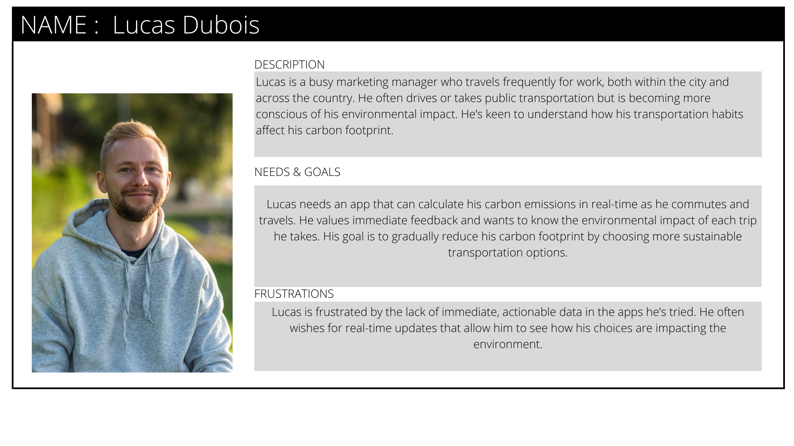
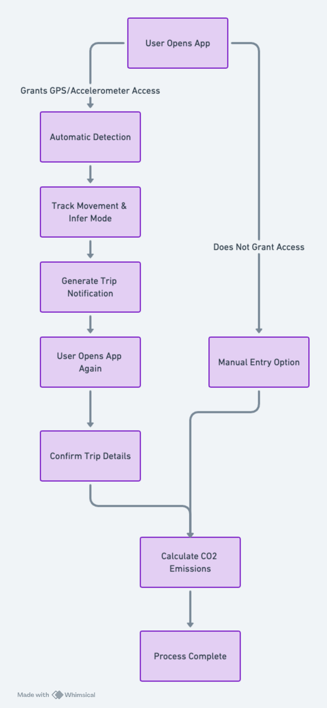
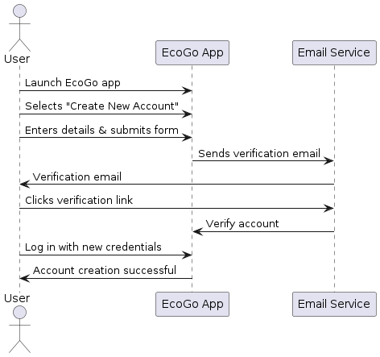

<hr>
<br />
<div align="center">
    
</div>
<br />

<p align="center" style="font-weight: bold; font-size: 21px"> Written Report </p>
<p align="center" style="font-weight: bold; font-size: 18px"> Moonshot Project </p>
<br>
<p align="center"> Thomas Planchard</p>
<br>

<p align="center"> Thomas Planchard. All Rights Reserved. </p>

<hr>

# Table of Contents
1. [Introduction](#introduction)
3. [Survey and Result](#data-collection)
4. [Functional Specification](#functional-specification)
5. [Technical Specification](#technical-specification)


# Introduction

This report serves as a comprehensive document outlining all key aspects of the EcoGo project. It includes an exhaustive description of the project, the results of a survey conducted to identify which features should be included in the app, the functional specifications, and the technical specifications. The technical section further includes algorithm descriptions, the rationale for their use, the application's architecture, the technologies employed, and a brief overview of the testing strategy.

## Project Description

**EcoGo** is a mobile application designed to assist individuals in tracking their carbon emissions, making eco-friendly transportation choices, and ultimately reducing their environmental impact.

The purpose of EcoGo is to raise awareness about the carbon emissions generated by transportation activities and to empower users to make more sustainable travel decisions. By tracking their carbon footprint in real-time, users can visualize the environmental impact of their transportation choices and receive personalized recommendations for reducing emissions.

## Built With

* 
* 
* 

## Survey and Results

The objectives of EcoGo were not selected randomly; they were informed by a survey conducted at the start of the project. This survey was crucial in identifying the most desired features for the app. The survey comprised the following questions:

1. **What is your primary mode of transportation for daily commuting?**
2. **On a scale of 1 to 5, how concerned are you about reducing your carbon footprint?**
3. **Which of the following features would you like to see in a sustainable transportation app? (Please select all that apply)**
4. **How important is it for you to have access to real-time data on ticket availability for public transit?**
5. **Would you be interested in features that provide information on the nearest bike-sharing stations, electric vehicle charging stations, or walking routes?**
6. **Are there any other functionalities you would like to see in a sustainable transportation app that are not listed above?**
7. **How likely are you to use an app that helps you track and reduce your carbon footprint by using sustainable transportation choices?**
8. **What are the main barriers or challenges you face in choosing eco-friendly transportation options?**
9. **Are there any other suggestions or feedback you would like to provide to help us improve the app?**


Here are the results of the survey.

| Time Stamp         | Primary Mode of Transport | Concern Level (1-5) | Desired Features                                                   | Importance of Real-time Data | Interest in Related Features               | Additional Features or Functionality         | Frequency of Use                                 | Barriers to Using Eco-friendly Transport  | Suggestions or Feedback                          |
|--------------------|---------------------------|---------------------|--------------------------------------------------------------------|------------------------------|--------------------------------------------|------------------------------------------------|------------------------------------------------|--------------------------------------------|--------------------------------------------------|
| 5/23/2023 19:34:56 | Walking                   | 4                   | - Gamification features<br>- Carbon footprint calculator           | Not much                     | Yes                                        | 50% reward incentive                          | Probably every day                              | Time and place are deserved                | It seems fine                                     |
| 5/23/2023 19:37:54 | Car                       | 3                   | - GPS tracking and navigation<br>- Carbon footprint calculator<br>- Personalized recommendations<br>- Real-time data on public transit schedules and availability | Essential                     | Yes                                        | Focused ads for eco-friendly purchases         | Not at all                                     | Time-consuming                              | Weather avoidance is helpful                     |
| 5/23/2023 19:39:21 | My car/bus                | 3                   | - Gamification features<br>- Carbon footprint calculator           | Very important               | Not really                                 | Carpooling system idea                        | Every day                                     | Distance                                    | Interesting app concept                            |
| 5/23/2023 19:46:58 | By car                    | 3                   | - GPS tracking and navigation<br>- Carbon footprint calculator<br>- Personalized recommendations<br>- Real-time data on public transit<br>- Integration with carpooling services<br>- Environmental impact information<br>- Gamification<br>- Social sharing | Not much for metropolitan citizens | Yes                                        | Carpooling system idea                        | Every day                                     | Cost                                        | It's interesting but needs further study          |
| 5/23/2023 19:51:24 | Diesel                    | 4                   | - Carbon footprint calculator<br>- Personalized recommendations<br>- GPS tracking and navigation<br>- Real-time data on public transit<br>- Integration with carpooling<br>- Gamification<br>- Social sharing | Very                                | Only if using the transportation mode        | Schedules and/or information on the services   | Probably every day                             | Time of travel, price                       | Nothing specific                                |
| 5/23/2023 19:53:25 | Walking or driving        | 4                   | - Carbon footprint calculator<br>- Personalized recommendations<br>- GPS tracking and navigation<br>- Integration with carpooling<br>- Real-time data on public transit<br>- Social sharing | Important to plan trips in advance | Yes                                        | None                                         | 60-80% useful                                | At the time of travel, the price            | No feedback at the moment                        |
| 5/23/2023 19:53:32 | Car                       | 2                   | - GPS tracking and navigation<br>- Carbon footprint calculator<br>- Personalized recommendations<br>- Real-time data on public transit schedules and availability | Very                                | Only if using the transportation mode        | Focused ads for more eco-friendly purchases    | Not at all                                     | Time of travel, the price                   | Weather avoidance is helpful                     |
| 5/23/2023 19:55:03 | Car                       | 3                   | - GPS tracking and navigation<br>- Personalized recommendations<br>- Carbon footprint calculator<br>- Real-time data on public transit | Very important                 | Yes                                        | Schedules and/or information on services       | Sometimes                                      | Cost, time                                   | Ads should help the user to be greener           |
| 5/23/2023 20:15:41 | Car                       | 1                   | - GPS tracking and navigation<br>- Carbon footprint calculator <br>- Personalized recommendations<br>- Real-time data on public transit<br>- Gamification<br>- Social sharing | High                                | Yes                                        | Schedules and/or information on services       | Not much                                      | Place and availability                       | Include schedules and service information         |
| 5/23/2023 20:59:15 | Car                       | 2                   | - Carbon footprint calculator<br>- Personalized recommendations<br>- Gamification<br>- Social sharing | Medium                              | Yes                                        | No ideas for now                              | Probably often                                 | Schedules and service information           | Emphasize on scheduling and easy use of the app  |
| 5/23/2023 23:05:09 | Car                       | 3                   | - Carbon footprint calculator<br>- Personalized recommendations<br>- GPS tracking and navigation<br>- Real-time data on public transit | Very important                 | Yes                                        | No ideas for now                              | Probably often                                 | Cost, time                                   | Emphasize on scheduling and easy use of the app  |
| 5/25/2023 9:13:19  | Walking                   | 4                   | - GPS tracking and navigation<br>- Carbon footprint calculator<br>- Personalized recommendations<br>- Real-time data on public transit | Very important                 | Unlikely                                  | Focused ads for more eco-friendly purchases    | Unlikely to use                               | Personal effort, distance                   | Useful for green-minded users                     |

## Features

 Based on these insights, along with extensive brainstorming sessions, I developed the following feature set for the app:


1. **Carbon Footprint Tracking:** Users can track their carbon emissions across various transportation modes, including walking, cycling, public transport, carpooling, and driving.
   
2. **Real-time Emission Calculation:** The app calculates carbon emissions in real time, based on GPS data, distance traveled, and the mode of transportation.

3. **GPS Navigation and Transportation Mode Selection:** Users can utilize GPS within the app to select a destination, choose their preferred mode of transportation, and receive guided directions to their destination.

4. **Graphical Representation:** Users can visualize their carbon footprint over time through interactive graphs, providing insights into their environmental impact.

5. **Gamification:** EcoGo introduces gamification by rewarding users with virtual coins for reducing their emissions. These coins can be used to unlock rewards in the in-app store.

6. **In-App Store:** The app features an in-app store where users can redeem coins for discounts and offers on eco-friendly products, carpooling services, and public transportation.

7. **Multi-language Support:** The app will be available in both English and French, catering to a diverse user base.

<br />
<div align="center">
  <h1 align="center">Functional Specification</h1>
  <p align="center">This section outlines the functional requirements of the app.</p>
  </p>
</div>


## 1. Executive Summary

This document specifies the functional requirements of EcoGo, a mobile application designed to empower individuals to track and reduce their carbon dioxide (CO2) emissions through everyday activities.

## 2. Background

The development of EcoGo is driven by the global need for actionable steps towards environmental sustainability. It aims to provide users with real-time data on their emissions, offering a tangible way to measure and reduce their carbon footprint. The development is also motivated by the creation of a project that can be used as a final project for the school.


## 3. Stakeholders
| Role | Description |
|----|----|
| **Project Owner** | Thomas Planchard developing EcoGo as a final project for obtaining a diploma. Responsible for all aspects of the project.|
| **Developers** | Thomas Planchard is responsible for developing the entire source code. |
| **Users** | Individuals who download and use the EcoGo application. |


## 4. Scope

 EcoGo is designed to cater to people who are environmentally conscious and seek actionable insights into reducing their carbon footprint. The application leverages real-time data tracking, gamification elements, and a reward system to foster sustainable behaviors among its users.

### 4.1. Objectives:

1. **Enable Comprehensive Carbon Footprint Tracking**:
   - Provide users with the ability to track carbon emissions across multiple transportation modes, including walking, cycling, public transport, and driving.

2. **Implement Real-Time Emission Calculation**:
   - Calculate carbon emissions in real time using GPS data, transportation mode, and distance traveled, ensuring users have up-to-date information on their environmental impact.

3. **Offer GPS Navigation with Transportation Mode Selection**:
   - Integrate GPS functionality that allows users to select a destination, choose their preferred mode of transportation, and receive guided directions within the app.

4. **Visualize Carbon Footprint Over Time**:
   - Develop interactive graphical tools that enable users to visualize their carbon footprint over time, providing insights into their environmental impact and progress.

5. **Incorporate Gamification to Encourage Sustainable Behavior**:
   - Introduce a gamification system where users earn virtual coins for reducing emissions, enhancing user engagement and promoting sustainable habits.

6. **Establish an In-App Store for Eco-Friendly Rewards**:
   - Create an in-app store where users can redeem earned coins for discounts and offers on eco-friendly products, carpooling services, and public transportation options.

7. **Support Multi-Language Accessibility**:
   - Ensure the app is available in both English and French to accommodate a diverse user base.
  

## 5. Target Audience:

**Persona 1 -Sarah Thompson:**


**Persona 2 -Lucas Dubois:**




**Persona 3 -Emily Roberts:**


**Persona 4 -Thomas Müller:**


**Persona 5 -Aisha Khan:**


**Persona 6 -Mark Johnson:**


  

## 6. Exclusions:
- The initial release of EcoGo will focus exclusively on iOS devices, with 
  plans for Android and other platforms considered for future updates. The main reason for that is to develop the app as fast as possible and to be able to present it as a final project for the school.

- The scope will initially concentrate on tracking emissions from 
  one or two primary transportation modes, such as driving and cycling, 

- The application will not support store offers, the gamification system and the multi-language support in the
  initial version; these features are considered superficial for the first version.


## 7. Glossary

| Term                             | Definition                                                                                                                          |
|----------------------------------|-------------------------------------------------------------------------------------------------------------------------------------|
| **CO2 (Carbon Dioxide)**         | A colorless, odorless gas produced by burning carbon and organic compounds and by respiration. It is naturally present in the air and is absorbed by plants in photosynthesis.|
| **GPS (Global Positioning System)** | A satellite-based radio navigation system owned by the United States government and operated by the United States Space Force which provides geolocation and time information.  |
| **UI (User Interface)**          | The space where interactions between humans and machines occur. The goal of this interaction is to allow effective operation and control of the machine from the human end.      |
| **MVP (Minimum Viable Product)** | A product with just enough features to attract early-adopter customers and validate a product idea early in the product development cycle.                                   |
| **React Native**                 | An open-source mobile application framework created by Facebook used to develop applications for Android, iOS, Web, and UWP by enabling developers to use React along with native platform capabilities.|
| **TypeScript**                   | An open-source programming language developed and maintained by Microsoft. It is a strict syntactical superset of JavaScript and adds optional static typing to the language.    |
| **Expo framework**               | An open-source platform for making universal native apps for Android, iOS, and the web with JavaScript and React.                                                        |
| **Firebase**                     | Google's mobile application development platform that helps developers build, improve, and grow their app. The platform includes functionalities like analytics, databases, messaging and crash reporting. |
| **Firestore**                    | A flexible, scalable database for mobile, web, and server development from Firebase and Google Cloud Platform. It's a NoSQL database service for storing, syncing, and querying data.|
| **NoSQL database**               | A mechanism for storage and retrieval of data that is modeled in means other than the tabular relations used in relational databases. Such databases have existed since the late 1960s.|
| **TLS (Transport Layer Security)**| A cryptographic protocol designed to provide communications security over a computer network. It's widely used for internet communications and online transactions.                 |
| **GDPR (General Data Protection Regulation)** | A regulation in EU law on data protection and privacy in the European Union and the European Economic Area. It also addresses the transfer of personal data outside the EU and EEA areas.  |
| **DPI (Dots Per Inch)**          | A measure of spatial printing, video or image scanner dot density, in particular the number of individual dots that can be placed in a line within the span of 1 inch (2.54 cm).    |
| **API (Application Programming Interface)** | A set of functions and procedures allowing the creation of applications that access the features or data of an operating system, application, or other service.                      |
| **2FA (Two-Factor Authentication)** | A security process in which the user provides two different authentication factors to verify themselves. This process is done to better protect both the user's credentials and the resources the user can access. |
| **SCC (Standard Contractual Clauses)** | Legal contracts designed to ensure that companies protect personal data when transferred outside the European Economic Area to countries which do not have an adequacy decision.     |

## 8. Functional Requirements

### 8.1. User Roles and Permissions

- **User:** Can create an account, log in, track emissions, view statistics, earn and spend coins, and receive offers.


### 8.2. Features and Functionality

####  8.2.1. Account Creation and Management
- Users can create an account using their email address, setting up a password and profile information (name, surname, picture).


####  8.2.2. Dashboard
- Presents current carbon footprint statistics, steps (number), calories burnt (kcal), distance traveled (km) and coins earned.
- Displays offers based on user activity and location. Those offers will be in partnership with eco-responsible brands and regional services. The user will be able to see the offers only if he is in the region where the offer is available. Nevertheless, this feature will be simulated in the first version of the app.

- The dashboard will be the first screen that the user will see when he opens the app.


####  8.2.3. Activity Tracking

Activity Tracking is a core feature of the application, serving as the primary data source for CO2 emission calculations. Two choices will be submitted to the user: automatic detection and manual entry.

- **Automatic Detection:** By granting the app access to the device's GPS and accelerometer, the app can automatically detect and track the user's movement. This feature allows the app to intelligently infer the mode of transportation used and calculate the distance traveled. Automatic tracking is crucial for users who prefer the app to passively monitor their travel and calculate emissions without manual input.

- **Manual Entry:** Users also have the option to manually enter their transportation mode and trip duration. This functionality caters to users who may prefer or need to input their travel details directly, offering flexibility and ensuring that all users can accurately track their carbon footprint regardless of their preference for automatic detection.

Upon detecting a trip, the application generates a pop-up notification the next time the user opens the app. This notification confirms the details of the trip, such as duration (e.g., 20 minutes), distance traveled (e.g., 20 km), and the estimated CO2 emissions (e.g., 30 kg CO2). The user is prompted to confirm these details, ensuring tracking and awareness of their carbon footprint on each trip. 


####  8.2.4. Emission Calculation
The emission calculation forms the core of the application. This function operates by:

- **Accurate CO2 Emission Estimation**: 
EcoGo calculates CO2 emissions by looking at how users travel and how far they go. To keep things simple and accurate, the app focuses on common ways people get around in cities: subway, bus, bicycle, walking, and car. This choice helps make sure the app's emission calculations are reliable. Whether users let the app automatically track their movement or they enter their travel details by hand, EcoGo sticks to these five modes of transport. This way, the app gives users straightforward and useful information about their carbon footprint.

- **Simplified Vehicle Model Consideration**: The primary goal is to accurately calculate the carbon footprint of your trips, rather than covering every vehicle model available. Therefore, the app will categorize vehicle options into broad types: electric, gasoline, SUV, city car, and saloon. This approach simplifies the process of estimating CO2 emissions based on the type of vehicle used for travel.


#####  ➭ Calculating System Carbon Emissions (Car)
Calculating System CO2 emissions for car travel involves understanding the amount of fuel the car consumes and then converting that fuel consumption into CO2 emissions. The calculation can vary depending on the type of fuel (e.g., gasoline, diesel, electric) and the vehicle's efficiency. Here's a basic approach for gasoline and diesel vehicles:

---

**Step 1: Determine Fuel Consumption**
First, the app will have to know the car's fuel consumption, typically measured in liters per 100 kilometers (L/100km) or miles per gallon (MPG). This information can often be found in the vehicle's manual or manufacturer's website. The consumption should be asked in the app when the user enters the car's details at the creation of the account.

---

**Step 2: Calculate Fuel Used**
Based on the distance traveled, calculate how much fuel the car used for the trip. For instance, if a car has a fuel efficiency of 8 L/100km and the trip is 100km long, the car used 8 liters of fuel. The formula for this calculation is:  
*Fuel Used (liters) = (Distance Traveled (km) / 100) x Fuel Efficiency (L/100km)*

---

**Step 3: Convert Fuel to CO2 Emissions**
Different types of fuel emit different amounts of CO2 per liter burned. On average, burning 1 liter of gasoline produces about 2.31 kg of CO2, while 1 liter of diesel produces about 2.68 kg of CO2. The app will use these emission factors to convert fuel consumption into CO2 emissions. The formulas for this conversion are:

*CO2 Emissions (kg)=Fuel Used (liters)×CO2 Emission Factor*

- For gasoline: *CO2 Emissions (kg)=Fuel Used (liters)×2.31*
- For diesel: *CO2 Emissions (kg)=Fuel Used (liters)×2.68*

##### ➭ Calculating System Carbon Emissions (Electric Car)
For electric vehicles (EVs), the calculation is different and generally involves the following steps:

1. **Electricity Consumption:** Determine how much electricity (in kilowatt-hours, kWh) the vehicle consumes per 100 kilometers or per mile. Same as for gasoline cars, this information should be asked when the user enters the car's details at the creation of the account.
2. **Electricity Source Emissions:** Calculate the CO2 emissions associated with generating the consumed electricity. This varies greatly depending on the energy mix of the grid (coal, natural gas, renewable energy sources, etc.) and can be expressed as kg of CO2 per kWh. As we can't know the exact source of electricity, the app will use the main sources of electricity in the country where the user is located. At first, the app will only focus on France, so it will be the nuclear energy that will be used as the main source of electricity.
   
   Here is the table of the C02 emissions by the factor of electricity source:

   | Electricity Sources | CO2 Emission Factor (g/kWh) 
   | --- | --- 
   | Nuclear | 12g of CO2 by kW|
   |Hydraulics | 24g of CO2 by kWh|
   |Gas| 490g of CO2 by kWh|
   |Wind power | 11g of CO2 by kWh|
   |Solary | 41-48 g of CO2 by kWh|
   |Bioenergy (biomass) | 230g of CO2 by kWh|
   |Coal | 820g of CO2 by kWh|


1. **Total Emissions:** Multiply the electricity consumed by the CO2 emissions factor of the electricity source.
   
   *CO2 Emissions (kg)=Electricity Consumed (kWh)×CO2 Emission Factor of Electricity Source*

---

##### ➭ Calculating System Carbon Emissions (Bus, Bicycle, and Subway)

1. **Bus:** The average CO2 emission factor for a bus is approximately **0.101 kg** CO2 per passenger kilometer. This factor can vary based on the bus type, occupancy, and fuel efficiency. However, the average value provides a reasonable estimate for emission calculations.

2. **Regular Bicycle:** Cycling is considered a zero-emission mode of transport. However, considering the food energy required by a cyclist and the carbon intensity of food production, a very small emission factor, such as **0.021 kg** CO2 per kilometer, can be used for a more comprehensive analysis.

3. **Subway:** The average CO2 emission factor for subway transport varies widely based on the electricity generation mix of the region. A general estimate is around **0.06 kg** CO2 per passenger kilometer.

---

#### 8.2.5. GPS Navigation and Transportation Mode Selection

1. **Accessing the GPS Navigation:**
   - The GPS is activated when the user clicks on the central button located in the app's footer.
   - Upon activation, the user is initially presented with a loading animation while the map is being downloaded. 

2. **Destination Input:**
   - Once the map is displayed, the user can click on a text input area at the bottom of the screen to enter their destination.
   - As the user begins typing, the app provides real-time suggestions based on the entered text, displaying these suggestions in a list below the input field.
   - The user can then select their desired destination from this list, which will update dynamically as they type.

3. **Transportation Mode Selection:**
   - After the destination is selected, a pop-up window appears, presenting the user with four transportation modes: Cycling, Driving, Public Transport, and Walking.
   - These modes were selected based on their global prevalence and usage, as supported by [statistical data](https://fr.statista.com/statistiques/1320820/modes-transport-courte-distance-monde/).
   - For each transportation mode, the pop-up displays the following information:
     - **Distance**: The total distance to be traveled in kilometers.
     - **Time**: The estimated travel time in hours and minutes.
     - **Carbon Footprint**: The estimated CO2 emissions associated with each mode, helping users understand the environmental impact of their choice.
   - If a particular transportation mode is unavailable for the selected route, the corresponding data fields will be marked as "Not Available," and the user will not be able to select that mode.

4. **Previewing the Route:**
   - Before confirming their choice, users can preview the route on the map by selecting one of the transportation modes. The route is highlighted on the map with a blue line, allowing the user to see the entire path from start to destination.

5. **Confirming the Transportation Mode:**
   - Once the user selects a transportation mode and reviews the information, they can confirm their choice by clicking the "Confirm" button on the pop-up.
   - Upon confirmation, the navigation system is activated, guiding the user to their destination.

6. **Navigation Interface:**
   - **Top of the Screen**:
     - The top section displays the next instruction, including a directional arrow, street name, and the distance to the next turn or action in meters.
   - **Bottom of the Screen**:
     - This section shows the estimated arrival time, remaining travel time, and remaining distance.
   - **On-Screen Map**:
     - The user's current location is indicated by a blue marker.
     - The entire route is shown with a blue line, helping users easily identify the path they need to follow.
     - A button to re-center the map on the user's location is available, allowing users to manually adjust the map view if they move it with their fingers.
   - **Real-Time Carbon Footprint Calculator**:
     - A real-time display of the carbon footprint generated by the selected transportation mode is shown. This data is continuously updated based on the user's progress along the route, providing immediate feedback on the environmental impact of their journey.


**Mimicking System for Real-World Testing**

Due to the app being fully developed on iOS, testing the app in real-world conditions presents a significant challenge. To address this, a parallel system will be developed to mimic user behavior during navigation.

**System Overview:**
 -	Once the user has selected a destination and confirmed their transportation mode, the mimic system will initiate a simulated journey.
 -	This system will automatically follow the predefined path, updating the iPhone’s location data to replicate real-time movement.

**Purpose:**
  -	The mimic system is designed to facilitate thorough testing of the navigation feature in controlled environments, ensuring all aspects of the app’s functionality perform as expected.
  - This system will also be instrumental in stress-testing the app’s performance under different scenarios, providing critical insights that inform further development and optimization.
	
**Technical Details:**
   - The detailed implementation of this mimic system, including how it interfaces with the navigation and GPS features, will be outlined in the technical specification.


--- 

####  8.2.6. Rewards System

Within the app, users accumulate coins as a reward for reducing their carbon footprint. The reward system is structured around several key criteria that directly relate to eco-friendly behaviors and choices:

1. **Eco-Friendly Transportation Choices:** Users earn coins for selecting sustainable transportation methods. Walking, cycling, and using public transit are prioritized over personal gasoline vehicles, with rewards scaled according to the eco-friendliness of the mode chosen.

2. **Travel Distance in Eco-Mode:** Coins are awarded based on the distance traveled using green transportation options. 

3. **CO2 Savings:** The app calculates the CO2 emissions saved by opting for a greener transportation mode instead of a conventional gasoline vehicle. Users receive coins proportional to the amount of CO2 they save, making a direct connection between rewards and environmental benefits.

4. **Completion of Eco-Challenges:** The app introduces daily or weekly eco-challenges, such as avoiding the use of personal gasoline vehicles for a day. Completing these challenges earns users additional coins, promoting engagement and continuous eco-conscious behavior.

5. **Consistent Eco-Friendly Actions:** Bonus coins are awarded for maintaining consistent sustainable behaviors over set periods, such as using public transportation or biking for several consecutive days. This system aims to foster long-term commitment to reducing one’s carbon footprint.


##### ➭ Coin Allocation

1. **Eco-Friendly Transportation Choices:**
   - Walking or Cycling: Earn 10 coins for every kilometer.
   - Public Transit: Earn 5 coins for every kilometer.
   - Note: These values incentivize the most sustainable options, with higher rewards for zero-emission choices.

2. **Travel Distance in Eco-Mode:**
   - For every 5 kilometers traveled by eco-friendly transportation in a single trip, users earn an additional 10 bonus coins.

3. **CO2 Savings:**
   - Calculating CO2 savings compared to driving a gasoline car: Earn 1 coin for every kilogram of CO2 saved.
   - Example: If choosing public transit over a personal car for a 10km trip saves 2kg of CO2, the user earns an additional 2 coins.

4. **Completion of Eco-Challenges:**
   - Daily Challenge (e.g., No Car Day): 50 coins.
   - Weekly Challenge (e.g., Use Public Transit 5 times in a week): 100 coins.

5. **Consistent Eco-Friendly Actions:**
   - Consistent use of eco-friendly transportation for a week: 100 bonus coins.
   - Consistent use for a month: 500 bonus coins.

##### ➭ Adjustments and Flexibility

- The number of coins awarded for each action is designed to encourage the use of the most sustainable transportation options available and to reward users for making significant contributions to reducing their carbon footprint.
- This reward system is subject to adjustments based on user feedback, the app's economic model, and the overarching goal of promoting sustainable behaviors. Future updates may refine coin values to better align with these objectives, ensuring the system remains effective and motivating for users.


#### 8.2.7. EcoGo Store

The EcoGo Store is a virtual marketplace within the app, showcasing offers from eco-conscious brands and restaurants. Users can spend their earned coins to redeem discounts and vouchers, engaging directly with businesses that share EcoGo's commitment to sustainability.

While the implementation of this feature in the current version will be simulated, due to its status as a school project. 


#### 8.2.8. User Settings

- **Account Management:** Users can update their account details. 
  - **Profile Updates:** Users can modify their profile information, such as name, surname, profile picture, and contact details.

  - **Password Changes**: For security purposes, users can change their password directly within the app.
    1. **Initiating Password Change:** When a user decides to change their password, they can start this process directly within the app by navigating to the User Settings section and selecting the option to change their password.

    2. **Email Verification for Identity Confirmation:** To ensure the security of the password change process and confirm the user's identity, the EcoGo app automatically sends an email to the user's registered email address. This email contains a verification link or code as a security measure to prevent unauthorized access to the user’s account.

    3. **Verification Process:** Upon receiving the email, the user must click the verification link or enter the provided code within the app. This step is crucial as it verifies the user's intent to change their password and confirms their identity, adding an extra layer of security.

    4. **Entering the New Password:** Once their identity has been confirmed through the verification process, the user is prompted to enter a new password. The app may also offer guidelines for creating a strong password, such as using a mix of letters, numbers, and special characters.

    5. **Confirmation and Completion:** After the user sets a new password, the app confirms that the password has been successfully changed. The user can now log in to the EcoGo app using their new password.


  - **Email Preferences**: Users have the option to opt-in or opt-out of receiving email notifications in several categories:
  
    1. **New Offers in the Store:** Users can choose to be notified via email when new discounts, vouchers, or partnerships are available in the EcoGo store.

    2. **Challenge Completion:** When users complete a challenge, they can receive an email congratulating them on their achievement and detailing the rewards earned.

    3. **Coin Milestones:** Emails can alert users when they have accumulated a significant amount of coins. This notification will be sent when users reach specific coin thresholds, such as 100, 500, and 1000 coins.
  
    - **Email Notification Example:**
      ---

      **Subject:** EcoGo Update: Congratulations on Completing a Challenge!

      **Body:**

      Hello [User Name],

      You've achieved something amazing! By completing the [Name of Challenge], you've taken another step towards a more sustainable lifestyle. 

      **Rewards Earned:** You've earned [Number] coins! 🎉

      Don't forget to check out the EcoGo store for eco-friendly offers where you can redeem your coins. Plus, new offers have just been added that you won't want to miss.

      Keep up the great work, and let's continue making a difference together!

      Best,
      The EcoGo Team

      ---

     4. **Unsubscribe Option:** Each email includes an easy unsubscribe link, allowing users to adjust their preferences at any time and maintain control over the types of email notifications they wish to receive.

  - **Transportation Preferences**: Given the app's focus on sustainable transportation, users can specify their preferred modes of transport.

    - **Preference Selection:** Users can select their preferred transportation methods from a list that includes options like walking, cycling, public transit, electric vehicles, and more. This selection informs the app about the user's typical modes of transport.

      **Flexible Preference Management:**

    - **Easy Updates:** Recognizing that users' transportation needs and preferences can change over time, EcoGo ensures that updating these preferences is straightforward and intuitive. Users can revisit their settings at any time to adjust their preferred modes of transportation.

    - **Responsive App Experience:** As users modify their preferences, the app immediately responds by updating the content, challenges, and rewards to match the new preferences. 


- **Notification Preferences Detail**

  **Initial Notification Setup:**

  - **Permission Request:** Upon first use of the app, EcoGo requests permission to send notifications to the user's phone.
  
  - **Authorization:** Users have the option to grant or deny this permission based on their comfort and desire to receive notifications. Granting permission is essential for the app to deliver timely updates and information relevant to the user.

  **Customizing Notification Preferences:**

  - **In-App Settings:** Initially, if permission is granted, EcoGo will send notifications based on standard settings. Users can then fine-tune their notification preferences directly within the app, choosing what types of alerts they wish to receive, such as challenge updates, reward notifications, or eco-tips.

  - **Device Settings Adjustment:** Users also have the flexibility to modify EcoGo's notification settings at any time through their phone's system settings.

  - **Opting Out:** Users who prefer not to receive any notifications from EcoGo can opt-out entirely by disabling notifications in their device settings. This option ensures that users have full control over their notification experience.

    
- **Privacy Controls:** In line with GDPR requirements, users can manage their privacy settings, including opting in or out of data-sharing features. This aspect will be developed in the [Security](#52-security) section of this document.
 

### 8.3. Use Cases

- **Use Case 1: User Account Creation**

  **Actors:**
  - User

  **Preconditions:**
  - The user has installed the EcoGo app on their iOS device.

  **Main Flow:**
  1. The user launches the EcoGo app and selects the option to create a new account.
  2. The user enters their email address, name, surname, and chooses a password. Optionally, they can upload a profile picture.
  3. The user submits the account creation form.
  4. The EcoGo app sends a verification email to the user's provided email address.
  5. The user clicks the verification link in the email to activate their account.
  6. The user logs in to the EcoGo app with their new credentials.

  **Postconditions**:
  - The user has successfully created and verified their EcoGo account.

  

---

- **Use Case 2: Carbon Footprint Tracking**

  **Actors:**
  - User

  **Preconditions:**
  - The user has an active EcoGo account.
  - The GPS and accelerometer permissions are granted.

  **Main Flow:**
  1. The user starts a trip using their preferred mode of transportation (e.g., walking, cycling).
  2. The EcoGo app automatically detects the trip start through GPS and accelerometer data (for automatic detection) or the user manually starts the trip in the app (for manual entry).
  3. During the trip, the app continuously tracks the distance traveled.
  4. At the trip's end, the app calculates the CO2 emissions based on the distance and mode of transportation.
  5. The app displays the CO2 emissions for the trip and updates the user's daily, weekly, and monthly statistics.

  **Postconditions:**
  - The user's carbon footprint data is updated based on the latest trip.

  


---

- **Use Case 3: Redeeming Rewards in the EcoGo Store**

  **Actors:**
  - User

  **Preconditions:**
  - The user has accumulated coins through eco-friendly activities.

  **Main Flow:**
  1. The user navigates to the EcoGo Store within the app.
  2. The user browses available offers from eco-responsible brands and restaurants.
  3. The user selects an offer they wish to redeem.
  4. The app displays the cost in coins and asks the user to confirm the redemption.
  5. The user confirms, and the coins are deducted from their account.
  6. The app displays a voucher or discount code for the redeemed offer.

  **Postconditions:**
  - The user has successfully redeemed coins for an offer in the EcoGo Store.

  

--- 

- **Use Case 4: Modifying Notification Preferences**

  **Actors:**
  - User

  **Preconditions:**
  - The user has an active EcoGo account.

  **Main Flow:**
  1. The user navigates to the User Settings section in the EcoGo app.
  2. The user selects Notification Preferences.
  3. The app displays options for various types of notifications (e.g., new store offers, challenge completions, coin milestones).
  4. The user toggles their preferences for each notification type.
  5. The user saves their preferences.

  **Postconditions:**
  - The user's notification preferences are updated according to their selections.


  

---

- **Use Case 5: Updating Transportation Preferences**

  **Actors:**
  - User

  **Preconditions:**
  - The user has an active EcoGo account and is logged into the app.

  **Main Flow:**
  1. The user navigates to the User Settings section and selects "Transportation Preferences."
  2. The user views their current preferences and selects options to update their preferred modes of transport (e.g., electric, gasoline, SUV, city car, saloon).
  3. The user saves their updated preferences, which the app confirms.
  4. EcoGo updates the user's profile and tailors future challenges and rewards based on the new preferences.

  **Postconditions:**
  - The user's transportation preferences are updated, affecting future app interactions and personalized suggestions.

  

---

- **Use Case 6: Manual Entry of Transportation Mode and Trip Details**

  **Actors:**
  - User

  **Preconditions:**
  - The user chooses not to enable automatic detection or wishes to enter a trip not captured by the app.

  **Main Flow:**
  1. The user selects the option to manually add a trip from the dashboard.
  2. The user selects the mode of transportation used and inputs details such as distance traveled and trip duration.
  3. The app calculates the CO2 emissions based on the entered details and updates the user's carbon footprint statistics.
  4. The user reviews and confirms the trip details and CO2 emission estimate.

  **Postconditions:**
  - The app records the manually entered trip, including it in the user's carbon footprint data.

  


---

- **Use Case 7: Choose and Confirm The Transportation Mode**

  **Actors:**
  - User

  **Preconditions:**
  - The user is about to start a trip and needs to select the mode of transportation.

  **Main Flow:**
  1. The user opens the EcoGo app and selects the option to start a new trip.
  2. The app prompts the user to choose the mode of transportation from a list of options (e.g., walking, cycling, public transit, car).
  3. The user selects the preferred mode of transportation.
  4. The app displays a confirmation screen with the selected mode and asks the user to confirm.
  5. The user confirms the selected mode, and the app begins tracking the trip.

  **Postconditions:**
  - The user's trip is successfully initiated with the selected mode of transportation.

  


---

- **Use Case 8: Requesting Personal Data**

  **Actors:**
  - User

  **Preconditions:**
  - The user wants to review the personal data EcoGo has collected on them, in compliance with GDPR.

  **Main Flow:**
  1. The user accesses the User Settings menu and selects the option to request their personal data.
  2. The app explains the process and asks the user to confirm their request.
  3. The user confirms, and the app initiates the process to compile the user's personal data.
  4. Once ready, EcoGo sends the user an email with a link to download their data in a machine-readable format.

  **Postconditions:**
  - The user receives access to their personal data collected by EcoGo, enhancing transparency and trust.

  

---

- **Use Case 9: Deleting Account and Associated Data**

  **Actors:**
  - User

  **Preconditions:**
  - The user decides to stop using EcoGo and wants to remove their account and all associated data.

  **Main Flow:**
  1. The user navigates to the User Settings section and selects the option to delete their account.
  2. The app displays a warning about the permanence of this action and asks for confirmation.
  3. The user confirms their decision to delete the account.
  4. EcoGo permanently removes the user's account and all associated personal data from its servers, in compliance with GDPR.

  **Postconditions:**
  - The user's account and all related data are permanently deleted, fulfilling the user's right to erasure.

  


## 9. Non-Functional Requirements

###  9.1. Performance

Performance objectives are structured around responsiveness, efficiency, and reliability to ensure a seamless experience for all users.

#### 9.1.1. User Interface (UI) Responsiveness

- **Adaptive UI Scaling:** The goal is to deliver a consistent and accessible experience for users on screens of any size, from small smartphones to large tablets.

    - **Screen Size and Resolution:** The application interface is designed to be responsive to a wide range of screen sizes, from a minimum of 4 inches to over 12 inches for tablets, covering resolutions from 640x1136 (iPhone SE) to 2796 x 1290 pixels (iPhone 15 Pro Max) and equivalent Android devices. 
    
    - **Density Independence:** UI elements are scaled based on screen density (measured in dots per inch, DPI) to ensure that text, icons, and interactive elements maintain their intended size and legibility. The app supports DPI settings from low (120 DPI) to extra-extra-extra-high (640 DPI), accommodating virtually all modern smartphones and tablets.
    
    - **Layout Flexibility:** The app utilizes a flexible grid layout that adapts to the screen size, ensuring that content is presented in an organized manner without overcrowding or truncation. This approach includes dynamic resizing and repositioning of UI components based on the device's aspect ratio and orientation (portrait or landscape).
    
    - **Font Scaling:** Text sizes are dynamically adjusted based on the user's screen size and system font size preferences, ensuring readability across all devices. This includes implementing scalable units (such as 'sp' for fonts in Android and Dynamic Type in iOS) that respond to user and system settings.
    
    - **Touch Target Size:** Interactive elements are designed with ample touch targets, adhering to the minimum recommended size of 44x44 points, to ensure ease of interaction regardless of the device's screen size or the user's finger size.

- **Frame Rate Consistency:** The application is designed to maintain a consistent frame rate that matches the maximum refresh rate of the user's device display.

  - **Target Frame Rates:** The app aims for a standard frame rate of 60 frames per second (FPS) on devices with standard 60Hz screens, which encompasses the majority of smartphones and tablets. For devices equipped with higher refresh rate displays, such as 90Hz, 120Hz, or even 144Hz screens. The app adjusts its frame rate to match the device's capabilities, ensuring a fluid and visually appealing experience.
  
  - **Adaptive Frame Rate Adjustment:** In scenarios where maintaining the maximum frame rate is not feasible due to complex animations or high processing requirements, the app employs adaptive frame rate strategies. This approach adjusts the frame rate dynamically to ensure the smoothest possible experience without compromising device performance or significantly draining the battery.
  
  - **Monitoring and Testing:** Continuous performance monitoring and benchmarking are integral to the app's development process. Real device testing across a diverse range of screen refresh rates and specifications ensures that frame rate consistency is maintained. Adjustments and optimizations are made based on real-world usage data and feedback.
  
  - **User-Centric Design:** Recognizing that a smooth visual experience is crucial to user satisfaction, the app prioritizes frame rate consistency not only as a technical goal but also as a core aspect of user-centric design. This commitment to performance ensures that users experience the benefits of a responsive interface, regardless of their device's specifications.
   

#### 9.1.2. Scalability

- **Objective:** Strategically scale the application to efficiently manage an expanding user base and increasing data volumes. Initially targeting a smaller audience for product testing, the system is architected to transition to accommodate larger user groups as adoption grows.

  - **Initial User and Data Volume Projections:** The app is initially designed to support up to 1,000 active users, with the expectation of handling data transactions and interactions typical of a user base engaged in daily activity tracking, emissions calculations, and interaction with the rewards system.

  - **Data Management Strategies:** Implementing efficient data storage and retrieval mechanisms, such as indexing and caching, is crucial for handling growing volumes of user-generated data. For the initial phase, a NoSQL database provides flexibility and scalability to accommodate the varied data types and structures inherent to activity tracking and user profiles.

  - **Load Balancing:** A load balancer is deployed to distribute incoming app traffic and data processing requests across multiple servers, preventing any single server from becoming a bottleneck. This is essential for maintaining application responsiveness as the number of simultaneous users increases.


###  9.2. Security

 Implementing robust security measures to protect user information from unauthorized access, alteration, and destruction. Our approach encompasses secure authentication practices, data encryption, compliance with GDPR standards, and regular security assessments.

#### 9.2.1. Secure Authentication

- **Authentication Mechanisms:** EcoGo integrates Firebase Authentication to manage user sign-ins and identity verification efficiently. This service supports various authentication methods, including email and password, social media accounts, and phone authentication, providing flexibility and ease of use for our users. For the initial version, email and password authentication will be the primary method.
- **Password Management:** Through Firebase Authentication, passwords are securely hashed and salted using industry-standard cryptographic algorithms, ensuring they are never stored in plaintext. Firebase enforces strong password practices, requiring passwords to meet specific length and complexity criteria. Additionally, users can reset their passwords securely through email verification.
- **Two-Factor Authentication (2FA):** For users seeking additional security, EcoGo, via Firebase, offers the option to enable two-factor authentication. This added security layer requires users to verify their identity through a secondary method upon login, significantly reducing the risk of unauthorized access.

#### 9.2.2. Data Encryption

- **Data In Transit:** EcoGo ensures that all data transmitted between the user's device and Firebase servers is encrypted using TLS (Transport Layer Security). This encryption protects users' data from being intercepted by unauthorized parties.
  
- **Data At Rest:** Firebase securely encrypts sensitive data at rest, including personal information and usage data stored within Firebase's databases. Utilizing advanced encryption algorithms, Firebase provides a secure storage solution that protects against data breaches and unauthorized access.

#### 9.2.3. Compliance and Data Protection

- **Firebase and GDPR:** Firebase's infrastructure and services are designed to comply with the General Data Protection Regulation (GDPR) and other relevant privacy laws. EcoGo benefits from Firebase's commitment to data protection and privacy, ensuring that user data is handled in compliance with legal standards.
- **User Data Management:** Users can manage their data directly within the app. This includes options to access, update, or delete their personal information, in line with GDPR rights. All user data management actions are facilitated through Firebase's secure backend services, ensuring transparent and secure data handling practices.
- **Data Processing Agreement (DPA):** Firebase includes data processing terms that detail the obligations and responsibilities regarding data protection and security. This ensures that data processing on behalf of EcoGo adheres to GDPR standards, with Google acting as a data processor.
- **Compliance with Data Transfer Regulations:** Firebase uses Standard Contractual Clauses (SCCs) for international data transfers, aligning with GDPR requirements. This ensures that user data is protected according to European Union standards, even when data is transferred outside the EU.

#### 9.2.4. GDPR Compliance

EcoGo is fully committed to complying with the General Data Protection Regulation (GDPR) to protect the privacy and security of our users within the European Union and beyond. Key aspects include:

- **Data Minimization:** We collect only the data necessary for the purposes stated in our Privacy Policy.
- **User Consent:** Explicit consent is obtained for the collection and processing of personal data, with clear options for users to opt-in or opt-out.
- **Right to Access and Erasure:** Users have the right to access their data and request its deletion. EcoGo provides mechanisms for users to exercise these rights easily.
- **Data Portability:** Users can request a copy of their data in a structured, commonly used, and machine-readable format.
- **Privacy by Design:** EcoGo incorporates privacy into the development and operation of our services, ensuring that user data protection is a core consideration.

#### 9.2.5. Privacy Policy for EcoGo

Welcome to EcoGo! We are committed to protecting your privacy and ensuring you have a positive experience on our app. This Privacy Policy outlines how we collect, use, share, and protect your information when you use our services.

###### ➭ Information We Collect

**a. Personal Information:** When you create an account with EcoGo, we collect personal information such as your name, email address, and profile picture. This information is essential for providing you with personalized services.

**b. Usage Data:** We collect data about how you use our app, including your transportation modes, distances traveled, and interactions with the app. This helps us improve EcoGo and tailor it to your needs.

**c. Location Data:** With your permission, we collect precise location data from your device to accurately track your transportation activities and calculate your carbon footprint.

###### ➭ How We Use Your Information

We use the information we collect to:

- Provide, maintain, and improve our services.
- Personalize your experience and tailor recommendations.
- Communicate with you about updates, support, and promotional offers.
- Monitor and analyze trends, usage, and activities.
- Ensure the security and integrity of our app.

###### ➭ Sharing Your Information

We do not share your personal information with third parties except in the following circumstances:

- **Service Providers:** We may share information with vendors and service providers who support our business, such as cloud hosting and analytics services.
- **Compliance and Protection:** If required by law or to protect our rights, we may disclose information about you. This includes responding to legal processes or to prevent fraud and abuse.
- **With Your Consent:** We may share information with other parties when we have your explicit consent to do so.

###### ➭ Data Security

EcoGo employs a range of security measures designed to protect your personal information from unauthorized access and disclosure. While we strive to use commercially acceptable means to protect your information, please be aware that no security measures are entirely foolproof.

###### ➭ Your Rights

You have the right to access, correct, delete, or transfer your personal information. You can also object to or restrict certain processing of your data. These rights can be exercised through the app's settings or by contacting us directly.

###### ➭ International Data Transfers

EcoGo is based on Firebase, a Google service, which means your information may be processed on servers located outside of your country. We ensure that international data transfers comply with applicable laws and regulations, including GDPR.

###### ➭ Changes to This Privacy Policy

We may update our Privacy Policy from time to time. We will notify you of any changes by posting the new Privacy Policy on this page and updating the "Effective Date" at the top.

###### ➭ Contact Us

If you have any questions or concerns about this Privacy Policy or our data practices, please contact us at:

- Email: ecogo@gmail.com

Your privacy is of utmost importance to us, and we are committed to protecting it as we empower you to reduce your carbon footprint with EcoGo.


### 9.3. Market Analysis: Competitors and Differentiators

####  9.3.1. Market Landscape

Upon thorough analysis, it appears that no direct competitors are occupying the niche of individual carbon footprint tracking combined with a gamification strategy. While various apps focus on aspects of environmental awareness and sustainability, none offer a direct comparison to EcoGo.
While EcoGo focuses on individual carbon footprint tracking, numerous companies and platforms target carbon footprint management and sustainability efforts at the corporate or organizational level. Here’s a list of some notable companies in this space:


| Company Name       | Country of Origin | Selling Points                                                                                                                                                      | Logo |
|--------------------|-------------------|----------------------------------------------------------------------------------------------------------------------------------------------------------------------|------|
| Carbon Trust       | UK                | Specializes in helping organizations, governments, and businesses reduce their carbon emissions and become more resource-efficient.                                  |  |
| Sustainalytics     | Netherlands       | Offers environmental, social, and governance (ESG) research and ratings, focusing on sustainable investment strategies.                                              |  |
| South Pole         | Switzerland       | Provides solutions for businesses to achieve sustainability goals, including carbon offsetting, renewable energy procurement, and climate strategy consulting.         |  |
| Schneider Electric | France            | Offers energy and sustainability services that include carbon footprint analysis, renewable energy procurement, and sustainability reporting for businesses.           |  |
| ENGIE Impact       | USA               | Delivers sustainability solutions and services to corporations and governments to accelerate their transformation to a sustainable future.                           |  |
| EcoVadis           | France            | Provides sustainability ratings for companies, aiding in monitoring environmental, social, and ethical performances within global supply chains.                      |  |
| Carbon Footprint Ltd | UK              | Offers services like carbon footprinting, carbon neutrality, and sustainability consulting for organizations aiming to reduce their environmental impact.           |  |
| ClearTrace         | USA               | Provides energy and carbon accounting software for companies to track and manage their carbon emissions and renewable energy use in real-time.                        |  |
| Plan A             | Germany           | Develops carbon reduction strategies for businesses, offering carbon footprint calculation, ESG reporting, and sustainability action plans.                           |  |
| Normative          | Sweden            | Offers software that automates carbon reporting for businesses, helping them to calculate their carbon footprint and identify ways to reduce it.                      |  |

####  9.3.2. Differentiators

EcoGo distinguishes itself with a unique proposition in the market:

- **Gamification of Sustainability:** EcoGo uniquely applies gamification techniques to the task of monitoring and minimizing individual carbon footprints. By transforming what could be seen as a tedious or complex process into a stimulating and rewarding activity.

- **Personal Real-Time Carbon Footprint Tracking:** EcoGo stands out as the sole application dedicated to empowering individuals with the ability to accurately track their carbon emissions in real-time. Unlike other platforms focusing on corporate and organizational carbon accounting, EcoGo caters specifically to personal sustainability goals, offering tailored insights and actions for reducing one's environmental impact daily. 

- **Applicable to Daily Life:** EcoGo's emphasis on everyday transportation choices and activities makes it highly relevant to users' daily lives. By integrating seamlessly into users' routines, EcoGo encourages sustainable behavior changes that are practical and impactful.


## 10. Preliminary Design
The initial design of the app was done using Figma. Figma facilitated the creation of the first draft of the app's interface.

- **Home Screen Design**: The home screen is structured to captivate users immediately. It showcases all important information at the forefront, such as current carbon footprint stats, recent activities, and their duration, enabling users to see their environmental impact instantly.

  - **Activity Tracking Visualization**: The app displays a visual representation of the user's recent activities, including the mode of transportation used and the corresponding time stamp. This visualization helps users understand their carbon footprint at a glance.
  
  - **Tailored Eco-Friendly Offers**: At the bottom of the home screen, users are presented with offers and suggestions for carpooling or alternative transportation options. These are suggested based on the user's habitual routes and transportation modes. 

   - **Navigation and Menu**: The app's navigation is intuitive, with a bottom menu bar that provides quick access to all the pages of the app tracking, challenges, profile, and the EcoGo store. The menu bar ensures that users can easily navigate between sections without losing context.


  

---   

- **Store Screen Design**: The store screen showcases the available offers from eco-friendly brands and restaurants. Users can browse through the offers, view details, and redeem them using the coins they've earned.

  


--- 

- **Profile Screen Design**: The profile screen provides users with an overview of their total carbon footprint reduction, coins earned, and challenges completed. It also includes a section for user settings, notifications, and transportation preferences. They have access to a graph that shows their carbon footprint reduction over time.

  

--- 

- **Splash Screen Design**: The splash screen is the first visual users see when launching the app. It features the EcoGo logo and a simple, clean design that sets the tone of the app.
  
  


## 11. Technical Requirements

- **Development Platform:** The application will be developed using React Native and TypeScript, utilizing the Expo framework. This choice supports cross-platform compatibility and streamlines development.
- **Backend Services:** Firebase will be used for authentication and data storage, offering scalability and security.
- **Database:** Firestore, a NoSQL database provided by Firebase, will store user data, carbon footprint information, and activity tracking details.

### 11.1. Risks and Assumptions


| Name | Risk | Mitigation Strategy |
| --- | --- | --- |
| **1. User Engagement Risk** | Users may not find the application interesting or may not actively use it. | Regularly update content to keep users engaged. |
| **2. Store Offers Interest Risk** | Users might not be interested in the offers provided by eco-friendly stores. | Conduct market research to align offers with user preferences. Regularly update and diversify store offerings. |
| **3. Lack of Similar Applications Risk** | The absence of similar applications might indicate a lack of market demand. | Conduct thorough market analysis to identify potential competitors or gaps in the market. Highlight the unique aspects of EcoGo. |
| **4. Technical Scalability Risk** | The app may not handle the increased load as the number of users grows. | Plan for scalability from the start, employing cloud services that automatically adjust to the load. |
| **5. Data Security Risk** | Risk of data breaches and privacy concerns. | Implement end-to-end encryption and regular security audits to protect user data. |
| **6. Regulatory Compliance Risk** | The app must comply with international data protection and privacy laws. | Stay updated on regulatory changes and adapt the app's privacy policies accordingly. |
| **7. Partner Reliability Risk** | Dependency on eco-friendly brands and stores may lead to service disruptions if partners withdraw. | Diversify partnerships and have backup offers ready to maintain a consistent user experience. |
| **8. Adoption by Target Audience Risk** | The assumed target audience may not be as interested in carbon footprint tracking as anticipated. | Validate the assumption with user research. |
| **9. Competitive Entry Risk** | New competitors may enter the market with similar offerings. | Keep innovating and improving the app to maintain a competitive edge. |


#### ➭ Assumptions

| Assumptions | Validation |
| --- | --- |
| **1. Interest in Eco-Friendly Offers:** Users are interested in eco-friendly offers and discounts. | Monitor user engagement with store offerings and conduct surveys to understand preferences. |
| **2. Effectiveness of Gamification:** Gamifying the application will enhance user engagement. | Track user participation in challenges and observe trends in app usage. |
| **3. Market Gap:** There is a gap in the market for a user-centric carbon footprint tracking application. | Analyze user reviews, feedback, and adoption rates compared to any potential competitors that may emerge. |
| **4. React Native Suitability:** React Native is a suitable framework for developing the application. | Conduct a thorough analysis of React Native's capabilities and limitations. |
| **5. Effectiveness of Social Sharing:** Users will be interested in sharing their achievements on social media. | Monitor user engagement with social sharing features. Conduct surveys to understand preferences. |
| **6. Device Compatibility:** The app is assumed to be compatible across various devices and operating systems. | Conduct extensive testing on multiple devices to ensure compatibility. |
| **7. User Behavior Change:** The assumption that the app can influence and change user behavior toward more eco-friendly practices. | Measure the impact of the app on user behavior through surveys and data analytics. |
| **8. Continual Use:** Users are assumed to use the app continually once downloaded. | Implement features that encourage daily engagement, and track active daily users. |
| **9. Network Effects:** The assumption that social sharing will lead to network effects and organic growth. | Track referral data and the impact of shared content on user acquisition. |
| **10. User Feedback:** It is assumed that users will actively provide feedback on the app. | Create easy channels for feedback within the app and incentivize users to share their thoughts. |


## 12. Sources of Information

https://ourworldindata.org/travel-carbon-footprint#:~:text=A%20domestic%20flight%20emits%20246%20grams%20per%20kilometer.
https://www.epa.gov/greenvehicles/greenhouse-gas-emissions-typical-passenger-vehicle


<br />
<div align="center">
  <h1 align="center">Technical Specification</h1>
  <p align="center">
    <br />
  </p>
</div>


## 1. Introduction

### 1.1. Audience

This document is primarily intended for:

- Software developer: to understand the user and technical requirements, and to guide decision-making and planning. Help them understand risks and challenges, customer requirements, additional technical requirements and choices made.

Secondary audiences:

- Program manager: to validate against the functional specification and the client's expectations.

- QA: to assist in preparing the Test Plan and to use it for validating issues.

- Project manager: to help identify risks and dependencies

### 1.2. Overview

EcoGo is a native mobile application designed exclusively for iOS, aimed at helping individuals track and reduce their carbon dioxide (CO2) emissions from everyday activities, with a particular focus on transportation. The app provides users with real-time data on their emissions and incentivizes eco-friendly behaviors through gamification and rewards.


### 1.3. Glossary

| Term              | Definition                                                                 |
|-------------------|----------------------------------------------------------------------------|
| **Firebase**      | A mobile and web application development platform that provides a variety of tools and services, including authentication, real-time databases, and cloud storage. |
| **AuthContext**   | A context provider in React that manages authentication state and user data throughout the app. |
| **Backend**       | The server-side part of an application that handles data processing, storage, and business logic, usually invisible to users. |
| **Frontend**      | The client-side part of an application that users interact with, including the user interface and user experience. |
| **CI/CD (Continuous Integration/Continuous Deployment)** | A set of practices that automate the integration and deployment of code changes, ensuring software is continuously tested and delivered. |
| **Decoded Polyline** | A sequence of latitude and longitude coordinates representing a route on a map, decoded from a compressed format used by Google Maps APIs. |
| **Loading Spinner** | A UI element that indicates an ongoing process, such as loading or waiting for data, often represented by a spinning circle or bar. |
| **GPS (Global Positioning System)** | A satellite-based navigation system that provides location and time information in all weather conditions, anywhere on or near the Earth. |
| **Carbon Footprint** | The total amount of greenhouse gases emitted directly or indirectly by human activities, usually expressed in equivalent tons of carbon dioxide (CO2). |
| **React Native** | A framework for building native mobile apps using React, a JavaScript library, allowing developers to use the same codebase for both iOS and Android platforms. |
| **Expo** | A framework and platform for universal React applications that allows developers to build, deploy, and iterate on iOS, Android, and web apps quickly. |
| **TypeScript** | A statically typed superset of JavaScript that compiles to plain JavaScript, offering type checking and improved tooling support. |
| **Firestore Database** | A NoSQL cloud database provided by Firebase that stores data in documents and collections, offering real-time data synchronization and scalability. |
| **Firestore Storage** | A service provided by Firebase for storing and serving user-generated content like photos and videos, with built-in security and scalability. |
| **Google Maps APIs** | A set of APIs provided by Google that allows developers to integrate location-based services like maps, routes, and places into their applications. |
| **Google Maps Place API** | An API that returns information about places using textual searches, phone numbers, and addresses, useful for location-based searches and autocomplete. |
| **Google Maps Directions v2 API** | An API that provides directions between locations, offering route planning for different modes of transportation such as driving, walking, and cycling. |
| **Google Maps SDK for iOS** | A software development kit that allows developers to integrate Google Maps into iOS applications, offering features like map rendering, markers, and routes. |
| **Modal**          | A UI component that appears as an overlay on top of the current screen, used for dialogues, forms, or menus without navigating away from the current content. |
| **ZigZag decoding** | A technique used to decode data, such as polylines, by converting encoded values back to their original form, often used in mapping applications. |
| **Expo Tunnel**   | A feature provided by Expo that allows developers to run their React Native apps on physical devices without requiring the computer and device to be on the same network, facilitating remote testing and debugging. |


### 1.4. Objectives 

**Carbon Footprint Tracking**
Users can track their carbon emissions from various transportation modes, including walking, cycling, public transport, and driving.

**Real-time Emission Calculation**
The app calculates carbon emissions in real-time based on GPS data, distance traveled, and transportation mode.

**GPS Navigation and Transportation Mode Selection**
Users can utilize GPS within the app to select a destination, choose their preferred mode of transportation, and receive guided directions to reach their destination.

**Graphical Representation**
Users can visualize their carbon footprint over time through interactive graphs, providing insights into their environmental impact.

As mentioned in the functional specification, the following features will be implemented in a future version of the app as they are not considered essential for the initial release:

-	Gamification: EcoGo will make carbon footprint tracking playful by rewarding users with virtual coins when they reduce their emissions, but this feature will be deferred to a later version.
- In-App Store: The ability for users to redeem coins for discounts and offers on eco-friendly products, carpooling services, and public transportation.
- Multi-language Support: EcoGo will initially support English, with plans to add additional languages in future releases.


### 1.5. Scope

This document will detail all technical aspects of the project, including technical decisions such as the architecture of the app and the technologies used. It will not cover design aspects or user experience considerations, as those decisions are addressed in the functional specification. Additionally, all test strategies and quality assurance details will be included in the separate test plan.

### 1.6. Potential Technical Risks and Challenges

1. **Real-Time Data Accuracy**:
   - The accuracy of real-time CO2 emission calculations heavily relies on the precision of GPS data and the correct detection of the user's transportation mode. Inaccurate or delayed data could lead to incorrect emission estimates.

2. **Battery Consumption**:
   - Continuous use of GPS for real-time tracking and updates can significantly impact battery life. This could lead to a poor user experience, especially during long journeys. Optimizing the app to balance data accuracy with battery efficiency is critical.

3. **GPS Signal Availability**:
   - GPS signal strength can be inconsistent, particularly in urban areas with tall buildings, underground locations, or remote regions. This variability could lead to gaps in data, impacting the accuracy of emission tracking and navigation services.

4. **Internet Connectivity**:
   - The app requires a stable internet connection to communicate with APIs for fetching route data, calculating emissions, and updating the user interface. Poor connectivity could hinder the app’s performance, leading to delays or failure in providing real-time updates.

5. **API Limitations and Costs**:
   - Relying on external APIs (e.g., Google Maps API) introduces dependencies on their availability, limits, and potential costs. Exceeding API request limits or experiencing service outages could impact the app's functionality.

6. **User Privacy Concerns**:
   - Continuous tracking of user location and transportation habits could raise privacy concerns. Ensuring that user data is securely handled and providing clear information about data usage is essential to maintain user trust.


## 2. Requirements

### 2.1. Functional Requirements

**Carbon Footprint Tracking:** 
- Implement a background system that continuously runs within the app to detect the user’s transportation mode, even when the app is not actively in use.
- Develop a tracking mechanism that records the time and distance traveled by the user in various transportation modes, including walking, cycling, public transport, and driving.

**Real-Time Emission Calculation:**
- Create an algorithm that calculates the carbon footprint in real-time. The calculation should be based on the user’s distance travelled and selected transportation mode, ensuring accurate emission data.
- The algorithm should dynamically adjust its calculations based on the detected transportation mode and GPS data.

**GPS Navigation and Transportation Mode Selection:**
- Integrate a navigation system using the Google Maps API, allowing users to select a destination and receive guided directions.
- Provide functionality for users to choose their preferred mode of transportation and display real-time navigation and emission data accordingly.
- Implement detailed and guided navigation, offering step-by-step directions and real-time updates throughout the journey.
-	Develop a system to mimic user movement, allowing for simulated navigation and testing of transportation modes and emission calculations.

**User Interface and Core Application Features:**
- Develop the front-end components of the app, including:
  - **Sign-Up/Sign-In**: User registration and authentication.
  - **Home**: Dashboard displaying carbon footprint stats and relevant user information.
  - **GPS**: Interface for navigation and transportation mode selection.
  - **Store**: (Future version) In-app store for redeeming rewards.
  - **Settings**: User account management, including modifying personal information and preferences.
  - **Profile**: User profile displaying cumulative statistics and achievements.

**Account Management:**
- Implement a system for user account creation, login, and logout.
- Provide features for modifying personal information, such as name, email, password, profile picture, and car information.

**Database Management:**
- Design and manage a database with two primary collections:
  - **User Collection**: Stores user-specific information, including account details.
  - **User Data Collection**: Records data related to users' cars, transportation modes, and carbon emissions.

### 2.2. Non-Functional Requirements

**Performance:**
- The app will utilize background operations and continuous location updates, which are battery-intensive features. The goal is to optimize battery usage and performance to align with industry standards of similar apps like Google Maps or Waze, ensuring that battery consumption remains within a comparable range of approximately 10% relative to those apps.

- In terms of responsiveness, the app will adhere to the following benchmarks as outlined by Robert B. Miller in 1968:
  - **0.1 seconds**: For all UI elements, such as pop-ups or button clicks, the system should respond within 0.1 seconds to give the user the impression of an instant reaction. At this speed, there is no need for additional feedback as the interaction feels immediate.
  - **1 second**: For actions like changing pages within the app, the system should maintain fluidity. While delays between 0.1 and 1 second may be noticeable, they should not disrupt the user experience.
  - **10 seconds**: For operations that involve downloading, such as fetching a map or uploading a new profile picture, the system should provide progress feedback if the operation takes up to 10 seconds. This helps keep the user engaged, as delays beyond this threshold may cause the user to lose focus and shift to other tasks.

**Security:**
- Implement secure user authentication using Google’s Firebase service, which provides built-in protection. Ensure that at no point within the app are Firebase credentials exposed, to protect against potential vulnerabilities.

**Usability:**
- The app will adhere to the design outlined in the functional specification, which has been specifically crafted to keep users engaged and facilitate smooth workflow.

### 2.3. User Stories

1. **As a user, I want to automatically track my transportation activities without manually starting the app, so I can accurately monitor my carbon emissions.**
2. **As a user, I want to receive real-time updates on my carbon footprint while navigating to a destination, so I can make environmentally conscious travel decisions.**
3. **As a user, I want to create an account and manage my personal information within the app, so I can securely use all features and update my profile as needed.**
4. **As a user, I want to see a detailed summary of my transportation habits and carbon emissions over time, so I can assess my environmental impact.**
5. **As a user, I want to select my preferred transportation mode and receive directions via the app, so I can efficiently reach my destination while minimizing my carbon footprint.**


## 3. Technical Stack

### 3.1. Front-End Technologies

The project will be developed using **React Native**. React Native offers several advantages, including:

- **Cross-Platform Development**: Write once, and run on both iOS and Android platforms, significantly reducing development time and effort.
- **Performance**: Near-native performance by using native components directly, which is crucial for mobile applications.
- **Large Ecosystem and Community Support**: Access to a wide range of libraries and tools, along with an active community for support.

**Comparison with Flutter**:
- **React Native** uses JavaScript or TypeScript, which many developers are already familiar with, while **Flutter** uses Dart, a language that may require a learning curve for developers.
- **React Native** allows the use of native components and modules, whereas **Flutter** uses its own rendering engine, which can result in larger app sizes.
- **React Native** benefits from integration with a larger ecosystem of JavaScript libraries, while **Flutter** provides more customizable UI components and smoother animations.

The app will be co-developed using the **Expo** framework, which offers additional advantages:

- **Simplified Development**: Expo provides a set of tools and services that simplify the development process, a fast refresh feature, and built-in support for common features like push notifications and camera access.
- **No Need for Native Code**: With Expo, developers can build and deploy applications without writing native code, which speeds up the development process.
- **Seamless Integration with React Native**: Expo works seamlessly with React Native, allowing developers to start with Expo and "eject" to plain React Native if more customization is needed.

**TypeScript vs. JavaScript**:
- **JavaScript** is a dynamically typed language, meaning that type-checking is done at runtime, which can lead to runtime errors if not carefully managed.
- **TypeScript** is a statically typed superset of JavaScript that allows developers to define types explicitly. This reduces bugs by catching type errors at compile time, improves code readability, and provides better tooling support, such as autocompletion and refactoring.

Given these benefits, **TypeScript** was chosen for the project to ensure a more robust and maintainable codebase.

### 3.2. Back-End Technologies

The back-end will be managed using **Firestore Database** and **Firestore Storage**:

- **Firestore Database** will store all user-related data. It is a NoSQL database that offers real-time data synchronization and scalability, making it ideal for mobile applications.
- **Firestore Storage** will handle the storage of user profile images. Profile images are not stored directly in the Firestore Database due to its limitations in handling large binary data. Instead, image URLs will be stored in the database, with the actual image files stored in Firestore Storage.

**Database Structure**:
- **Users Collection**:
  - **Document ID**: The user’s ID.
  - **Fields**: `email`, `profileImageUrl`, `userId`, `username`.

- **UserData Collection**:
  - **Document ID**: The same as the user’s ID.
  - **Fields**: `carSize`, `carType`, `totalCarbonFootprint`, `vehicleConsumption`, `userId`.

<div align="center">

</div>

**Future Growth and Scalability**:

The database structure is designed to handle future growth by separating user data into two collections: `Users` and `UserData`. This separation allows for scalability and flexibility in managing user information. As the app grows, additional fields can be added to these collections to accommodate new features and data requirements, it can also be adapted with indexing strategies to handle large-scale data queries.

**Security and Data Protection**:

- **Authentication**: User authentication will be handled using Firebase Authentication, which provides secure sign-in methods and integrates with other Firebase services.
- **Data Encryption**: Firebase services automatically encrypt data in transit and at rest, ensuring that user data is protected.
- **Access Control**: Firebase Security Rules will be implemented to control access to data and ensure that only authorized users can read or write data.
- **Secure API Keys**: API keys and other sensitive information will be stored securely using environment variables and managed through Firebase security rules.


### 3.3 APIs

The choice to use Google Maps APIs is based on several key factors. Firstly, they are well-documented, which significantly streamlines development and reduces potential issues. Being provided by Google, ensures the assurance of long-term support and stability, minimizing the risk of sudden deprecation. Additionally, Google Maps APIs are highly efficient and reliable, making them an ideal choice for location-based services. Lastly, Google offers a $300 credit for these services, which is particularly beneficial for a school project without revenue, allowing for extensive testing and development without incurring costs.

The app will communicate with these Google Maps APIs:

- **Google Maps Place API**
- **Google Maps Directions v2 API**
- **Google Maps SDK for iOS**

Their usage will be described in detail in their respective section.

**APIs usage/limitations**:

- During the development process, we will monitor the usage of Google API with the help of the Google Cloud console, we will also set up alerts to notify us when we are reaching the limit of the free tier, in case we exceed it we will just use a new account to continue the development till the first one is reset.
- To handle errors or service outages, we will implement a retry mechanism in case of a failed request, we will also display a message to the user in case of a service outage, and we will also monitor the Google status page to be aware of any service outage.


## 4. System Architecture


### 4.1. File Structure

```bash
├── .env
├── .gitignore
├── .watchmanconfig
├── FirebaseConfig.ts
├── app.json
├── babel.config.js
├── global.css
├── metro.config.js
├── package-lock.json
├── package.json
├── tailwind.config.js
├── tsconfig.json
│
├── app/
│   ├── SignIn.tsx
│   ├── SignUp.tsx
│   ├── index.tsx
│   ├── (tabs)/
│   │   ├── Challenges.tsx
│   │   ├── Gps.tsx
│   │   ├── Profile.tsx
│   │   ├── Store.tsx
│   │   └── home/
│   │       └── index.tsx
│   └── screens/
│       ├── InfoUser.tsx
│
├── assets/
│   ├── icon.png
│   ├── animation/
│   ├── icons/
│   └── images/
│
├── components/
│   ├── index.ts
│   ├── common/
│   ├── home/
│   ├── map/
│   ├── profil/
│   └── screens/infoUser/
│   ├── store/
│
├── constants/
│   ├── data.ts
│   ├── icons.ts
│   ├── index.ts
│   └── theme.ts
│
├── context/
│   └── AuthContext.tsx
│
├── ios/
│
└── utils/
    ├── CalculateCarbonFootprint.ts
    ├── MapUtils.ts
    ├── UploadImageToFirebase.ts
    └── UploadModal.tsx
```

### 4.2. File and Directory Purposes

- **`.env`**: This file contains will contain the API key. It will be used to store sensitive information and environment variables securely.

- **`.gitignore`**: Specifies files and directories that should be ignored by Git.

- **`FirebaseConfig.ts`**: Contains the configuration and initialization code for connecting the app to Firebase services, such as authentication and database.

- **`app.json`**: This file holds metadata about the app, including the name, version, and platform-specific settings for React Native.

- **`babel.config.js`**: Configuration file for Babel, a JavaScript compiler that transpiles modern JavaScript syntax for compatibility with older environments.

- **`global.css`**: A global stylesheet that applies base styles across the entire application.

- **`metro.config.js`**: Configuration for Metro, the JavaScript bundler used by React Native.

- **`package-lock.json`**: Automatically generated file that locks the versions of installed dependencies, ensuring consistent installs across different environments.

- **`package.json`**: Contains metadata about the project, including dependencies, scripts, and configurations. It is the core file for managing the Node.js project.

- **`tailwind.config.js`**: Configuration for Tailwind CSS. This file customizes the design system used in the app.

- **`tsconfig.json`**: Configuration file for TypeScript, specifying compiler options and settings that affect the type-checking behavior.

- **`app/`**: 
  - **Pages**: Houses the main pages of the app, and the various tabs under `(tabs)/`. Non-tab pages like `SignIn.tsx` are accessible without authentication, while tab pages are behind the authentication check.
  - **`screens/`**: Stores additional screen components, which are used within the app’s navigation flow.

- **`assets/`**: 
  - **Static Assets**: Contains images, icons, and animations that the app uses to provide visual content.

- **`components/`**: 
  - **Reusable Components**: Contains common, home, map, profile, and store components. Each subfolder organizes components by their usage within different parts of the app, making it easier to maintain and reuse code.

- **`constants/`**: 
  - **App-Wide Constants**: Stores data that should remain consistent across the app, like icon paths (`icons.ts`), theme settings (`theme.ts`), and other standard data (`data.ts`, `index.ts`).

- **`context/`**: 
  - **Authentication State**: Contains the `AuthContext.tsx`, which manages the authentication state.

- **`ios/`**: 
  - **iOS-Specific Files**: Includes files necessary for building and running the app on iOS devices.

- **`utils/`**: 
  - **Utility Functions**: Houses utility functions and helper modules that provide reusable logic and operations used throughout the app.


### 4.3. Step-by-Step Project Setup and Development

#### 4.3.1 Create the Project

To start developing the app, the first step is to create a new project using Expo.
**How to Create an Expo Project**:

1. **Install Expo CLI**: If you haven't already installed Expo CLI, you can do so by running the following command in your terminal:
   ```bash
   npm install -g expo-cli
   ```

2. **Create a New Project**: Once Expo CLI is installed, you can create a new project by running:
   ```bash
   expo init EcoGo
   ```
   During this process, you'll be prompted to choose a template. Select the "blank (TypeScript)" template to start with a basic setup that includes TypeScript support.

3. **Navigate to the Project Directory**:
   ```bash
   cd EcoGo
   ```

#### 4.3.2. Install npm and Set Up TypeScript

**Install npm**:

npm (Node Package Manager) will be used to manage dependencies for the project. It is installed automatically when you install Node.js. If you need to install npm separately, you can do so by following the instructions on the [official npm website](https://www.npmjs.com/get-npm).

To verify if npm is installed, run:
```
npm -v
```

if you need to update npm to the latest version, you can do so by running:
```
npm install -g npm
```

**Configure typescript**

After creating the project with the "blank (TypeScript)" template you'll find a 'tsconfig.json' file in your project root. Customize it to suit your project's need. Here's what we are going to use in our project:

```json
{
  "extends": "expo/tsconfig.base",
  "compilerOptions": {
    "strict": true,
    "paths": {
      "@/*": [
        "./*"
      ],
      "@firebase/auth": ["./node_modules/@firebase/auth/dist/index.rn.d.ts"]
    }
  },
  "include": [
    "**/*.ts",
    "**/*.tsx",
    ".expo/types/**/*.ts",
    "expo-env.d.ts"
,   "context/authContext.tsx"  ]
}
```

This configuration ensures that TypeScript is properly set up to work with React Native and Expo.

**Install Required Dependencies:**

Before starting development, make sure to install the necessary dependencies. Here are some you absolutely need

```bash
npm install @react-navigation/native @react-navigation/stack
npm install @reduxjs/toolkit react-redux
npm install react-native-maps
```


#### 4.3.3. Front End

The front-end development of the app will be the most time-consuming part of the project. It involves creating all the pages and components as per the design specifications provided in the functional requirements.

**Important Code Principles**:

- **Folder Naming**: Folder names should be in **lowercase**.
- **Page and Component Naming**: Page and component names should follow the **PascalCase** convention (e.g., `SignIn.tsx`, `SignUp.tsx`).
- **Function Naming**: Function names should use **camelCase** (e.g., `handleLogin`).
- **Constant Naming**: Constants should be named using **UPPERCASE** (e.g., `API_KEY`).

**Developing Pages**:

Each page in the `app` folder should be developed according to the design. For example, the pages within the `(tabs)` folder are protected by the `AuthContext` and should contain the necessary components. Here is an example of how a page should be structured:

```typescript
import React from 'react';
import { View, ScrollView } from 'react-native';
import Dashboard from '../components/home/dashboard/Dashboard';
import Activities from '../components/home/activities/Activities';
import Recommendation from '../components/home/recommendation/Recommendation';

export default function Home() {
  return (
    <View>
      <ScrollView>
        <Dashboard />
        <Activities />
        <Recommendation />
      </ScrollView>
    </View>
  );
}
```

**Breakdown**:

- The `Dashboard`, `Activities`, and `Recommendation` components are each responsible for a section of the screen and should be developed in isolation with their respective directories.
- Ensure each component has its corresponding stylesheet (e.g., `Dashboard.style.ts`) for better modularity and separation of concerns.

**Styling components**:

- Use a centralized theme where possible, and avoid inline styles for better maintainability. Each component should have its own stylesheet file to keep styles modular and reusable.

#### 4.3.4. Common Setup Issues and Debugging

Common Setup Issues and Debugging:

- Expo Not Starting: If Expo fails to start, try clearing the cache with:

``` bash
expo start -c
```

- TypeScript Errors: Ensure that your tsconfig.json is properly set up and matches the project structure. If you encounter type errors, double-check your import paths and module resolutions.
- Dependency Issues: If you encounter issues with dependencies, try reinstalling them or clearing npm's cache:

```bash
npm cache clean --force
npm install
```


#### 4.3.5. Authentication and User Management

The authentication and user management system in the app relies on Firebase services to handle user sign-up, sign-in, and data management. The following components are involved in this process:


##### ➭ Authentication Context (`AuthContext.tsx`)

`AuthContext` serves as the central point for managing user authentication and profile data. It interacts with Firebase services to handle user sign-up, sign-in, and session management. Additionally, it provides methods for updating user data and managing the authentication state across the app.


**Functions and Their Purpose**

1. **`login(email: string, password: string)`**:
   - **Purpose**: Authenticates a user using their email and password.
   - **Implementation**: Uses Firebase's `signInWithEmailAndPassword` function to log the user in. Upon successful login, it updates the global authentication state. Handles errors such as invalid email, user not found, and incorrect password.

2. **`logout()`**:
   - **Purpose**: Logs the user out of the app.
   - **Implementation**: Uses Firebase's `signOut` function to end the user's session. The global authentication state is reset.
  
3. **`register(email: string, password: string, username: string, image: any, userData: any)`**:
   - **Purpose**: Registers a new user and sets up their profile in the database.
   - **Implementation**: 
     - Creates a new user with Firebase Authentication using `createUserWithEmailAndPassword`.
     - Uploads the user's profile image to Firebase Storage and retrieves the image URL.
     - Stores the user’s profile data in the `users` collection and additional data (like car type and size) in the `userData` collection in Firestore.
     - Manages errors such as invalid email format or an email already in use.

4. **`updateUser(newUserData: Partial<User>)`**:
   - **Purpose**: Updates the current user's profile information in Firestore.
   - **Implementation**: 
     - Modifies the relevant fields in both `users` and `userData` collections based on the input provided.
     - Ensures the global state is updated to reflect the latest changes.


5. **`updateUserData(userId: string)`**:
   - **Purpose**: Fetches and updates the user’s data from Firestore after authentication.
   - **Implementation**: 
     - Retrieves documents from the `users` and `userData` collections using `getDoc`.
     - Updates the global state with the retrieved user data.


6. **`onAuthStateChanged`**:
   - **Purpose**: Listens for changes in the user’s authentication state.
   - **Implementation**: 
     - Automatically updates the app’s state when the user signs in or out, ensuring the correct data is loaded or cleared as needed.
     - This function is set up in the `useEffect` hook to monitor authentication state changes and update the `AuthContext` accordingly.

**Error Handling**

**Login Errors**

- **Invalid Email**:
  - If the email format provided by the user is incorrect, the `login` function catches this error, which is returned by Firebase as `auth/invalid-email`. The user is then alerted with the message: `"Invalid email format. Please check your email and try again."`

- **User Not Found**:
  - If the email entered by the user does not correspond to any registered account, Firebase returns an `auth/user-not-found` error. The application will display the following message: `"No account found with this email. Please check your email or sign up for a new account."`

- **Wrong Password**:
  - If the password entered is incorrect, Firebase returns an `auth/wrong-password` error. The user is informed with this message: `"Incorrect password. Please try again or reset your password if you've forgotten it."`

**Registration Errors**

- **Invalid Email**:
  - During the registration process, if the email format is incorrect, the `register` function captures this `auth/invalid-email` error. The user is notified with the message: `"Invalid email format. Please enter a valid email address."`

- **Email Already in Use**:
  - If the email provided during registration is already associated with an existing account, Firebase triggers an `auth/email-already-in-use` error. The application will return this message to the user: `"This email is already in use. Please use a different email or sign in to your existing account."`

**Data Retrieval and Update Errors**

- **Data Retrieval**:
  - If there is an issue retrieving user data from Firestore (e.g., due to network issues or missing documents), the `updateUserData` function will log the error and notify the user with a generic message such as: `"Error fetching your data. Please check your connection and try again."`

- **Data Update**:
  - When updating user data in Firestore, if an error occurs (e.g., permission issues or network errors), the `updateUser` function logs the error and provides feedback to the user. The message could be: `"Failed to update your profile. Please try again later."`
  - If the issue is related to a specific field (e.g., a required field is missing), the error handling will inform the user specifically: `"Failed to update your profile. Please ensure all required fields are filled correctly."`

**Data Flow**

- **User Authentication**:
  - When a user logs in or registers, Firebase Authentication creates or validates the user's credentials. If successful, a session token is generated, and the app uses this token to manage the user's session.
  - The user's data is then fetched from Firestore, updating the `AuthContext` state with the user’s profile and additional data.

- **Data Storage**:
  - **Profile Image**: Uploaded to Firebase Storage and the URL is stored in the `users` collection.
  - **User Data**: Stored in two Firestore collections:
    - `users`: Contains basic user information such as username, email, and profile image URL.
    - `userData`: Stores additional information like car type, car size, consumption, and carbon footprint emission.

- **Session Management**:
  - The `onAuthStateChanged` function ensures that the app's state reflects the current authentication status. When the user logs out, the session is terminated, and the user data is cleared from the app's state.

- **Firebase Operations**:
  - **Sign In**: `signInWithEmailAndPassword` is used for authenticating users.
  - **Sign Up**: `createUserWithEmailAndPassword` is used for creating new users, followed by Firestore operations to store additional profile data.
  - **User Data Update**: `updateDoc` is used to modify user documents in Firestore, while `setDoc` is used for initial document creation.
  - **Profile Image Handling**: Images are uploaded using Firebase Storage APIs, and their URLs are retrieved and stored in Firestore.

<div align="center">

</div>

##### ➭ Sign-In Page (`SignIn.tsx`)

**Key Parts**

1. **State Management**
   - **Purpose**: useState allows the component to track changes and trigger a re-render when this state changes. This is useful in our case for updating the UI dynamically, such as showing a loading spinner while the login process is in progress and hiding it once the process is complete.
   - **`loading`**: We need to implement state management to handle the loading state, which will indicate when the login process is in progress.

2. **References**
   - **Purpose**: useRef allows to store and update values without causing the component to re-render. Unlike useState, which triggers a re-render every time the state changes, useRef provides a mutable reference that persists across renders without affecting the UI. This is particularly useful for storing the current values of the email and password fields, which do not need to trigger a re-render of the component every time the user types.
   - **`email`**: Stores the email entered by the user.
   - **`password`**: Stores the password entered by the user.

3. **`handleLogin()` Function**
   - **Purpose**: Handles the login process when the user attempts to sign in.
   - **Implementation Steps**:
     1. Check if both the email and password fields are filled. If not, display an alert message: `"Error: Please fill all the fields"`.
     2. Indicate that the login process is ongoing.
     2. Calls the `login` function from `AuthContext`, passing the email and password.
     3. If the login fails, display an alert with the error message returned from the `login` function (e.g., `"Sign In Error: Invalid email or password"`).

4. **Input Fields**
   - **Email Input**:
     - Captures the user's email address and updates the ref value.
   - **Password Input**:
     - Captures the user's password and updates the ref value.

5. **Sign In Button**
   - **Purpose**: Triggers the `handleLogin` function when pressed.
   - **Loading State**: Displays a loading spinner if `loading` is `true`, otherwise shows the "Sign in" button.

**Data Management**

- **Email and Password Handling**:
  - The email and password are stored.
  - Upon pressing the sign-in button, these values are passed to the `login` function in the `AuthContext`.

- **Login Function**:
  - The `login` function in `AuthContext` interacts with Firebase Authentication to validate the provided credentials. It returns a response indicating success or failure.
  - Based on the response, the `SignIn` component provides feedback to the user, either transitioning to the next screen (on success) or displaying an error message.

- **Error Handling**:
  - The component handles missing input fields by displaying an alert. If Firebase returns an error during the login attempt, it is caught and displayed to the user.

<div align="center">

</div>

##### ➭ Sign-Up Component (`SignUp.tsx`)

  1. **State Management**
     Use local state management to handle registration progress, image selection, car details input, and password validation.

  2. **References for Input Fields**
    Use ref hooks to store the user's email, password, confirm password, and username.


 **Function Implementations**

  - **`handleRegister()`:**
    - **Purpose**: To handle the user registration process.
    - **Implementation Steps**:
      1. Validate that all required fields are filled. If any are missing, show an error alert.
      2. Check if the password and confirm password fields match. If not exit the function.
      3. Show the loading indicator.
      4. Construct the `userData` object, including car type, car size, and consumption (if the car is not electric).
      5. Call the `register` function from the authentication context, passing the necessary parameters.
      6. Handle the response from the `register` function. If registration fails, show an alert with the error message.

**Data Flow**

1. **Input Data Collection:**
   - The email, password, confirm password, and username fields collect data via `useRef`. The car type, car size, and consumption fields, as well as the profile image, are managed via `useState`.

2. **Registration Process:**
   - When the user clicks the "Sign Up" button, the `handleRegister` function validates the input, manages the state during the process (loading indicator), and interacts with the authentication context to register the user in Firebase.

3. **User Feedback:**
   - Error handling and feedback are provided via alerts and UI updates, such as showing error messages or hiding the loading indicator upon completion.
  
<div align="center">

</div>

#### 4.3.6. GPS Navigation and Transportation Mode Selection

The navigation system is one of the most complex tasks in the application. Below are the steps required to build this system:

##### ➭ Install `react-native-maps`
   - Install `react-native-maps` to use Google Maps within the app. Follow the installation guide [here](https://github.com/react-native-maps/react-native-maps/blob/master/docs/installation.md).

##### ➭ Google Maps API Setup
   - **Create a Billing Account**: Set up a billing account with Google Cloud to receive the $300 free credit.
   - **Generate Google Maps API Key**: Enable the following APIs on the generated API key:
     - **Google Maps Place API**
     - **Google Maps Directions v2 API**
     - **Google Maps SDK for iOS**

##### ➭Display the Map
   - **Map Initialization**: Use the `MapView` component from `react-native-maps` to display Google Maps within the app. Ensure to set the `provider` prop to `PROVIDER_GOOGLE` to use Google Maps instead of Apple Maps.

##### ➭ Fetch User Location

The app will first request the user’s permission to access their location using the `expo-location` library. Once permission is granted, it will retrieve the user's current location using `Location.getCurrentPositionAsync` from the `expo-location` library. After obtaining the location, the app will display a marker on the map that corresponds to the user's current position.

<div align="center">

</div>

##### ➭ Get Destination Input

The app will utilize the **Google Maps Places API** to provide autocomplete suggestions based on user input and to fetch detailed information about selected places. When the user inputs a destination, the app will send a request to the Google Maps Places API to retrieve suggestions. The response from the API will look like this: 
```json
{
  "predictions": [
    {
      "description": "Eiffel Tower, Paris, France",
      "structured_formatting": {
        "main_text": "Eiffel Tower",
        "secondary_text": "Paris, France"
      },
      "place_id": "ChIJLU7jZClu5kcR4PcOOO6p3I0",
      "terms": [
        { "value": "Eiffel Tower" },
        { "value": "Paris" },
        { "value": "France" }
      ],
      "types": ["tourist_attraction", "point_of_interest", "establishment"]
    },
    {
      "description": "Eiffel Tower Restaurant, Las Vegas, NV, USA",
      "structured_formatting": {
        "main_text": "Eiffel Tower Restaurant",
        "secondary_text": "Las Vegas, NV, USA"
      },
      "place_id": "ChIJ7bDDEQnEyIAR7_Cf-Lw1GhQ",
      "terms": [
        { "value": "Eiffel Tower Restaurant" },
        { "value": "Las Vegas" },
        { "value": "NV" },
        { "value": "USA" }
      ],
      "types": ["restaurant", "food", "point_of_interest", "establishment"]
    }
  ],
  "status": "OK"
}
```

Once the user selects a destination, another request will be sent to the Places API to fetch detailed information, including the latitude and longitude of the selected place. The response will contain the following data:
```json
{
  "result": {
    "address_components": [
      {
        "long_name": "Eiffel Tower",
        "short_name": "Eiffel Tower",
        "types": ["premise"]
      },
      {
        "long_name": "Champ de Mars",
        "short_name": "Champ de Mars",
        "types": ["route"]
      },
      {
        "long_name": "7th arrondissement",
        "short_name": "7th arrondissement",
        "types": ["sublocality_level_1", "sublocality", "political"]
      },
      {
        "long_name": "Paris",
        "short_name": "Paris",
        "types": ["locality", "political"]
      },
      {
        "long_name": "Île-de-France",
        "short_name": "IDF",
        "types": ["administrative_area_level_1", "political"]
      },
      {
        "long_name": "France",
        "short_name": "FR",
        "types": ["country", "political"]
      },
      {
        "long_name": "75007",
        "short_name": "75007",
        "types": ["postal_code"]
      }
    ],
    "formatted_address": "Champ de Mars, 5 Avenue Anatole France, 75007 Paris, France",
    "geometry": {
      "location": {
        "lat": 48.8583701,
        "lng": 2.2944813
      },
      "viewport": {
        "northeast": {
          "lat": 48.8597190802915,
          "lng": 2.295830280291502
        },
        "southwest": {
          "lat": 48.8570211197085,
          "lng": 2.293132319708498
        }
      }
    },
    "place_id": "ChIJLU7jZClu5kcR4PcOOO6p3I0",
    "types": ["tourist_attraction", "point_of_interest", "establishment"]
  },
  "status": "OK"
}
```

 This geolocation data will be crucial for calculating routes in the next part.

**Key Functionalities**

1. **Fetching Place Suggestions**
   - **`fetchSuggestions` Function**:
     - **Purpose**: Fetches place suggestions from the Google Maps Places Autocomplete API based on user input.
     - **How It Works**:
       1. The user begins typing a destination in the search input field.
       2. The app sends a request to the Google Maps Places API, including the user's current location and input text.
       3. The API returns a list of place suggestions, which are sorted to favor places within the user's current country.
       4. The sorted suggestions are stored and displayed in a list below the input field.

<div align="center">

</div>

1. **Handling Place Selection**
   - **`handleSuggestionPress` Function**:
     - **Purpose**: Handles the event when a user selects a place from the suggestions list.
     - **How It Works**:
       1. The user selects a suggestion from the list.
       2. The app sends a request to the Google Maps Places Details API using the place_id of the selected suggestion.
       3. The API returns detailed information, including the latitude and longitude of the selected place.
       4. Once the destination is set, the app triggers the funtion to calculate the route (described in the next part).

<div align="center">

</div>

1. **How the request are sent**
   - **Fetch Suggestions Request**:
     - **URL**: `https://maps.googleapis.com/maps/api/place/autocomplete/json`
     - **Parameters**: `input` (user input), `location` (user's current location), `key` (Google Maps API key).
   - **Fetch Details Request**:
     - **URL**: `https://maps.googleapis.com/maps/api/place/details/json`
     - **Parameters**: `place_id` (selected place ID), `key` (Google Maps API key).

2. **Sequence of Operations**

<div align="center">

</div>

3. **Schema of how many requests are sent**
<div align="center">

</div>

##### ➭ Route Calculation

Once the destination is identified, the app needs to calculate the route between the user's current location and the destination. To achieve this, the latitude and longitude coordinates from both the user's location and the destination will be used. As specified in the functional requirements, the app must provide the user with options to choose between four transportation modes: DRIVE, WALK, TRANSIT, and BICYCLE.
Each time the user enters a destination, the app will need to make four API requests, one for each of the four transportation modes. The app will use the Google Maps Directions API to retrieve the route information.

Upon receiving the response from the API, the app must analyze the data. The typical structure of a response includes details like route distance, duration, and encoded polyline data that represents the route path. Here's an example of what a response might look like:

```json
{
  "routes": [
    {
      "legs": [
        {
          "distance": {
            "text": "12.3 km",
            "value": 12300
          },
          "duration": {
            "text": "15 mins",
            "value": 900
          },
          "steps": [
            {
              "travel_mode": "DRIVING",
              "start_location": {
                "lat": 37.7749295,
                "lng": -122.4194155
              },
              "end_location": {
                "lat": 37.7894068,
                "lng": -122.4109767
              },
              "polyline": {
                "points": "a~l~Fjk~uOwHJy@P"
              },
              "duration": {
                "value": 180,
                "text": "3 mins"
              },
              "distance": {
                "value": 1000,
                "text": "1.0 km"
              }
            }
            // additional steps...
          ]
        }
      ],
      "overview_polyline": {
        "points": "a~l~Fjk~uOwHJy@P"
      }
    }
  ]
}
```

In the response, the encoded polyline under `overview_polyline.points` needs to be decoded to draw the route on the map. The app will also store all the steps provided under the `legs` array to enable guided navigation for the user.


**Key Steps**

1. **Prepare Origin and Destination Objects**:
   - The function should begin by preparing the origin and destination objects. The origin is constructed using the user's current location, while the destination is constructed using the latitude and longitude coordinates derived from the user's input.
   

2. **Define Travel Modes**:
   - Then the function should calculate routes for the different travel modes. Each mode will be processed in a loop, where a separate request is made for each mode.


3. **Create API Request for Each Travel Mode**:
  For each travel mode, the function should construct a request body for the API request. The request body should include the following information:

  - `origin`: The starting location of the user.
  - `destination`: The target destination coordinates.
  - `travelMode`: One of the four modes (DRIVE, WALK, TRANSIT, BICYCLE).
  - `routeModifiers`: Options provided by Google to customize the route. In this case, all options (`avoidTolls`, `avoidHighways`, `avoidFerries`) are set to `false`, as we are not focusing on these details at this stage.
  - `computeAlternativeRoutes`: Set to `false` to focus on the primary route.
  - `languageCode`: Set to `'en-US'` since the app is currently focused on English.
  - `units`: Set to `'METRIC'` to receive distances in metric units.

  To optimize the API response and avoid unnecessary data, the function should also specify a `fieldMask`. This limits the response to only include the necessary information: `'routes.distanceMeters,routes.duration,routes.legs,routes.polyline.encodedPolyline'`.

  The request body would look like this:

  ```javascript
  const requestBody = {
    origin,
    destination: destinationObj,
    travelMode: mode,
    routeModifiers: { avoidTolls: false, avoidHighways: false, avoidFerries: false },
    computeAlternativeRoutes: false,
    languageCode: 'en-US',
    units: 'METRIC',
  };
  ```

4. **Send API Request**:
   - The app constructs a POST request to the Google Maps Directions API using the built request body and the API key. To handle the multiple travel modes, all the requests are stored in an array. The array of requests is then executed using Promise.all, which sends all the requests simultaneously. This approach ensures that all route details for the different travel modes are retrieved efficiently.

   ```javascript
     `https://routes.googleapis.com/directions/v2:computeRoutes?key=${GOOGLE_MAPS_APIKEY}`,
     requestBody,
     {
       headers: {
         'X-Goog-FieldMask': fieldMask,
       },
     }
   ```

5. **Parse API Response**:
   - Upon receiving the response, the app will check if the response contains valid route data. If a valid route is found, it extracts key details such as the route's distance, duration, and encoded polyline.
   - The encoded polyline is decoded with a function into an array of coordinates representing the route(explanation below). Additionally, the app will also store the detailed steps of the route for later use in navigation.
   - This process will be repeated for all four travel modes. The results will be stored temporarily in the app, it will be helpful when presenting the user with the choice of transportation modes.

    **Decode Polyline**:

    The purpose is to convert a polyline string, which is an encoded sequence of latitude and longitude points, into an array of decoded points that represent a path on a map. It is a format returned by Google Maps APIs, where the route is provided in a compressed format to save space.

    **Initialization**: 
      - The function initializes an empty array to store the decoded coordinates.
      - It sets up variables to track the current position in a string, the total length of the string, and the current latitude and longitude values.

    **Decoding Loop**:
      - The function loops through the encoded string, processing each character to extract the latitude and longitude values.
      - For each coordinate (latitude or longitude), it decodes the characters by:
        - Adjusting each character by subtracting 63 (the offset used by Google to encode).
        - Accumulating the bits of the decoded value.
        - Handling continuation bits (characters with a value of 0x20 or higher) until the entire value is decoded.
      - It then applies ZigZag decoding to get the actual latitude or longitude difference and updates the current latitude or longitude.

    **Building Points Array**:
      - The decoded latitude and longitude are scaled back to their original values (dividing by 1e5) and stored in an array as objects with `latitude` and `longitude` properties.

    **Returning the Result**:
      - The function returns the array, which now contains the sequence of coordinates representing the polyline as a series of latitude and longitude pairs.

    <div align="center">
    
    </div>

6. **Handle Errors**:
   - If the API request fails or if the response does not contain a valid route, the function will handle this by adding a placeholder with 'Not available' for distance and duration.

7. **Store and Display Routes**:
   - After processing all travel modes, the app stores the route options and makes them available for the user to choose their preferred mode of transportation. The app also stores the detailed steps for all modes, allowing for guided navigation.

<div align="center">

</div>

##### ➭ Polyline

The `<Polyline />` component is used to draw a line on the map that connects multiple geographic coordinates (latitude and longitude pairs). This component will be essential for visualizing the route between the user's current location and the destination. The polyline will represent the path that the user should follow to reach their destination. The component should be inserted inside the `<MapView />` component because it is responsible for rendering the route or path on the map. The `<MapView />` component provides the map itself, and the `<Polyline />` is used to draw the line that represents the route on this map. By placing the `<Polyline />` inside `<MapView />`, the polyline is correctly overlaid on the map at the specified coordinates.

The component has a few essential props that we need to set to define the appearance and shape of the polyline:

**Input Data**:

- **`coordinates`**: This prop expects an array of objects, where each object contains `latitude` and `longitude` properties. These coordinates define the points that the polyline will connect in order. The `coordinates` array is the most essential input, as it determines the shape and position of the polyline on the map. We get the coordinates from the API response that provides the route details.
  
  Example:
  ```javascript
  const routeCoords = [
    { latitude: 37.78825, longitude: -122.4324 },
    { latitude: 37.78925, longitude: -122.4314 },
    { latitude: 37.79025, longitude: -122.4304 },
  ];
  ```

- **`strokeColor`**: This prop sets the color of the polyline. It takes a string representing a color value, for the app it will be this one `"blue"`, `"#FF0000"`.

- **`strokeWidth`**: This prop sets the thickness of the polyline. It takes a number that represents the width of the line in pixels. For the app, it will be set to `10`.


##### ➭ Transportation Mode Choice

At this stage, the application should have stored the polyline data and essential information for the four transportation modes: driving, walking, cycling, and transit. The next step is to allow the user to choose their preferred transportation mode through a user interface element called a **modal**.

**What is a Modal?**

A **modal** is a pop-up window or dialog that overlays the current screen content without navigating away from it. The modal will overlay the map and display the available transportation modes for the user to select.

**How It Works**
  The modal will be triggered when the user has decided his destination and validated it. It will appear on the screen, overlaying the map, while still allowing the map to be visible in the background. The modal will contain a list of transportation modes, each accompanied by an icon, duration, and distance.

**Key steps**

1. **Display the Modal:**
   - The modal will appear on the screen, overlaying the map. It is triggered when the user is ready to choose a transportation mode.
   - The modal contains a list of the four transportation modes, each with an icon, duration, and distance.
   - Use the `Modal` component from React Native to create the modal. Set it to slide in with transparency, ensuring it overlays the map without obstructing the background.

2. **Key Functions:**

   - **onSelectedMode**: Updates the selected transportation mode when the user taps on one of the options in the modal. This selection will immediately update the map to show the route corresponding to the selected mode.
   - **onConfirm**: Finalizes the user’s selection of the transportation mode. After the user confirms their choice, the modal closes, and the app transitions into the guided navigation phase.
 - 

3. **Rendering the Options:**

- The modal will use a `FlatList` component to render the available transportation options. Each option will include:
  - An icon that visually represents the mode of transport.
  - The duration and distance associated with the route for that mode.
  - An indicator that highlights the currently selected mode.
- When the user selects an option, the map will update to display the route corresponding to the chosen mode.
  
4. **Confirming the Choice:**

   - The modal includes a "Confirm" button that the user presses after selecting their preferred transportation mode. Upon confirmation, the selected mode is locked in, the modal closes, and the app transitions into the guided navigation phase.

<div align="center">

</div>


##### ➭ Step-by-Step Navigation

After the user selects a destination and confirms their mode of transportation, the trip to the destination begins, and the app will provide guided directions. The guided navigation relies on the steps stored during the route calculation. These steps contain detailed instructions for each segment of the journey, guiding the user through the route.
Each step in the navigation process includes detailed instructions. Here is an example of how the steps are structured:

```json
{
  "steps": [
    {
      "distanceMeters": 100,
      "staticDuration": "PT1M",
      "navigationInstruction": {
        "instructions": "Head north on Main St",
        "maneuver": "turn-left"
      },
      "endLocation": {
        "latLng": {
          "latitude": 37.7749,
          "longitude": -122.4194
        }
      }
    },
    {
      "distanceMeters": 200,
      "staticDuration": "PT2M",
      "navigationInstruction": {
        "instructions": "Turn right onto 1st St",
        "maneuver": "turn-right"
      },
      "endLocation": {
        "latLng": {
          "latitude": 37.7750,
          "longitude": -122.4195
        }
      }
    }
  ]
}
```

**Breakdown of the Step Structure**:

1. **distanceMeters**: The distance for this particular segment of the journey, measured in meters.
2. **staticDuration**: The estimated time to complete this segment, in ISO 8601 duration format.
3. **navigationInstruction**: This object contains the detailed directions for the step:
   - **instructions**: A string providing the textual directions for the user (e.g., "Turn left onto 1st St").
   - **maneuver**: Describes the type of movement required (e.g., "turn-left", "straight").
4. **endLocation**: The latitude and longitude coordinates marking the end of this step.


To guide the user during navigation, the app will display an instruction on the screen that includes three key pieces of information:
 - Turn Direction Icon: An icon indicating the direction the user needs to turn (e.g., left, right, straight).
 - Street Name: The name of the street or path where the user needs to turn or continue. This information is extracted from the navigation instructions provided by the step data.
 - Distance to Next Instruction: The distance in meters between the user’s current location and the next maneuver. This distance will update in real-time as the user moves.


In addition to the guided navigation instructions, the app will display a summary of the journey at the bottom of the screen. This summary includes:
 - The estimated total duration of the trip is calculated based on the selected mode of transportation and the route provided by the Google Maps API.
 - The distance left to travel is displayed in kilometers. This is dynamically updated as the user progresses along the route.
 - The estimated time left to reach the destination, which is also updated in real-time as the user moves closer to their destination.

**Key Components**:

1. **`getTurnDirection` Function:**
   - This function will interpret the `maneuver` property from the navigation instructions and return the corresponding icon that visually represents the action the user needs to take. Here is the list of possible maneuvers and their corresponding icons:
     - **turn_slight_left**: `arrow-top-left` (MaterialCommunityIcons)
     - **turn_sharp_left**: `arrow-bottom-left` (MaterialCommunityIcons)
     - **turn_slight_right**: `arrow-top-right` (MaterialCommunityIcons)
     - **turn_sharp_right**: `arrow-bottom-right` (MaterialCommunityIcons)
     - **uturn_left**: `arrow-u-down-left` (MaterialCommunityIcons)
     - **uturn_right**: `arrow-u-down-right` (MaterialCommunityIcons)
     - **straight / continue / name_change / depart / head**: `arrow-up` (MaterialCommunityIcons)
     - **merge**: `merge` (MaterialCommunityIcons)
     - **ramp_left**: `ramp-left` (MaterialIcons)
     - **ramp_right**: `ramp-right` (MaterialIcons)
     - **fork_left**: `fork-left` (MaterialIcons)
     - **fork_right**: `fork-right` (MaterialIcons)
     - **ferry**: `ferry` (MaterialCommunityIcons)
     - **roundabout_left**: `roundabout-left` (MaterialIcons)
     - **roundabout_right**: `roundabout-right` (MaterialIcons)
     - **turn_left**: `arrow-left-top` (MaterialCommunityIcons)
     - **turn_right**: `arrow-right-top` (MaterialCommunityIcons)
   - The function will use a switch statement to match the maneuver string (e.g., 'turn_left', 'turn_right') with an appropriate icon from the `MaterialIcons` or `MaterialCommunityIcons` libraries.
   - If the maneuver type is recognized, the function returns a TSX element representing the icon. If not, it returns `null`.

---

2. **`getStreetName` Function:**
   - This function will extract the street name or key destination from the instruction text using a regular expression.
   - The regex looks for keywords like "onto", "on", "towards", or "Continue onto" and captures the subsequent text, which is typically the street name or route.
   - If a match is found, the function returns the street name. Otherwise, it returns the full instruction.

---

3. **`updateInstructions(newLocation)` Function**
   
  This function will be responsible for updating the navigation instructions based on the user's current location. It continuously checks the user's position and compares it with the next step in the journey.

  **Data Managed:**
  - The user's current GPS coordinates.
  - Reference to the list of steps in the current route, containing all the navigation instructions.
  - The final destination coordinates.
  - The calculated distance between the user's current location and the end of the current navigation step.
  - A state setter function to update the distance to the next instruction.
  - A state setter function to update the current instruction displayed to the user.
  - State setters for updating remaining distance, time, and estimated arrival time.

  1. **Initial Checks**: 
    - The function starts by verifying if a destination is set and if there are any remaining steps in the route.
    - If either is missing, the function returns early, doing nothing further.

  2. **Current Step Data**:
    - The function retrieves the current step, which represents the next set of instructions the user needs to follow.
    - It then calculates the distance from the user's current location to the end location of the current step.

  3. **Distance Calculation**:
    - A function will be needed to calculate the distance between the user's current coordinates and the step's end coordinates.
    - If the user is within the defined threshold (10 meters), it considers the step completed and moves to the next step in the list by removing the completed step from the list.

  4. **Next Step Preparation**:
    - The function prepares the next instruction to be displayed by setting the distance to the next step and identifying the maneuver.
    - If the user has reached the final step, it sets the instruction to indicate that the user has arrived at their destination.

  5. **Update Display**:
    - Finally, the function updates the state with the new instructions and calls `updateRemainingDistanceAndDuration` to adjust the remaining travel data.

<div align="center">

</div>

---

4. **`updateRemainingDistanceAndDuration()`**

This function will recalculate the total remaining distance and duration to the destination. It helps the app provide the user with up-to-date information on how far they still need to travel and how long it will take.

**Data Managed:**
- A reference to the list of steps remaining in the current route.
- The total distance left to travel.
- The total time remaining to reach the destination.
- State setters for updating the UI with the latest distance, time, and arrival estimates.

1. **Initialization**:
   - The function initializes two variables, to handle the distance and the time.

2. **Iterate Over Remaining Steps**:
   - It loops through all remaining steps, accumulating the total distance and duration left to travel.
   - The distance is summed up in meters, and the duration is summed up in seconds.

3. **Convert and Format**:
   - The total remaining distance is converted from meters to kilometers (if necessary) and formatted as a string for display.
   - The total duration is converted from seconds to a formatted time string ("2h45").

4. **Calculate Arrival Time**:
   - The function calculates the estimated arrival time based on the current time plus the remaining duration.

5. **Update State**:
   - Finally, it updates the state with the calculated total distance, duration, and arrival time so that this information can be displayed to the user.

<div align="center">

</div>

##### ➭ Simulating User Navigation

The purpose of simulating the user’s trip within the app is to address the challenge posed by the inability to directly install the app on an iPhone during development. While Expo provides a solution that allows developers to run the project on an iPhone via the Expo Go application, this setup works like a server-client relationship. The server must be started on the computer, and the app runs on the iPhone. If the network connection between the devices is lost, the app will shut down, making it difficult to test features like a navigation system.

To overcome this challenge, simulating the user’s trip within the app provides a reliable method for testing and ensuring that the navigation system behaves correctly, even when an actual GPS signal or network connection isn’t available.

**How the Simulation Works**

The function `startRouteSimulation` will be central for this feature. It will be designed to simulate the user's journey along a predefined route, updating the user's location at regular intervals as if they were moving in real-time. This approach allows the navigation system to be tested in a controlled environment.

**Data Required**
- An array of coordinates representing the path of the selected route.
- A fixed value representing the simulated speed of the user in meters per second.

**Purpose**
- The function mimics the user's movement by calculating new locations along the route based on the provided speed.
- The function regularly updates the user's location and navigation instructions, allowing for real-time testing of the navigation feature.

**Function Overview**

1. **`startRouteSimulation`**:
   - **Input Data**:
     - The sequence of latitude and longitude points that define the route.
     - The user's simulated speed, in meters per second.
   - **Process**:
     - The function calculates the user’s new position along the route at regular intervals (every second).
     - It updates the location and recalculates the remaining distance and duration of the trip.
     - The `updateInstructions` function is called to update the turn-by-turn directions based on the new simulated location.
   - **Output**: The user’s location, navigation instructions, and trip summary are continuously updated as the simulation progresses.

<div align="center">

</div>


#### 4.3.6. Determining The Mode Of Transportation

To calculate the carbon footprint of a user's journey, the app must first determine the mode of transportation being used. The app will utilize built-in sensors such as GPS, accelerometer, and gyroscope to detect the user's movement and infer the mode of transportation based on the data collected. Notably, these data are processed in real-time and are not stored in the database. The following steps outline how the app will handle transportation mode selection:

1. **Sensor Data Collection**:
   - The app will collect sensor data, including GPS location, accelerometer readings, and gyroscope data, to monitor the user's movement patterns.
   - GPS data provides location information, while the accelerometer and gyroscope data determine the user's speed, acceleration, and orientation.
   - To maintain efficiency, GPS data will be updated every 10 seconds, and accelerometer and gyroscope data will be sampled at a frequency of 50 Hz, balancing the need for accuracy with battery conservation.
   - The app will run these processes in the background, allowing it to continuously monitor transportation modes without requiring the user to keep the app active on the screen.
2. **Data Processing**:
   - The collected sensor data will be processed to identify patterns associated with different modes of transportation.
   - An algorithm will analyze the data to distinguish between walking, cycling, driving, and public transportation based on factors such as speed, acceleration, and movement patterns.
  
    <div align="center">
    
    </div>

3. **Limitations and Considerations**:
   - The app will account for scenarios where multiple modes of transportation are detected within a single journey. However, only those modes where the distance traveled exceeds 100 meters will be considered. If the user switches between several transportation modes without reopening the app, they will be prompted to review and confirm these activities the next time they open the app.
   - The activity tracking data will be stored locally in the app’s cache until the user reopens the app. Upon reopening, the user will be prompted to review and confirm or dismiss the detected activities. Once the user has made their selection, the cache will be cleared to prevent the app from being overloaded with non-relevant information.
  
**Why Use GPS Alongside Accelerometer and Gyroscope?**

GPS data provides crucial location information, which can validate the inferences made from the accelerometer and gyroscope. By cross-referencing data from different sensors, the app can improve the accuracy of transportation mode detection. For instance, GPS can confirm that the user is moving at a speed consistent with driving when the accelerometer indicates high acceleration. Additionally, GPS can provide contextual data, such as proximity to road networks or transit routes, further enhancing mode detection accuracy.


#### 4.3.7. Carbon Footprint Calculation

In this section, we'll centralize the carbon footprint calculations to avoid redundant code across the app. The carbon footprint calculations will be encapsulated in a single function within a dedicated file, ensuring consistency and ease of maintenance. 

##### ➭ Define Constants

To avoid errors, it is better to define the constants that will be used in the formula. Specifically, the consumption rates for cars and the emissions factors for different modes of transportation should be clearly defined upfront.

```typescript
const TRANSPORTATION_EMISSIONS = {
  plane: 0.246,    // kg CO2 per km
  bus: 0.101,      // kg CO2 per km
  bicycle: 0.021,  // kg CO2 per km
  walk: 0,         // kg CO2 per km (assumed zero emissions)
  fuel: 2.31,      // kg CO2 per liter (for cars using gasoline)
  gazoil: 2.68,    // kg CO2 per liter (for cars using diesel)
  electric: 0.012, // kg CO2 per kWh
};

const CONSUMPTION_RATES = {
  fuel: 0.07,      // liters per km for gasoline cars
  gazoil: 0.06,    // liters per km for diesel cars
  electric: 0.139, // kWh per km for electric cars
};
```

##### ➭ Function
This function will take three parameters:

- `distance`: The distance traveled in kilometers.
- `transportation`: The mode of transportation used.
- `consumption`: Optional consumption rate for vehicles (e.g., fuel consumption per km).

The function will use these parameters to calculate the carbon footprint of the trip in kg CO2.

1. **Initialization**: 
   - `carbonFootprint` is initialized to 0. This variable will hold the final CO2 emissions value.

2. **Fuel or Diesel Cars**:
   - If the transportation mode is either 'fuel' (gasoline) or 'gazoil' (diesel), the formula first calculates the amount of fuel used over the given distance. 
   - The fuel used is computed by multiplying the `consumption` rate (liters per 100 km) by the `distance` and then dividing by 100 to adjust for the units. 
   - The carbon footprint is then calculated by multiplying the fuel used by the corresponding emissions factor from the `TRANSPORTATION_EMISSIONS` constant.

3. **Electric Vehicles**:
   - For electric vehicles, the formula calculates the electricity consumed either directly from a provided `consumption` rate or from a default rate stored in `CONSUMPTION_RATES`.
   - The electricity used is then multiplied by the emissions factor for electricity, yielding the carbon footprint.

4. **Other Transportation Modes**:
   - For all other modes of transportation, the carbon footprint is directly calculated by multiplying the distance by the relevant emissions factor from `TRANSPORTATION_EMISSIONS`. 

5. **Return Value**:
   - The function returns the calculated `carbonFootprint` value, representing the CO2 emissions for the given trip.


##### ➭ Usage of the Function

Once the file is created and the function is implemented, it can be imported and used across the app. 

**Example Use Case:**

In the activity detection feature, when the user reopens the app and confirms the detected activity, the app will calculate the carbon footprint based on the mode of transportation and the distance traveled. 

- **User Confirmation:** When the user confirms the activity details (e.g., mode and distance), the app calls the function with the corresponding parameters.
- **Data Storage:** The returned carbon footprint value is then saved in the database, associated with the user's profile.

##### ➭ Usage In The Navigation 

To ensure efficient performance during navigation, the app will calculate the carbon footprint at intervals of every 100 meters traveled. This approach avoids continuous calculations that could slow down the app. 

1. **Distance Tracking State**:
   - We will maintain a state variable, `distanceAccumulated`, which tracks the cumulative distance traveled since the last carbon footprint calculation.

2. **Distance Check**:
   - Every time the app updates the user's location, the distance traveled since the last update is added to `distanceAccumulated`.

3. **Carbon Footprint Calculation**:
   - When `distanceAccumulated` reaches or exceeds 100 meters, the app triggers the carbon footprint calculation for the selected mode of transportation.
   - The calculation is performed using the function for the carbon, which takes into account the 100 meters traveled and the user's chosen mode of transportation.
   - After calculating the carbon footprint, the app subtracts 100 meters from `distanceAccumulated`. Any remaining distance (if `distanceAccumulated` was more than 100 meters) is carried over to the next calculation cycle.

4. **Efficiency Consideration**:
   - This method ensures that the carbon footprint is calculated efficiently, minimizing the processing load on the app. It strikes a balance between accuracy and performance, ensuring that the app remains responsive during navigation while still providing timely updates on the user's carbon emissions.

<div align="center">

</div>

### 5. Test Plan

#### 5.1. Purpose of the Test Plan

The purpose of this test plan is to outline the testing strategy and approach of the app. 

#### 5.2. Scope

- Application: EcoGo
- Platforms: iOS
- Technologies: React, React Native, Firebase, Google Maps API,
- Objective: Ensure the application is fully functional, user-friendly, and provides accurate CO2 consumption data across both platforms.

#### 5.3. Objectives

- Validate the accuracy of the CO2 consumption calculations.
- Confirm the application meets performance, security, and usability standards.
- Verify seamless integration with third-party services and APIs.
- Identify and resolve any bugs or issues.

#### 5.4. Test Items

- User authentication (Login, Register, Logout).
- User activity tracking and data input.
- CO2 consumption calculations logic and accuracy.
- UI/UX consistency and responsiveness.
- API integration and data retrieval.
- Notifications. 
- Data storage and retrieval.
- Security aspects (eg. data encryption, secure connections).
- Compatibility with various screen sizes and OS versions. 

#### 5.5. Test Approach

##### ➭ Test Levels

- Unit Testing: Individual components and functions' logic.
- Integration Testing: Interaction between frontend and backend components.
- System Testing: End-to-end testing of the application on iOS.
- Acceptance Testing: Final testing before deployment to ensure the application meets all requirements.

##### ➭ Test Types

- Functional testing: Verify the application functions according to the requirements.
- UI/UX testing: Ensure the application is usable without any design flaws on any screen size.
- Performance testing: Evaluate the application's performance under various conditions such as low network speed or high traffic.
- Compatibility testing: Confirm the application works across different devices, screen sizes, and OS versions.
- Security testing: Identify and resolve any security vulnerabilities.
- Usability testing: Evaluate the application's ease of use and user satisfaction.
- Regression testing: Ensure new updates or features do not negatively affect existing functionality.

##### ➭ Beta Testing

- Beta testing will be conducted to gather feedback from real users before the final release.
- Beta testers will be selected from the target audience to provide valuable insights and suggestions.
- Feedback will be collected through surveys, interviews, and user testing sessions.
- Beta testing will help identify any issues or areas for improvement before the official launch.
- The goal is to get as much feedback as possible from iOS users to ensure a successful launch.

##### ➭ Accessibility Testing
  
- Accessibility testing will be conducted to ensure the application is usable by all users, including those with disabilities.
- The application will be tested using screen readers, voice commands, and other assistive technologies.
- The goal is to ensure the application is accessible to all users and complies with accessibility standards such as WCAG 2.0. (Web Content Accessibility Guidelines)

#### 5.6. Test Environment

##### ➭ Hardware

- Devices for testing:
  - iOS devices: iPhone 14 Pro, built-in MacOS emulator and Iphone 15 Pro Max.
  - Tablets: iPad Pro 2021.

##### ➭ Software

- Operating Systems:
  - iOS: iOS 14, iOS 15.
- Development Tools:
  - IDE: Visual Studio Code.
  - Emulators: Xcode.
- Testing Tools:
  - Jest (Unit Testing).
  - Detox (End-to-end Testing).
  - Appium (UI Testing).
  - Firebase Test Lab (Cloud Testing).
  - Postman (API Testing).
  - Jira (Bug Tracking).

##### ➭ Network Environment

- Network Speed:
  - 3G.
  - 4G.
  - 5G.
  - Edge.
  - Slow Wi-Fi(ADSL).
  - Fast Wi-Fi(Fiber).
  - No Network.
  - No Service.


#### 5.7. Entry and Exit Criteria

##### ➭ Entry Criteria

- Development of features is complete.
- Unit tests passed. Consider 80% code coverage.
- Test environment is set up and stable.

##### ➭ Exit Criteria

- All critical and high-severity defects are resolved.
- Test coverage meets the required threshold.
- All acceptance test passed.
- User feedback is positive.


### 6. Deployment Plan 

**Primary Deployment Platform: Apple App Store**

Given that EcoGo is primarily designed for iOS, the deployment platform of choice will be the Apple App Store. However, deploying an app on the App Store is a complex and lengthy process, often taking up to a year for approval. Apple reviews every app submission thoroughly, and even a single warning can lead to the app being declined. Additionally, there is a $100 fee for submitting the app to the App Store.

**API Request Considerations**

An important factor to consider is the cost associated with API requests. As the number of users increases, so does the number of API requests, which can significantly increase operational costs. Given that the app currently has no business or financial plan to support these costs, it will be challenging to handle more than 2 or 3 users simultaneously for testing purposes.

**Utilizing Expo Tunnel for Testing**

To mitigate the challenges of deploying the app on the App Store and managing API request costs, we will use a method provided by Expo: **Expo Tunnel**.

Expo Tunnel allows developers to run their React Native apps on physical devices without the need for the computer and device to be on the same network. This method is particularly useful for further testing of the app in real-world conditions.

**Steps for Deployment Using Expo Tunnel:**

1. **Build the App on iPhone Using Xcode:**
   - First, the app will be built on an iPhone using Xcode. This involves connecting the iPhone to the computer via a USB cable. Once the iPhone is recognized by the computer, the app is built and deployed directly onto the device.

2. **Starting the App with Expo Tunnel:**
   - After building the app on the iPhone, navigate to the project's folder on your computer.
   - Run the command `npx expo start --tunnel`. This command starts the Expo server and enables the tunnel flag, allowing the app to be used on the iPhone regardless of whether the computer and iPhone are on the same network.

**Benefits of Using Expo Tunnel:**

- **Remote Access:** Expo Tunnel enables the app to be accessed on the iPhone from anywhere, not just within the same network as the development machine. This is particularly useful for testing the app in different environments and locations.
  
- **Ease of Testing:** By using Expo Tunnel, the app can be tested on physical devices without the need for complex network configurations or the need to deploy on the App Store.
  
- **Cost Management:** By limiting the app’s use to a small number of testers (2 or 3 users), we can manage API request costs effectively while still ensuring thorough testing of the app’s core functionalities.


While the ultimate goal is to deploy EcoGo on the Apple App Store, the use of Expo Tunnel provides a practical and cost-effective solution for ongoing development and testing. This method allows us to test the app in real-world scenarios, gather feedback, and refine the app without incurring the high costs and long delays associated with a full App Store deployment.


### 7. Implementation Plan

#### 7.1. Development Strategy

The project will be developed using the Agile methodology. Agile is a flexible and iterative approach that focuses on continuous improvement through small, manageable work increments known as sprints. This method allows for adaptability in response to changes in requirements or team availability. The key reason for choosing Agile is to accommodate the inconsistent work schedules of the team members, making it preferable to avoid rigid deadlines and objectives. However, it’s important to note that this flexibility could potentially lead to delays in the overall app production if not carefully managed.

#### 7.2. Milestones and Phases


| **Phase** | **Reasoning** | **Tasks** | **Estimated Timeline** |
|-----------|---------------|-----------|------------------------|
| **1. User Interface and Core Application Features** | Developing the front-end components first is crucial as it provides a clear idea of the app's overall architecture. | - Sign-Up/Sign-In: Implement user registration and authentication. <br> - Home: Create a dashboard displaying carbon footprint statistics and relevant user information. <br> - GPS: Develop the interface for navigation and transportation mode selection. <br> - Store (Future version): Plan for an in-app store for redeeming rewards. <br> - Settings: Provide user account management features. <br> - Profile: Develop a user profile displaying cumulative statistics and achievements. | 4-6 Weeks |
| **2. Account Management** | Implementing account management early helps establish the database and data structure, which facilitates subsequent development tasks. | - Implement a system for user account creation, login, and logout. <br> - Provide features for modifying personal information, such as name, email, password, profile picture, and car information. | 2-3 Weeks |
| **3. Database Management** | Early development of the database ensures a robust backend infrastructure that supports all app features. | - Design and manage a database with two primary collections: <br> - **User Collection:** Stores user-specific information, including account details. <br> - **User Data Collection:** Records data related to users' cars, transportation modes, and carbon emissions. | 3-4 Weeks |
| **4. GPS Navigation and Transportation Mode Selection** | As one of the most time-consuming tasks, this phase will be tackled after the core app features are stable. | - Integrate a navigation system using the Google Maps API. <br> - Provide functionality for users to choose their preferred mode of transportation and display real-time navigation and emission data. <br> - Implement guided navigation, offering step-by-step directions and real-time updates. <br> - Develop a system to mimic user movement for simulated navigation and testing. | 5-7 Weeks |
| **5. Carbon Footprint Tracking** | This phase is crucial for the app’s core functionality of tracking carbon emissions. | - Implement a background system to detect the user’s transportation mode. <br> - Develop a tracking mechanism to record time and distance traveled in various modes, including walking, cycling, public transport, and driving. | 3-4 Weeks |
| **6. Real-Time Emission Calculation** | Once tracking is in place, developing the algorithm for real-time emission calculation is the next logical step. | - Create an algorithm that calculates the carbon footprint in real-time, based on speed and transportation mode. <br> - Ensure the algorithm dynamically adjusts calculations based on detected mode and GPS data. | 2-3 Weeks |
