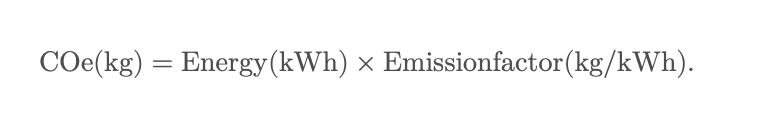
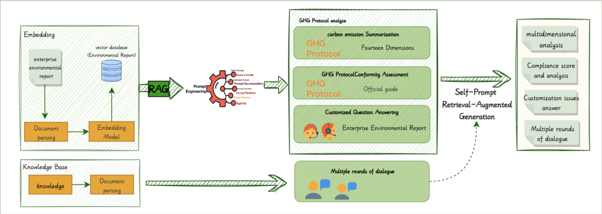
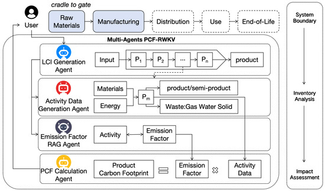

 

# Introduction 

Climate change is among the most pressing challenges facing the global community today, requiring immediate and coordinated responses across all sectors of society. Digital technology, notably artificial intelligence (AI), is simultaneously recognized as both a significant contributor to greenhouse gas emissions and as a powerful tool for addressing environmental challenges. Within the field of AI, Large Language Models (LLMs) advanced computational models trained on vast datasets to understand and generate human-like text—have risen dramatically in prominence and application, influencing countless aspects of modern life, from digital communication to industrial optimization.

The environmental impact of these models, however, remains poorly understood by the broader public and even within many sectors of the technology industry. Their training and operation demand immense computational resources, translating into considerable energy consumption and, consequently, substantial carbon emissions. Yet paradoxically, these same technologies hold potential for significant positive environmental impacts, capable of optimizing energy use, enhancing sustainability initiatives, and supporting climate change mitigation efforts.

This thesis aims to critically analyze the dual role of Large Language Models in the context of climate change. Specifically, it addresses the central question: *"What is the environmental impact of large language models, and how can these same models be leveraged to reduce global carbon footprints?"* By systematically examining both the negative impacts associated with their development and operation, as well as their capacity for positive environmental contributions, this work seeks to offer a balanced and insightful perspective on the role of LLMs in contemporary environmental challenges. Ultimately, this exploration aims to inform sustainable practices within the field of AI, highlighting pathways for developers, policymakers, and corporations to responsibly harness the power of large-scale computational models for a more sustainable future.

# CHAPTER 1 - Large Language Models (LLMs)

As briefly introduced, Large Language Models (LLMs) leverage advanced architectures to provide unprecedented language capabilities. This section elaborates comprehensively on their structures, methodologies, and practical uses

## Definition and Core Architecture: 

Definition and Scale. Large language models (LLMs) are neural network models with hundreds of millions to tens of billions of tunable parameters. They are trained on vast corpora of text to capture the statistical structure and semantics of human language. Modern LLMs learn in two main stages. In the first stage—self‑supervised pre‑training—the model is trained on unlabeled text to predict parts of the input from other parts. Common pre‑training objectives include autoregressive language modeling, where the model predicts the next token given the previous context, prefix language modeling, where a randomly chosen prefix is used and the rest of the tokens are predicted, and masked language modeling, where random tokens or spans are masked and the model learns to reconstruct them. Pre‑training teaches the model general linguistic patterns and world knowledge. In the second stage—fine‑tuning—the model is adapted to a specific task (e.g., question answering, summarization or instruction-following) using labeled data. Fine‑tuning may take the form of task-specific transfer learning, instruction tuning, or alignment with human feedback. This two‑stage training paradigm allows a pre‑trained model to be reused for many downstream tasks with relatively little additional data.

The core architectural innovation enabling modern LLMs is the **Transformer**, introduced in 2017. Unlike earlier recurrent neural networks (RNNs) or long short‑term memory (LSTM) networks, Transformers rely entirely on self‑attention to model relationships among tokens in a sequence. Self‑attention assigns a relevance score to each token in a sequence based on the current context, allowing the model to focus on the most informative words. For example, in the sentence “Swing the bat! … The bat flew at night,” the attention mechanism weights the word “bat” differently in each context, enabling the model to distinguish between the sports equipment and the animal. Self‑attention is formulated through query, key and value vectors: each token emits a query, key and value; attention scores are computed by taking the scaled dot product of queries with keys; and the resulting weights are used to aggregate values. This design captures both local and long‑range dependencies and allows the model to consider global context simultaneously. Moreover, Transformers use multi‑head attention, which runs several self‑attention operations in parallel with different learned projections.  Multi‑head attention allows the model to attend to different aspects of the context at once, enhancing robustness and expressivity. Because there are no recurrent connections, Transformers can process all tokens in a sequence in parallel, greatly accelerating training and enabling models to scale to billions of parameters .

The elimination of recurrence and reliance on self‑attention makes Transformers highly scalable. Each input token can attend to every other token in a layer, but these attention computations can be parallelized across all positions. This parallelism allows Transformer‑based LLMs to train efficiently on large datasets and to model long‑range context more effectively than RNN‑based architectures. It also enables the use of distributed training across many GPUs or TPUs.  Empirical scaling laws show that as the model size, dataset size and compute budget grow, the model’s performance improves according to a power law, motivating the trend towards ever‑larger LLMs.  However, the attention mechanism has a quadratic complexity with respect to sequence length, so training and inference cost grows rapidly with longer contexts.  This tension between expressivity and computational cost is a central theme in the evolution of LLMs and sets the stage for the historical overview that follows.

## Evolution and Key Milestones
The journey to today’s large language models spans decades of research. Early language models relied on statistical n‑gram models, which estimated the probability of the next word based on a fixed‑length context. Although simple, n‑gram models could not capture long-range dependencies or complex syntax. In the 1980s and 1990s, recurrent neural networks (RNNs) and their more robust cousin, the long short‑term memory (LSTM) network, improved sequence modeling by maintaining a hidden state across time steps. LSTMs addressed the vanishing gradient problem and performed well for moderate-length sequences, yet they still struggled to capture dependencies over hundreds of tokens and were difficult to parallelize.

A pivotal moment came in 2017 with the introduction of the Transformer architecture by Vaswani et al. in the paper **“Attention Is All You Need”**. The Transformer overcame many limitations of RNN/LSTM models by relying entirely on self‑attention and positional encoding, enabling non‑sequential, parallel processing. This innovation allowed researchers to train much larger models on massive datasets and to model long-range dependencies effectively. The combination of self‑attention’s efficiency and the scaling properties of neural networks led to an explosion of model sizes and capabilities.

Following the Transformer’s debut, a sequence of pre-trained LLMs marked key milestones. In 2018, Google introduced BERT (Bidirectional Encoder Representations from Transformers), a model that used masked language modeling and next-sentence prediction during pre-training to learn deep bidirectional representations of text. BERT could be fine-tuned with just one additional output layer to achieve state-of-the-art performance across a range of tasks. In the same era, OpenAI released the Generative Pre‑Trained Transformer (GPT) series, which used an autoregressive pre-training objective to generate text. GPT‑2 (2019) expanded to 1.5 billion parameters and exhibited striking fluency, while GPT‑3 (2020) scaled to 175 billion parameters and demonstrated emergent abilities such as few-shot learning, where the model performs a new task from only a handful of examples—capabilities not apparent in smaller models. These releases showcased how increasing parameter counts and dataset sizes could lead to qualitatively new behaviours, confirming the scaling laws.

The subsequent years saw a proliferation of LLMs from both industry and academia, each pushing the boundaries of size and efficiency. Google’s T5 recast all NLP tasks into a text-to-text format; XLNet introduced permutation-based training to capture better bidirectional context; RoBERTa showed that simply training BERT longer and on more data yields improvements; and open-source projects like GPT‑Neo and Meta’s LLaMA democratized access to powerful models. By late 2022, conversational agents like ChatGPT, built on GPT‑3.5 and later GPT‑4, brought LLM capabilities to the mainstream, prompting a surge of applications across sectors.

This rapid technical evolution illustrates how architectural innovations (Transformers) and scaling strategies (massive pre-training followed by task-specific fine-tuning) have transformed natural language processing. 

## Capabilities and Applications
Having traced how advances in architecture and scale gave rise to modern LLMs, we now turn to what these models can actually do. A defining feature of LLMs is their general‑purpose language ability. Because they are pre‑trained on diverse, Internet‑scale text corpora, LLMs acquire a broad knowledge base that enables them to perform a wide variety of tasks.  At the most fundamental level, a single LLM can:
-	Generate coherent text, from essays and articles to creative stories and poetry;
-	Summarize long documents or synthesize multiple sources into concise overviews;
-	Translate between languages and dialects;
-	Answer questions or engage in multi‑turn dialogues;
-	Reason over information given in textual form to solve problems or follow chains of logic.

In contrast to earlier specialized models, these diverse abilities come from a single model that can be adapted through fine‑tuning or prompting. Researchers therefore refer to them as “foundation models”: they form a general base that can be reused across many downstream applications. Moreover, as the previous section noted, increasing model size and data has led to emergent capabilities: abilities that seem to appear suddenly once models reach a certain scale. For example, recent work observes that some tasks (such as three‑digit addition) suddenly become solvable only after the model is scaled past a threshold, a phenomenon sometimes described as “emergence”.  Although the existence and interpretation of such jumps is debated, the key point is that very large LLMs can perform in‑context learning—that is, they can follow instructions or learn from a handful of examples provided in the prompt without additional training—a behavior not observed in smaller models. This versatility makes LLMs uniquely powerful tools.

The general‑purpose capabilities of LLMs translate into concrete benefits across industries. A recent review in Scientific Reports highlights the following examples:
-	**Healthcare**: LLMs assist in diagnosing diseases, personalizing treatment plans and managing patient data. They can summarize clinical notes and literature to support diagnostic decision‑making and help identify adverse events.
-	**Automotive**: LLMs support predictive maintenance by analyzing maintenance logs and sensor data; they also power in‑car virtual assistants that understand spoken commands and provide real‑time translation, improving safety and user experience.
-	**E‑commerce and Consumer Services**: LLMs drive recommendation systems, analyze consumer behavior and power chatbots that handle customer queries, optimize search results and personalize shopping experiences.
-	**Education**: LLMs facilitate personalized learning through intelligent tutoring systems, automated grading and tailored feedback, making education more accessible and effective.
-	**Finance and Banking**: LLMs are used for fraud detection, customer‑service automation and risk management. They can parse financial news, generate reports and identify anomalies in transaction data.

Across these domains, LLMs *“drive significant advancements by automating tasks, improving accuracy and providing deeper insights”*. Put simply, organizations deploy LLMs to streamline workflows, enhance customer interactions and unlock data‑driven insights—often matching or surpassing human performance on specialized language tasks.

Taken together, these capabilities and use cases show why the evolution described previously matters. The architectural innovations that enabled LLMs have not merely produced larger models; they have produced tools with unparalleled versatility and real-world impact. 

## Toward Environmental Impact

While LLMs enable remarkable capabilities, they also introduce significant sustainability challenges. Performance gains from scaling model size come with steep compute and energy costs. A landmark 2019 analysis quantified how training modern NLP models can emit **hundreds of thousands of pounds of CO₂**; in its most extreme case, the team estimated **≈626,000 lb (≈284 tCO₂e)** for a single training pipeline with extensive hyperparameter search, bringing the environmental cost of “bigger is better” into sharp relief. More recently, widely cited estimates for GPT-3 (175B) put its training energy around **1,287 MWh** and **≈552 tCO₂e**, underscoring the scale of resources required for state-of-the-art models. Larger successors (e.g., GPT-4) are believed to have required substantially more compute, though precise figures remain undisclosed; emerging work also highlights non-carbon impacts such as significant cooling-water use during training.    

Operational use compounds these concerns. Once deployed at scale, LLMs answer millions to billions of queries, and inference—the forward pass to serve user requests—often dominates lifetime emissions. Analyses across providers and academic studies now converge on this point: inference typically outweighs training over a model’s service life, with the balance shaped by prompt length, tokens generated, model/hardware choice, and data-center carbon intensity. Recent modeling suggests that typical ChatGPT-class requests consume on the order of ~0.3 Wh per query (far lower than earlier, rougher heuristics), though the true value varies with usage patterns and systems. The key takeaway is that aggregate demand—rather than one-off training—drives much of the ongoing footprint.      

These dynamics frame the central question for the rest of this thesis: **how do we measure, compare, and ultimately reduce** LLM emissions across training and inference without forfeiting their benefits? We turn next to the methods and standards used to quantify energy use and translate it into CO₂-equivalent—laying the groundwork for evaluating models, infrastructure choices, and mitigation strategies in a consistent way.  

# CHAPTER 2 - Current Methods and Standards for Measuring the Environmental Impact of Computing

In this section, we review how the environmental footprint of computing is assessed, focusing on energy use and greenhouse gas (GHG) emissions. As Large Language Models (LLMs) demand massive computation, understanding these measurement methods is crucial to quantify their environmental impact. We cover how energy consumption is measured, how it is translated into CO₂-equivalent emissions, the tools and frameworks available, and the relevant standards (e.g. GHG Protocol, ISO 14064) for reporting such impacts. 

## Measuring Energy Consumption in Computing

Assessing the climate impact of AI begins with measuring how much electricity computing workloads consume. At the smallest scale, researchers use on‑board sensors or power APIs to sample the real‑time power draw of CPUs and GPUs. Utilities such as NVIDIA’s nvidia-smi and Intel’s RAPL interface allow developers to read power draw every few milliseconds and integrate it over time to obtain total energy in kilowatt‑hours (kWh). *Strubell et al. (2019)*, for example, instrumented the GPUs and CPUs used in NLP experiments and multiplied the average power by runtime to estimate training energy. This direct measurement approach can be extended to memory, storage and networking equipment; summing the energy of all components (including idle and overhead energy) yields the total electricity consumption of a computing task.

### Data-Center Overhead and PUE

In large-scale computing facilities, not all of the electricity drawn from the grid goes into running chips; cooling systems, power conversion, lighting and other infrastructure add overhead. The industry standard metric for capturing this overhead is Power Usage Effectiveness (PUE)—the ratio of total facility energy to the energy consumed by IT equipment. A PUE of 1.58 (the approximate global average around 2018) means that for every 1 kWh delivered to servers, another 0.58 kWh is consumed by cooling and other supporting systems. Companies publicly report their PUE to demonstrate efficiency improvements. For example, Google reports a fleet‑wide PUE of 1.09 across its large-scale data centres, meaning only 9 % overhead; this is significantly lower than the industry average of around 1.56. Google’s quarterly PUE data show values between 1.04 and 1.14 across individual campuses. Using PUE in emissions calculations simply multiplies the measured IT energy by the PUE factor to account for total facility electricity use.

### Life‑Cycle Considerations

Operational energy is the most visible contributor to a data centre’s footprint, but a comprehensive assessment must include embodied emissions—the energy and materials used to manufacture and construct data‑centre hardware and buildings.  A 2024 report summarised by TechRadar, citing Morgan Stanley, estimated that about 60 % of future data‑centre emissions will come from operations and roughly 40 % from the construction of facilities and infrastructure. A life‑cycle assessment (LCA) therefore examines *“cradle to grave”* impacts: raw material extraction, chip fabrication, facility construction, operational energy, maintenance, and end‑of‑life decommissioning. Data4 Group’s LCA of European data centres illustrates this approach: they found that a typical facility produces 6,600–10,400 tonnes of CO₂ per megawatt of operational IT over a 20‑year period, and that 80 % of those emissions come from energy used in operations, while the remaining emissions arise from construction and materials. Construction emissions alone amount to 1,500–2,100 tCO₂ per megawatt, and within that footprint the concrete and steel used in the building shell contribute about 25 %. These LCAs show why focusing solely on operational energy can underestimate the true environmental cost of computing.

Because manufacturing data for chips and servers are often proprietary, practitioners sometimes rely on typical power ratings or thermal design power (TDP) and assume average utilisation to approximate embodied energy.  Combining such estimates with the Software Carbon Intensity (SCI) framework—which defines emissions per unit of software function—allows researchers to compare models or services on a per‑query basis.  Overall, measurement frameworks that pair direct power monitoring (for training and inference) with facility‑level metrics (PUE) and cradle‑to‑grave LCAs provide the foundations for rigorous, transparent assessments of AI’s environmental impact.

## Converting Energy Use to CO₂-Equivalent Emissions

### Emission Factors and CO₂e Calculation

Once the total electricity consumption of a training run or inference workload is known, it must be converted into carbon dioxide equivalent (CO₂e) to quantify climate impacts. This conversion multiplies energy (kWh) by an appropriate emissions factor (kg CO₂e per kWh), which represents the carbon intensity of the electricity supply. Emissions factors vary by region: a grid dominated by coal has a high factor, while one supplied largely by wind or hydro has a low factor.  CodeCarbon, for example, defaults to a global average of 475 g CO₂e/kWh (0.475 kg CO₂e/kWh) when country‑specific data are unavailable. Researchers often select factors using regional electricity mixes or cloud providers’ disclosures; if the energy mix is known (e.g., 50 % renewable and 50 % gas), a weighted average factor is applied. The basic conversion is therefore:

When accounting for data‑centre overhead and multiple devices, a more detailed formula is used.  Stanford’s CS324 course expresses total emissions as the product of three terms: the energy‑to‑emissions conversion factor `Rpower -> emit`, the power usage effectiveness (PUE) of the data centre, and the sum of each device’s power multiplied by its runtime.  Mathematically:

This equation ensures that one accounts for not only the IT load but also the extra electricity used for cooling and power distribution (via PUE). Using a region‑appropriate emission factor is critical; the same model trained on a renewable‑powered grid will emit much less CO₂e than one trained on a fossil‑heavy grid.

*Google’s Emissions Factors Table, showing regional and energy source-specific factors.*

### Origins and adoption of the GHG Protocol

To contextualize these calculations, it is useful to recall that the **Greenhouse Gas (GHG) Protocol** provides the overarching framework used by most organizations to measure and report emissions. The protocol was launched in 1998 as a collaboration between the **World Resources Institute (WRI)** and the **World Business Council for Sustainable Development (WBCSD)** to develop internationally accepted GHG accounting standards. Its first Corporate Standard appeared in 2001 (updated in 2004) and introduced the widely used Scope 1, Scope 2 and Scope 3 categories that now underpin corporate climate disclosures. Adoption has become near‑universal: the GHG Protocol Secretariat reports that 97 % of S&P 500 companies disclosing to CDP in 2023 used its methods, and CDP received climate disclosures from more than 18 700 companies in 2022, a sharp increase over previous years.

### Legal frameworks referencing the GHG Protocol

Although the protocol itself is not statutory, it is embedded in several regulations. The European **Corporate Sustainability Reporting Directive (CSRD)** and its **European Sustainability Reporting Standards (ESRS)** require large firms to report gross Scope 1, Scope 2 and Scope 3 emissions, explicitly referencing the GHG Protocol’s Corporate and Scope 3 standards and even requiring companies to include emissions from purchased cloud computing and data‑centre services in upstream Scope 3 when material. The global **IFRS S2** climate‑disclosure standard likewise mandates Scope 1–3 measurement in accordance with the GHG Protocol and is expected to cover **100 000–130 000 companies** across multiple jurisdictions. At the national level, California’s Climate Corporate Data Accountability Act will require companies with revenues over USD 1 billion to report Scope 1 and Scope 2 emissions from **2026** and Scope 3 from **2027**, effectively pushing large U.S. firms toward GHG‑compliant accounting. These developments highlight how the GHG Protocol has become the de facto framework for regulated climate disclosures, providing common definitions and guidance for computing emissions across all scopes.

*Schema of the GHG Protocol, showing Scope 1, 2 and 3 emissions.*

### Beyond Carbon

While CO₂ remains the primary focus of climate accounting, other environmental metrics are increasingly recognized. One such metric is water usage, because data centres rely on large volumes of water for cooling and, in some regions, for electricity generation. The industry standard for measuring cooling-water efficiency is **Water Usage Effectiveness (WUE)**, defined as litres of water consumed per kilowatt‑hour (kWh) of IT energy. Average data centres have a WUE around **1.8 L kWh⁻¹**, whereas Amazon Web Services claims a much lower **0.15 L kWh⁻¹**, and Microsoft reports an average **0.30 L kWh⁻¹**. WUE varies by climate; for example, Microsoft’s portfolio spans values from **1.52 L kWh⁻¹** in arid Arizona to **0.02 L kWh⁻¹** in humid Singapore. As AI workloads proliferate, water demand is rising: training a single large language model in a Microsoft data centre can evaporate about **700 000 litres** of water, and global AI demand could require **4.2–6.6 billion m³** of water withdrawal by 2027. These findings have prompted sustainability frameworks to encourage reporting of water use alongside CO₂ emissions and to promote water‑saving measures—such as closed‑loop cooling, situating facilities in cooler climates, and using reclaimed or recycled water.

A second emerging impact metric is electronic waste (e‑waste). LLMs and generative AI demand constant hardware upgrades, leading to high turnover of servers, printed circuit boards and batteries that can contain toxic substances like lead and chromium. A recent Physics World analysis estimated that, without mitigation, generative AI could produce **2.5 million tons** of e‑waste annually by 2030, and in a worst‑case scenario the total e‑waste generated between 2023 and 2030 could reach **5 million tons**. Rapid server turnover and geopolitical pressures on semiconductor supply chains would exacerbate this trend. However, strategies such as extending the lifespan of computing infrastructure, reusing or remanufacturing components, and improving recycling could reduce e‑waste by **up to 86 %**. These results illustrate that carbon-only metrics do not capture the full environmental footprint of AI infrastructure. Consequently, sustainability assessments are increasingly calling for water, e‑waste and other impacts to be reported alongside CO₂e.

## Tools and Frameworks for Carbon Accounting in Computing

Accurately recording the energy consumed by computing workloads and converting those numbers to greenhouse‑gas emissions requires a combination of tools and methods. Recent work has expanded this ecosystem to cover everything from embedded sensors on CPUs to cloud‑wide dashboards, and many initiatives now consider operational emissions and embodied hardware emissions separately.

### Software Instrumentation Libraries** 

To understand the energy use of a computing workload one must monitor the hardware itself. Low‑level instrumentation libraries have emerged that integrate with machine‑learning code to sample power counters and convert the resulting measurements into estimates of CO₂‑equivalent (CO₂e) emissions. CodeCarbon is widely adopted: it attaches to the CPU, GPU and RAM, multiplies their consumption by location‑specific emission factors and displays the resulting CO₂e in a dedicated dashboard that even recommends cloud regions with a lower carbon intensity. CarbonTracker takes a similar approach but emphasises real‑time monitoring; it queries a carbon‑intensity API based on the user’s geographic location, supports multiple chip architectures and updates its predicted emissions after a few training epochs with minimal overhead. 

Ease of integration is a recurring theme. Eco2AI wraps the measurement and logging functionality in a simple decorator that can be applied to existing functions; the library records energy consumption per run, multiplies it by a regional emission coefficient and falls back to a global average when the country is unknown. At the other end of the spectrum, pyJoules exposes the lowest‑level counters available: it uses the Intel Running Average Power Limit (RAPL) interface and Nvidia Management Library (NVML) to measure energy drawn by CPUs, memory and GPUs. When users decorate a function, pyJoules reports its energy consumption directly  and cautions that extraneous background tasks should be disabled to obtain accurate measurements.

Because each library must access hardware power sensors, they remain confined to bare‑metal systems or privileged virtual machines. They cannot yet account for the embodied emissions of manufacturing the hardware itself or measure workloads running on managed cloud services, where only aggregated telemetry is available.

### Carbon Calculators 

When direct measurement is impractical—because the computation runs on a shared server, a managed cloud environment or an HPC scheduler—researchers turn to carbon calculators. These tools trade precision for accessibility by approximating emissions from high‑level inputs. The ML CO₂ Impact Calculator asks users to specify the type and number of GPUs used and the duration of the run; it then estimates the resulting CO₂ emissions and indicates how much of that figure has already been offset by the chosen cloud provider. Since the tool does not account for the power‑usage effectiveness (PUE) of the data centre, users are encouraged to adjust the result by the PUE of their facility. Its emissions factors come from electricityMap and other published datasets, and the estimates are therefore based on annual average grid mixes.

*Variation of the Average Carbon Intensity of Servers Worldwide, by Region. (Vertical bars represent regions with a single available data point.)*

The Green Algorithms model generalises this idea beyond GPUs. By combining three inputs—runtime, hardware specification (CPU, GPU and memory) and country of execution—the calculator estimates energy consumption and converts it to CO₂e emissions. To help users grasp the magnitude of their impact, the output also expresses the result in “tree‑months,” a heuristic indicating how long it would take a tree to absorb the same amount of carbon. The Green Algorithms methodology is open and has been extended into Green Algorithms 4 HPC, which automatically scans job records on high‑performance clusters and provides aggregate estimates.

Because carbon calculators rely on simplified models and average utilisation assumptions, their results are best used as approximate indicators or to raise awareness in research papers rather than as detailed accounting. They cannot capture dynamic power scaling, variations across datacentres or the embodied emissions of hardware manufacture.

### Cloud Provider Sustainability Tools

For organisations that rely on public clouds, the most detailed carbon data comes directly from the providers themselves.  Microsoft’s Emissions Impact Dashboard (EID) integrates with Azure and Microsoft 365 services and produces Power BI reports that cover direct and indirect emissions across all three Greenhouse‑Gas Protocol scopes. It can quantify the emissions avoided by migrating from on‑premises infrastructure to the Microsoft cloud and allows customers to download the underlying data for inclusion in ESG reports. Google’s Cloud Carbon Footprint provides similar functionality through the Google Cloud Console: emissions are broken down by project, region and product, and the tool reports both location‑based and market‑based scope‑2 figures. To capture variations in the grid mix, Google’s methodology uses hourly carbon‑intensity data and allows exports to BigQuery for custom analysis.

Amazon Web Services was slower to provide transparency but launched a refreshed Customer Carbon Footprint Tool (CCFT) in 2024. The new CCFT offers regional granularity and data exports in CSV or Parquet formats down to grams of CO₂e. Its methodology allocates emissions from unused capacity proportionally among customers, aligning the estimates more closely with the actual impact of cloud usage. Despite these improvements, the CCFT reports only Scopes 1 and 2, limits per‑service breakdown to EC2 and S3 and delivers data with a delay of up to three months.

Microsoft has supplemented its EID with Emissions Insights and a Carbon Optimization dashboard. Emissions Insights enables more granular queries and API‑based exports, while Carbon Optimization—currently in preview—tracks emissions trends at the resource level and recommends actions such as right‑sizing or switching regions to reduce impact. Together these tools demonstrate how cloud providers are integrating carbon data into their solutions, democratizing access to emissions information and enabling customers to manage their environmental footprint.

### Cross‑provider and third‑party frameworks

Provider dashboards offer only part of the picture: they are tied to a single cloud platform and may omit supply‑chain (Scope 3) emissions or rely on market‑based emission factors. In response, community‑driven frameworks aim to provide a unified view across multiple providers and to incorporate embodied impacts. Cloud Carbon Footprint (CCF), for example, ingests usage and billing data from AWS, Google Cloud and Azure and converts those figures into estimates of both operational and embodied emissions. To translate billing units such as vCPU‑hours and storage months into energy consumption it relies on Etsy’s Cloud Jewels project. CCF currently focuses on location‑based reporting but invites contributions to support market‑based approaches.

Instead of providing a tool, the Green Software Foundation (GSF) has proposed a common metric, the Software Carbon Intensity (SCI). The SCI expresses the total carbon emissions—operational plus embodied—associated with producing one unit of software output, such as an API call or a training epoch. The specification emphasises that reductions should come from eliminating emissions rather than purchasing offsets and provides a five‑step procedure to scope the system, select the functional unit, choose measurement methods, quantify component emissions and report the result. Because it is a rate metric, the SCI allows comparison across systems of different scales and complexity and can be applied to anything from distributed services to serverless functions. Its principles have begun to influence tooling in cloud platforms.

*Green Software Foundation’s principles.*

### Observations and limitations

Despite rapid progress, the landscape of carbon‑accounting tools still has several limitations. Most provider dashboards depend on proprietary telemetry and may deliver delayed or aggregated data. As example, the AWS CCFT reports emissions with a three‑month lag and excludes Scope 3 emissions, whereas Google and Microsoft update their dashboards monthly.  Calculators such as the ML CO₂ Impact Calculator require users to provide hardware parameters and datacentre PUE values, which may not always be known.

Scope coverage is another concern: Google and Microsoft dashboards include supply‑chain (Scope 3) emissions, but AWS currently reports only Scopes 1 and 2. Open‑source frameworks like CCF try to estimate embodied emissions, yet these estimates depend on assumptions about server manufacture and allocation.

Spatial and temporal granularity vary widely. Tools that provide hourly or regional carbon intensity—such as Google’s methodology or CarbonTracker’s real‑time data—enable carbon‑aware scheduling, but many calculators rely on yearly national averages. Finally, integration remains a challenge: instrumentation libraries require direct access to hardware power sensors and thus may not function in virtualised or managed environments, while provider dashboards often require specific roles, licences or enterprise agreements to access the data.

Nonetheless, the combination of instrumentation, provider‑level reporting and standardised methodologies is gradually enabling more credible carbon accounting in computing. As the ecosystem matures, it will help researchers and practitioners design carbon‑efficient systems and make informed trade‑offs between performance and environmental impact.

## Standards and Protocols for Environmental Impact Measurement

Assessing the sustainability of computing requires more than ad-hoc measurements; it relies on established environmental accounting standards that provide rigorous definitions, boundaries and verification processes. Chief among these is the ISO 14064 family. ISO 14064‑1:2018 specifies principles and requirements for quantifying and reporting an organisation’s greenhouse‑gas (GHG) emissions and removals, including guidance on designing and managing a GHG inventory. Academic and industrial analyses of AI’s carbon footprint often cite ISO 14064‑1 to ensure their inventories meet accepted principles like completeness and transparency. The two companion standards extend the framework: ISO 14064‑2 describes how to quantify and report emission reductions at the project level—useful when evaluating the benefits of a new data‑centre design or a novel AI model that claims to cut emissions while ISO 14064‑3 sets requirements for third‑party validation and verification of GHG assertions. Together they provide a structured, internationally recognised approach to measuring emissions and lend credibility to environmental claims. For instance, an AI service provider can benchmark its calculations against ISO 14064 and then seek third‑party verification under ISO 14064‑3 to assure stakeholders that its reported footprint is robust.

A complementary set of standards, ISO 14040 and ISO 14044, codifies the methodology for life‑cycle assessment (LCA). ISO 14040 establishes the principles and framework for conducting an LCA—defining system boundaries and the four phases of goal and scope definition, inventory analysis, impact assessment and interpretation. ISO 14044 provides detailed requirements for implementing those phases, including guidelines on data quality, impact categories and reporting results. These standards are crucial in computing because they capture impacts beyond electricity use: the embodied emissions from manufacturing semiconductors, constructing data‑centre buildings and handling end‑of‑life disposal can rival operational energy consumption. Although conducting a full cradle‑to‑grave LCA for every new AI model is often impractical, ISO 14040/14044 serve as an aspirational framework; they remind researchers to account for hidden impacts like hardware production or coolant chemicals that purely operational metrics overlook.

As software has become a major driver of emissions, standards bodies are developing IT‑specific guidance. The newly ratified ISO/IEC 21031:2024—jointly developed by the Green Software Foundation and ISO/IEC JTC 1—introduces a Software Carbon Intensity (SCI) metric and a methodology for calculating the rate of carbon emissions per unit of software function. According to ISO’s description, the standard aims to provide a reliable, consistent and fair measure of software emissions so that practitioners can make evidence‑based design and deployment decisions. The specification outlines steps such as defining the software system boundary, selecting an appropriate functional unit (e.g., per API call), measuring energy consumption during operation, accounting for the carbon intensity of the electricity used and considering the efficiency of underlying hardware. Unlike offset‑based approaches, the SCI emphasises emissions reductions, not compensations. For AI services that operate at scale, ISO/IEC 21031 could enable consistent reporting of carbon emissions per thousand queries, complementing traditional hardware‑centric metrics and aligning software development with the GHG Protocol and ISO 14064 principles.

Beyond ISO standards, data‑centre operators rely on sector‑specific metrics and certifications to benchmark environmental efficiency. Power Usage Effectiveness (PUE), formalised in ISO/IEC 30134‑2, expresses the ratio of total facility energy to IT‑equipment energy; values close to 1 indicate that most electricity feeds the computing hardware rather than overheads like cooling and lighting . Water Usage Effectiveness (WUE), defined by The Green Grid consortium, gauges the amount of water consumed per unit of IT energy—a growing concern as AI training runs require substantial cooling water. Energy‑management standards such as ISO 50001 provide frameworks for continuous improvement: organisations develop policies, set targets, monitor performance and review results to enhance energy efficiency. In addition, certifications like ENERGY STAR for servers—which require certified equipment to use about 30 % less energy than standard servers and LEED green‑building ratings, which evaluate sustainability across categories like energy use, materials and indoor environmental quality, help contextualise the environmental performance of AI infrastructure. An AI laboratory running models in a LEED‑certified data centre with a low PUE and ENERGY STAR servers will have a markedly smaller carbon footprint than one using older, inefficient facilities. Taken together, these standards and metrics provide the vocabulary and tools needed to compare and improve the environmental impact of computing systems.

## Application of These Methods and Standards to AI and LLMs

Having outlined general measurement methods, we can now connect them to AI- and LLM‑specific scenarios.  The environmental footprint of large language models arises at two stages: **training** and **inference**.

### Training Phase Footprint

Training a state-of-the-art LLM involves running tens of thousands of GPU hours, making energy usage enormous. Researchers apply the measurement techniques above to quantify this. For example, a landmark study by *Emma Strubell, Ananya Ganesh, Andrew McCallum. (2019)* measured the energy consumed in training several NLP models and estimated their CO₂ emissions. 

*Estimated cost of training a model in terms of CO2 emissions (lbs) and cloud compute cost (USD).7 Power and carbon footprint are omitted for TPUs due to lack of public information on power draw for this hardware.*

They found that training a large transformer with hyperparameter tuning emitted on the order of hundreds of thousands of pounds of CO₂ (over 280 metric tons), roughly equivalent to five cars’ lifetime emissions. The procedure included monitoring GPU power draw, summing total kWh, and multiplying by a carbon factor. More recent LLM training reports (for models like GPT-3, Llama, etc.) similarly calculate emissions by recording total energy used. Notably, Meta’s Llama model reports listed the electricity consumed and then converted to emissions using region-specific factors (though early versions used rough averages). In a comprehensive 2025 study, Jacob Morrison, Clara Na, Jared Fernandez, Tim Dettmers, Emma Strubell, Jesse Dodge. measured the training of a series of language models and explicitly followed GHG Protocol Scope 2 methods, determining that training their 13-billion-parameter model consumed hundreds of MWh and emitted 493 metric tons of CO₂e (assuming typical U.S. grid mix). These examples illustrate how standard energy-to-emission conversion is applied to quantify the climate impact of training LLMs.

*(from ["Holistically Evaluating the Environmental Impact of Creating Language Models."])Models are ordered by their total water consumption and associated CO₂ emissions. Sub-billion-parameter systems were trained on 1.7 trillion tokens; OLMo 1B on 3 trillion; OLMo 2-7B on 4 trillion; OLMoE on 5 trillion; and OLMo 2-13B on 5.6 trillion. The data show that environmental impact rises sharply as both model size and training-data volume increase.*

### Inference and Deployment Footprint

Once deployed, LLMs can be used millions or billions of times, so the per-query energy becomes critical. Methods for measuring inference energy mirror those for training: instrument the model serving hardware to measure power per query, or estimate via benchmarked power usage. Some works use a functional unit like “per 1000 queries” to report emissions, aligning with the SCI approach of emissions per operation. For instance, an online inference energy tool by Hugging Face reports how many watt-hours each API call uses. By multiplying that by the carbon intensity of the host server’s electricity, one obtains CO₂e per query. A study by Alexandra Sasha Luccioni, Sylvain Viguier, Anne-Laure Ligozat. *"Estimating the carbon footprint of bloom, a 176B parameter language model"* evaluated the footprint of serving NLP models and emphasized considering the potentially vast number of inferences, which can quickly match or exceed training emissions. Indeed, if an LLM is very popular, the cumulative electricity for inference (across all user queries) can rival the training cost within months. This highlights the need to measure environmental impact across the model lifecycle, training (one-time, but intensive) and inference (continuous). Standards like the GHG Protocol would count both under the service provider’s Scope 2 emissions, and recent research encourages reporting both stages.

### Using Standards in Practice

The methodologies and standards described are not just theoretical, they are increasingly being adopted by AI practitioners. For example, when OpenAI or Google report on their models’ sustainability, they often cite compliance with carbon accounting standards (or at least use standard units and methods). The GHG Protocol’s scope definitions have been explicitly referenced in academic work to clarify what is included in AI emission calculations. By doing so, a paper can state it calculated emissions “in accordance with Scope 2 accounting”, signaling that only electricity use was counted and using a location-based emission factor from an authoritative source (e.g., EPA or IEA data for grid emissions). Similarly, if a study includes manufacturing impact of AI hardware, it may cite LCA standards or prior LCAs of semiconductors to estimate that portion. In short, the community is moving toward standardized reporting: for each new model, report energy (in MWh), carbon emissions (in tons CO₂e with method described), possibly water usage, and assumptions (PUE, emission factor, etc.). This mirrors how other industries report environmental impact and allows comparisons and tracking of improvements over time.
	
### Challenges and Evolving Practices

Despite the tools and standards available, measuring LLM environmental impact still faces challenges. One issue is transparency: many AI companies do not disclose full details (e.g., exact energy use, locations, hardware manufacturing data). This makes third-party estimates uncertain. Another challenge is incorporating Scope 3 emissions (like chip manufacturing) reliably, current studies often have to use proxy data or broad assumptions. Nonetheless, the trend in research is to be ever more comprehensive. The BLOOM language model effort in 2022 was noted for providing an extensive environmental impact appendix, covering training energy by region and even inferring the impact of model development (experiments before final training). Following that, the latest works (e.g., Morrison et al. 2025) measure not only training and inference, but also water consumption and encourage using renewable energy or better cooling to mitigate those impacts. 

# CHAPTER 3 - Carbon Footprint of ChatGPT vs. LLaMA Models

The development and deployment of large language models (LLMs) like OpenAI’s ChatGPT (based on GPT-3/GPT-4) and Meta AI’s LLaMA family carry a significant carbon footprint. This section compares their energy consumption and CO₂-equivalent emissions, drawing on published metrics for both the one-time training phase and the ongoing inference (serving) phase. We also highlight how differences in model architecture, training methodology, hardware, and infrastructure influence the carbon impact.

## Training Phase: Energy Use and CO₂ Emissions

### GPT-series (OpenAI)

Training state-of-the-art models requires massive computational resources. OpenAI’s original GPT-3 model (175 billion parameters, 2020) consumed on the order of ~1.3 GWh of electricity for a single full training run, resulting in an estimated 552 metric tons of CO₂ emissions. This was computed assuming training on cloud GPUs (NVIDIA V100) in a U.S. data center with average grid mix and Power Usage Effectiveness (PUE) near 1.1. The newer GPT-4 model (2023), which is significantly larger and more computationally intensive, required dramatically more energy, on the order of 50–60 GWh of electricity for training. 

*Graph comparing the estimated electricity consumption from training GPT-3 and GPT-4*

Estimates of GPT-4’s training footprint range widely based on assumptions about hardware and datacenter efficiency. A recent analysis by Stanford (*Artificial Intelligence Index Report 2025*) reported GPT-4’s training emitted ~5,100 tCO₂, roughly 10× the emissions of GPT-3. (Notably, independent calculations suggest it could have been as high as 12,000–15,000 tCO₂ if run on a typical fossil-fueled grid, whereas training on a cleaner-energy datacenter could cut this down to ~1,100 t.) 

*Graph showing the difference if GPT-4 was trained in the Azure cloud region Canada East its training carbon footprint would have been smaller by a factor of 13.*

OpenAI has not publicly disclosed GPT-4’s exact energy use or carbon emissions, but these estimates make clear that GPT-4’s training phase likely released on the order of thousands of tons of CO₂e. Contributing factors include its larger model size (reportedly an order of magnitude more parameters than GPT-3) and longer training duration. In practice, OpenAI partnered with Microsoft Azure for training; Azure’s modern facilities have a low PUE (~1.18) and options for renewable energy, which can mitigate emissions. Still, without full transparency from OpenAI, current figures for GPT-4 remain estimates derived from leaked hardware usage and reasonable assumptions.

### LLaMA-series (Meta)

In contrast to OpenAI’s secrecy, Meta has published detailed carbon accounting for its LLM training. LLaMA-2 (2023) – with model sizes of 7B, 13B, and 70B parameters, was trained on Meta’s Research SuperCluster using approximately 3.3 million GPU-hours on NVIDIA A100 80GB GPUs.

| Model Size | Time (GPU hours) | Carbon Emitted(tCO2eq) |
|------------|-------------------------------|-------------------------|
| 7B         | 184320                   | 31.22 |
| 13B        | 368640                 | 62.44|
| 70B        | 	1720320                 | 291.42 |
|Total	   | 3311616                 | 539.00 |

 Meta reports that the total electricity usage for LLaMA-2’s training corresponds to ~539 tCO₂e emissions. This figure encompasses all LLaMA-2 model variants and was 100% offset by Meta’s sustainability program (Meta purchased renewable energy or credits to neutralize these emissions) Notably, LLaMA-2’s carbon footprint is of the same order as GPT-3’s, despite LLaMA-2 having fewer parameters (70B vs 175B). This is due to its training on an extremely large dataset of 2 trillion tokens. (By comparison, GPT-3 was trained on ~300 billion tokens.) The larger training corpus for LLaMA-2 increased the compute requirements, effectively offsetting the advantages of its smaller size. However, Meta’s use of efficient hardware (A100 GPUs are more energy-efficient than the older V100s used for GPT-3) and a modern datacenter powered by 100% renewable energy matching helped contain the net emissions. Meta’s transparency stands in contrast to OpenAI’s approach: the LLaMA-2 model card explicitly lists the training compute and emissions, and emphasizes that others can use the open model rather than re-train new models from scratch, preventing duplicate carbon costs.

### Scaling to newer models

Both organizations scaled up their models in 2023–2024, with significant implications for carbon footprint. OpenAI’s GPT-4, as noted, likely emitted several thousand tons of CO₂. Meta’s follow-up LLaMA-3 (2024) was also compute-intensive. While Meta had not publicly released LLaMA-3’s full details as of this writing, analyses suggest its training emissions were substantially higher than LLaMA-2. In fact, the Stanford AI Index 2025 reports a 405B-parameter “LLaMA 3.1” model with an estimated 8,930 tCO₂ from training, a reflection of how dramatically emissions rise with model size. This would make LLaMA-3’s largest variant about 1.7× more carbon-intensive than GPT-4’s training. Even a more modest version of LLaMA-3 (in the 70B parameter range) was estimated to emit roughly 4× the CO₂ of GPT-3. 

*Image showing the comparison of the carbon footprint of one passenger flight from New York to San Francisco with the carbon footprint of training LLaMA-3, GPT-3 and the average car lifetime emissions.*

Meta has indicated it continues to offset 100% of training emissions for its models, and it benefits from a strategy of running data centers on renewable power since 2020 (achieving net-zero operations). By contrast, OpenAI leverages Azure’s sustainability initiatives; Microsoft’s cloud aims for 100% renewable energy by 2025, which should help reduce the effective carbon intensity of training and serving models. Still, the absolute energy demand of cutting-edge models remains enormous. In summary, GPT-3 and LLaMA-2 each consumed on the order of 500–600 tCO₂ for training, whereas GPT-4 and LLaMA-3 pushed into the thousands of tons, underscoring the exponential increase in carbon footprint with model scale.

*Carbon emissions from training various AI models (in metric tons CO₂e). Early models like AlexNet (2012) were negligible in emissions, whereas modern LLMs are several orders of magnitude higher.*

## Inference Phase: Energy Consumption and Life-Cycle Impact

While training is a one-time (if expensive) event, the operational energy usage of an LLM during deployment (inference) can dominate its lifetime carbon footprint. Serving millions of user queries on ChatGPT or similar services requires data centers running clusters of GPUs 24/7, ready to generate text on demand. Studies by Meta, AWS, and Google indicate that 60–90% of an LLM’s total life-cycle emissions often come from inference usage, not training (*"Carbon Emissions and Large Neural Network Training"*). In other words, a model that is heavily used will burn far more energy over its deployed life than during its initial training. For ChatGPT, which reached 100+ million users, the aggregate computational load is enormous. Each query to ChatGPT involves running the model’s forward pass on specialized hardware. OpenAI’s public statements note that they “work closely with Microsoft to improve efficiency and footprint” in running these models, but the scale of usage means emissions add up rapidly. A recent analysis estimated that each ChatGPT prompt (query) consumes roughly 4.3 grams of CO₂ on average. This is an order of magnitude more per query than a typical Google web search (∼0.2 g CO₂), due to the greater computing required to generate several paragraphs of text. Although 4–5 grams of CO₂ per chat query may sound small, one must consider the volume: for example, 1 million queries would correspond to ~4.3 tons of CO₂. Indeed, at ChatGPT’s global usage scale, the model may be responsible for tens of tons of CO₂ emissions per day from inference alone.

### Architecture and hardware factors

The energy cost of inference is highly sensitive to model size, model design, and the hardware/platform optimizations. OpenAI’s latest GPT-4 model (which powers ChatGPT’s most advanced version) is believed to have hundreds of billions of parameters, making it computationally heavy for each inference. By contrast, Meta’s LLaMA family often emphasizes smaller models (e.g. 7B or 13B parameters for certain use-cases) or efficient architectures, which can be deployed at lower cost. In practice, using a smaller model or more efficient hardware drastically cuts per-query energy. For example, running a 70B-parameter model on a current NVIDIA A100 GPU in FP16 precision consumes on the order of 15 milligrams of CO₂ per output token generated. 

| Model scale    | Hardware + precision  | Carbon per output token                                            |   |   |
|----------------|-----------------------|--------------------------------------------------------------------|---|---|
| 288+ B params  | NVIDIA H100 @ FP16    | ~30 mg CO₂ (estimated for models like GPT-o3 and Llama 4 Behemoth) |   |   |
| 70 B params    | NVIDIA A100 @ FP16    | ~15 mg CO₂                                                         |   |   |
| 70 B params    | NVIDIA H100 @ FP8     | ~7.5 mg CO₂ (≈ 2 × better;)              						  |   |   |
| 70 B params    | Google TPU v5e @ INT8 | ~3 mg CO₂ (TPU v5e launch)                                         |   |   |
| 13-27 B params | NVIDIA A100 @ FP16    | ~3 mg CO₂ (applicable to models like Gemma 3 and LLaMA variants)   |   |   |
| 2 B params     | NVIDIA A100 @ FP16    | ~0.5 mg CO₂                                                        |   |   |

If we instead use a model one-fifth that size (e.g. ~13B parameters) on the same hardware, the carbon per token is about 3 mg, a 5× reduction. Advanced hardware and optimizations can further improve this: the NVIDIA H100 (2022) offers ~2× better efficiency than the A100, and techniques like 8-bit quantization can cut the energy per token by half again. For instance, a 70B model running on an H100 with INT8/FP8 precision might emit only ~7.5 mg of CO₂ per token; Google’s TPU v5e, using int8 precision, has been reported to generate as little as ~3 mg CO₂ per token for similar model sizes. These differences mean that Meta’s LLaMA models, when deployed at smaller scale or with optimization (e.g. quantization, distillation), can be significantly more carbon-efficient in serving. In fact, Meta has explored model distillation and mixture-of-experts (MoE) architectures for efficiency: an MoE model effectively activates only subsets of the network’s parameters for a given query, which can reduce the required compute per inference. OpenAI’s GPT-4 architecture is not publicly detailed, but it is suspected to be a dense model running fully for each prompt; thus, its per-token energy use is inherently high. This puts a premium on scalable infrastructure: OpenAI serves GPT-4 via Azure data centers with thousands of GPUs, whereas an open model like LLaMA-2 can be deployed by third-parties on smaller clusters or even on single machines (for the smaller 7B/13B versions), potentially with higher utilization efficiency for specific tasks.

### Infrastructure and deployment differences

Another factor in carbon impact is where and how the models are hosted. Microsoft Azure (hosting ChatGPT) and Meta’s own facilities both boast energy-efficient data centers with high cooling and power efficiency (PUE ~1.1–1.2) and increasing use of renewable energy sources. Meta achieved 100% renewable energy matching for its global operations in 2020, meaning that the electricity used for LLaMA training and inference is effectively compensated with renewables. Microsoft has similarly committed to 100% renewable energy for Azure by 2025. These measures reduce the carbon intensity (kg CO₂ per kWh) of the electricity powering the GPUs. For example, if a model is served from a data center in a coal-heavy region, its emissions per query will be much higher than if served from a region powered by hydro or solar. OpenAI’s GPT-4 training analysis showed a 13× difference in CO₂ emissions depending on training location (West US vs. Eastern Canada) due to grid cleanliness. The same principle applies to inference: deploying models in regions or facilities with cleaner energy can dramatically cut operational emissions. Both OpenAI and Meta appear aware of this; however, transparency differs. OpenAI has not released real-time data on ChatGPT’s energy consumption or carbon footprint, and observers have relied on external calculations (and Microsoft’s cloud sustainability reports) to estimate its impact. Meta, on the other hand, publishes sustainability reports and included emissions info in LLaMA model cards, explicitly acknowledging the environmental cost and offsets.

ChatGPT and Meta’s LLaMA exemplify two approaches to large-scale AI deployment, one as a closed API service and the other as an open model family, but both face the reality that inference energy use eclipses training over the long run. ChatGPT’s immense popularity translates into a significant ongoing carbon footprint, partially mitigated by efficient hardware and cloud infrastructure, yet still a cause for concern in aggregate (on the order of thousands of tons of CO₂ yearly for heavy usage). LLaMA-based models, by being open-source, enable users to opt for smaller, task-specific models that are cheaper and greener to run. For instance, an organization could fine-tune a 7B or 13B LLaMA-2 model for a particular application, achieving similar accuracy to GPT-3.5 on that task at a ~10× lower energy cost in inference. Such strategies – model right-sizing, efficient hardware utilization, and renewable-powered deployment are increasingly important for reducing the carbon footprint of AI. In conclusion, ChatGPT (GPT-3/4) and LLaMA (2/3) both require substantial energy, but Meta’s models have an edge in transparency and potential for community-led efficiency improvements. The carbon impact of these LLMs can be measured in thousands of tons of CO₂, so optimizing both the training process and the serving infrastructure (e.g. using cleaner energy, better cooling, and more efficient model designs) is critical to making large-scale AI more sustainable. All available data reinforce that bigger models come with disproportionately higher emissions, and going forward, researchers are challenged to “green” the AI lifecycle by adopting the best practices (efficient models, hardware, and hosting) to bend the emissions curve even as model capabilities grow.

# CHAPTER 4 - Reducing the Carbon Footprint of Large Language Models

Having quantified the significant emissions of various LLMs in Section 2.3, we now explore strategies to mitigate their carbon footprint without sacrificing performance. Recent research and industry practices suggest multiple approaches to make both the training and deployment of LLMs more sustainable. This section introduces new elements and hypotheses for reducing emissions.

## Model Efficiency and Compression Techniques

As the field continues to push the limits of model size, researchers are discovering that state-of-the-art performance need not entail wasteful over-parameterisation. A growing body of work shows that the intelligence of today’s largest language models can often be distilled into smaller, leaner architectures that deliver comparable accuracy at a fraction of the computational cost. One compelling illustration comes from knowledge distillation, a training paradigm in which a compact “student” model learns to replicate the outputs of a much larger “teacher” model. DistilBERT—the distilled version of BERT—exemplifies the power of this approach: it achieves over 95 % of BERT’s language-understanding performance while using 40 % fewer parameters and operating 60 % faster. By reducing both the number of weights and the number of operations per token, distilled models directly lower the energy required for training and inference.

Model developers have found further efficiencies by excising redundancy within the network itself. Sophisticated pruning methods, such as the Optimal BERT Surgeon, analyse which weights contribute least to model outputs and remove them with minimal impact on accuracy. In practice, such techniques can reduce BERT-like models to one-tenth their original size with less than a 1 % drop in performance. A complementary strategy restructures the model to share parameters across layers.  The ALBERT architecture, for instance, decomposes the large vocabulary embedding matrix into two smaller matrices and reuses the same parameters across multiple transformer layers. These innovations markedly shrink the memory footprint and accelerate training, again translating to lower carbon emissions.

Alongside structural streamlining, researchers are also improving efficiency by changing the numerical representation of model parameters. Quantization replaces 32‑bit floating‑point weights and activations with low‑precision formats—commonly 8‑bit integers. This simple change reduces the memory footprint and relaxes bandwidth constraints, enabling processors to leverage high‑throughput integer pipelines. It also decreases the energy consumed per multiplication or addition, so that inference runs faster and cooler. Recent studies find that int8 quantization can retain the accuracy of networks as large as BERT‑large within 1 % of their floating‑point baselines, while the Hugging Face documentation emphasises that quantized models require less memory and therefore consume less energy. Advanced post‑training techniques now push quantization down to four or even two bits with minimal accuracy loss, enabling large language models to run on a single consumer‑grade GPU and dramatically cutting per-token energy use.

Finally, not all savings come from altering the model itself; they can also emerge from the way it is trained. Mixed‑precision training—performing most operations in 16‑bit floating point—reduces memory transfers and computation time. Adaptive training frameworks such as Zeus dynamically adjust batch size and GPU power limits, yielding energy reductions of up to 75 % without slowing convergence. Early‑stopping and careful hyperparameter tuning prevent unnecessary epochs, and fine‑tuning pre‑trained models—rather than training from scratch—amortises the carbon cost of the original model across many applications.

Taken together, these advances show that sustainability and state-of-the-art performance need not be in tension. By distilling, pruning, sharing and quantising, developers can create models that are nimble yet capable, and by adopting energy‑savvy training practices they can ensure that gains in accuracy do not come at undue environmental cost.

## Hardware and Infrastructure Optimizations

Another major avenue for reduction is leveraging more efficient hardware and data center infrastructure. Modern AI accelerators (such as the latest GPUs or TPUs) can perform vastly more computations per watt of energy than older hardware. Empirical results demonstrate that upgrading from an older GPU (NVIDIA T4) to a newer one (A100) for LLM training cuts both training time and emissions drastically. In one experiment, switching to the A100 reduced training time by ~62% and lowered CO2 output by 83% on average for the same set of models and tasks. Importantly, this gain did not come at the cost of model performance faster chips simply achieve the result more efficiently. Thus, utilizing high-performance, energy-efficient hardware is a direct way to curb emissions. Specialized AI chips and GPUs (versus only CPUs) also help, as they deliver more computation per unit of energy. Additionally, advanced cooling solutions in hardware (e.g. liquid cooling for GPU servers) can reduce the power overhead for cooling, further improving the overall efficiency of the training setup.

That said, there is a trade-off to consider with new hardware: the embodied carbon from manufacturing these cutting-edge devices. Producing a top-tier GPU carries a significant carbon cost, which can offset some benefits if hardware is refreshed too frequently. A sustainable strategy is to extend the lifespan of existing hardware while operating it efficiently. For example, researchers at MIT Lincoln Lab found that by capping the power draw of GPUs (running them at slightly lower peak wattage), they could reduce energy use by ~15% for training jobs at the cost of only ~3% longer runtimes.

*"We studied the effects of capping power and found that we could reduce energy consumption by about 12 percent to 15 percent, depending on the model," Siddharth Samsi*

 This small slowdown was *“barely noticeable”* in multi-day trainings, yet it kept the GPUs running ~30°F cooler and eased strain on cooling systems. Cooler, less stressed hardware is less prone to failures and can remain in service longer, delaying the need for new hardware purchases (and the associated manufacturing emissions). In summary, optimizing hardware usage whether by choosing energy-efficient processors or tuning their operation can yield large emission savings. Companies and research labs are encouraged to invest in “green computing” infrastructure, as these improvements often pay dividends both environmentally and financially (through energy cost savings and hardware longevity).

## Carbon-Aware Computing Practices

Even when models are carefully compressed and run on the most efficient hardware, the carbon footprint of large‑scale AI remains highly sensitive to where and when the computation occurs. Electricity grids vary dramatically in their carbon intensity, and this variation opens opportunities for carbon‑aware computing—the practice of aligning heavy workloads with times and locations that have cleaner energy. Analyses of regional grids show that the same job can emit up to an order of magnitude more CO₂ if run in a coal‑heavy region such as Wyoming versus a renewables‑rich region like Sweden. Several cloud providers now expose tools that allow users to choose datacentre regions on the basis of carbon intensity, and projects like the open‑source BLOOM language model took advantage of France’s nuclear‑heavy grid to keep training emissions low.  When direct access to clean power is unavailable, organisations may purchase renewable‑energy certificates or carbon offsets to compensate for their electricity usage, though most sustainability frameworks treat these as a second‑best option rather than a substitute for actual emissions reductions.

Carbon‑aware computing also encompasses time‑shifting strategies. The carbon intensity of a grid changes by the hour: solar generation makes electricity cleaner during midday, particularly outside the morning and evening demand peaks, while wind resources often make nighttime power cleaner. Monitoring services such as Electricity Maps publish real‑time carbon intensity data that can be used to schedule jobs when the renewable share is highest. In practice, this means pausing training during peak‑demand periods dominated by fossil‑fuel generation and resuming when the grid mix improves. One adaptive scheduling study found that deferring training tasks during high‑carbon hours reduced total emissions by roughly 25 % without altering the model or the overall computation. Similarly, datacentres can shift energy‑intensive workloads to cooler nighttime hours or winter months to reduce the electricity needed for cooling. Importantly, the overhead in calendar time is usually small: pausing a week‑long training job for a few high‑emission hours may extend its completion by a day but avoids a disproportionate share of emissions.

A third pillar of carbon‑aware computing is demand shaping: reducing or consolidating non‑urgent workloads when the grid is dirty and batch‑processing them when it is clean. Such practices recognise that, beyond operating emissions, the largest contribution to a datacentre’s lifetime footprint may be the embodied carbon of the hardware itself. Analysts note that manufacturing new servers and cooling systems can dominate the total emissions associated with AI infrastructure; therefore, keeping existing hardware fully utilised and extending its lifespan is crucial. By operating at high utilisation during clean‑energy windows and idling during dirty ones, datacentres can maximise the value extracted from each machine while minimising total emissions.

These strategies—locating workloads in greener regions, scheduling them at cleaner times and shaping demand—are still nascent but early results suggest substantial savings. They complement structural and hardware optimisations: a compressed or quantised model running on an energy‑efficient GPU will only achieve its full sustainability potential if it is powered by clean electricity at optimal times. 

## Reusing Models and Emerging Approaches

A complementary way to reduce the overall environmental impact of LLM development is to avoid unnecessary retraining. Instead of training new models from scratch for every task or organization, the field is moving toward reusing and fine-tuning pre-trained models. Using an existing LLM as a starting point (especially an open-access model with known emissions) and fine-tuning it for a new task requires only a fraction of the computational effort compared to full training. This approach not only saves time and resources but also acts as a form of “emissions recycling”, the large one-time cost of training a GPT-3 or BLOOM can be amortized over hundreds of derived applications. Encouraging model sharing and avoiding duplicate large trainings is therefore a pragmatic way to curb the collective carbon footprint of the AI community. For example, if one group has already trained a 10-billion-parameter model on a huge dataset, other groups can build on those weights instead of burning compute to train a similar model from scratch. Initiatives like Hugging Face’s model hub facilitate this by making pre-trained models widely available for reuse.

In addition, transparency in reporting the energy usage and emissions of training runs is crucial. By openly documenting the carbon cost of models, researchers can create accountability and track progress as techniques improve. The BLOOM project is a case in point: it published a detailed carbon footprint analysis (estimating ~25 to 50 tonnes CO2 for the full training) and discussed the methodology used to minimize and offset those emissions. Such reporting not only highlights the problem to the community but also allows comparison and competition on energy efficiency, not just accuracy. Over time, this could incentivize more innovations for energy reduction (much as model size or speed optimizations are incentivized today).

Finally, looking forward, there are emerging technologies that could dramatically alter the energy paradigm of AI. Research into neuromorphic computing (brain-inspired chips) and analog AI accelerators promises orders-of-magnitude improvements in efficiency by changing how calculations are done at the hardware level. Likewise, exploring algorithms like sparse models or mixture-of-experts that activate only portions of the model as needed can reduce the active compute per query. While these ideas remain largely experimental or theoretical for now, early trials have shown potential in limited domains. For instance, mixture-of-experts models have achieved comparable results to dense LLMs while using less computational power by routing each input through a small subset of “expert” parameters instead of the entire network. As these approaches mature, they could open up new ways to maintain high performance with significantly lower energy consumption essentially hypotheses being tested on a few examples today that might become mainstream tomorrow.

In summary, reducing the carbon footprint of LLMs will likely require a combination of the above strategies. By building smaller or more efficient models (through distillation, pruning, and quantization), leveraging efficient hardware (while managing its full life-cycle impact), and adopting carbon-aware practices (clean energy, smart scheduling, and model reuse), it is possible to substantially cut emissions without diminishing AI capabilities. Encouragingly, studies have shown that many of these measures can be implemented with minimal impact on model accuracy or training outcomes. The challenge ahead lies in scaling up these solutions and integrating them into standard AI development pipelines. Embracing such sustainable AI practices is a necessary step to ensure that future LLM breakthroughs do not come at the expense of the environment. By innovating in how we design, train, and deploy models, we can drive down the environmental cost of AI even as we push the boundaries of model performance.

# CHAPTER 5 - Leveraging Large Language Models to Reduce Carbon Footprints

## Energy Management and Grid Operations

While Section 2.4 examined how to curb the environmental cost of running LLMs, this section investigates how the models themselves can be used as tools for decarbonization.

Recent peer-reviewed and preprint studies demonstrate that large language models (LLMs) can actively contribute to decarbonization by improving forecasting, modeling, and demand-response participation. In the power sector, *Ma et al.* (2025) designed a multi‑agent interactive load‑forecasting framework in which an LLM orchestrates specialised agents for data cleaning, forecast generation, and human feedback. Their experiments showed that forecast accuracy improved when system operators supplied contextual insights—such as upcoming holidays or weather anomalies—and that the framework remained affordable for real-world deployment. For instance, during test runs the system allowed operators to inform the model about an impending heat wave; the LLM incorporated that information, producing a more accurate demand forecast and enabling dispatchers to rely on cleaner generation rather than firing up a gas peaker plant. Such human-in-the-loop forecasting illustrates how LLMs can both lower the barrier for non-expert use and reduce carbon-intensive reserves.

On the demand side, *He et al. (2025)* developed an LLM interface for Home Energy Management Systems (HEMS) that transforms free-form user descriptions—like “we cook dinner around 6 p.m. and do laundry on weekends”—into eight well-structured control parameters. The system uses a ReAct (reason‑and‑act) prompting strategy with few-shot examples, significantly raising extraction accuracy. In their evaluation, the Mistral‑7B‑Instruct‑v0.2 model with ReAct+example prompts achieved 96.9 % accuracy on easy tasks, 87.5 % on medium, and 78.8 % on hard tasks. A practical demonstration involved a household whose electricity bill dropped from £31 to £16 (a 48 % reduction) when the LLM-enabled HEMS scheduled appliances according to real-time electricity prices. This example underscores how LLMs can dramatically increase participation in demand-response programs, unlocking flexible loads that were previously underused.

Building operations also offer fertile ground for LLM applications. *Gao et al. (2024)* integrated ChatGPT with the EnergyPlus simulation engine, showing that the model can automate simulation input generation, analyse outputs, detect anomalies, and even suggest design adjustments. In one case study, a natural-language description of a modular apartment building (“the iUnit”) was converted by a multi-agent LLM into a complete EnergyPlus input data file (IDF) containing dozens of object definitions; after debugging by the LLM agents, the file ran without errors and matched baseline simulation results. This automated workflow reduced weeks of manual IDF scripting to a matter of hours. Jiang et al. (2025) further argued that LLMs can support automated energy-model generation, fault detection and diagnosis, and real‑time energy-management optimisation, and recommended research directions such as domain-specific fine-tuning, retrieval-augmented generation (RAG), and multimodal integration to handle the complexity of building energy data. As a result, the deployment of LLMs in building energy modeling could enable rapid “what‑if” analyses, accelerate retrofitting assessments, and help architects and engineers design low-carbon buildings more efficiently.

In commercial buildings and district energy systems, LLMs are emerging as assistants for energy modeling and optimization. The EnergyPlus–LLM integration reported by *Gao et al.* uses ChatGPT to auto-generate simulation inputs, analyze outputs, and even suggest design alterations. Their case studies show that proper prompt engineering allows the model to produce accurate building-energy simulations and identify anomalies, cutting down the engineering time required for each project. A parallel perspective paper in Building Simulation argues that LLMs can streamline automated energy model generation, fault detection and energy management optimization. Although these studies remain at early stages, they suggest that LLM-driven assistance could accelerate efficiency retrofits and optimize HVAC control, both of which reduce buildings’ operational emissions.

## Corporate Carbon Accounting and Product Footprints

Beyond optimizing energy operations, large language models (LLMs) can play a pivotal role in measuring and reporting emissions—an essential precursor to effective decarbonization. Two strands of research highlight these opportunities.

The CarbonChat system demonstrates how LLMs can automate complex sustainability reporting tasks. Instead of manually parsing lengthy corporate sustainability reports, CarbonChat uses a retrieval-augmented generation (RAG) architecture to break documents into logical chunks, retrieve relevant sections, and answer tailored queries. Its architecture includes a diversified index module (combining document-tree and semantic chunking) and a self-prompting pipeline that integrates intent recognition, structured chain-of-thought prompting, and hybrid retrieval; this ensures both syntactic and semantic fidelity. 

*CarbonChat architecture diagram.*

CarbonChat then maps information into fourteen analytical dimensions corresponding to Scope 1, Scope 2, and Scope 3 categories in the Greenhouse Gas Protocol. Extensive experiments reported large improvements in retrieval accuracy and response relevance (measured by ROUGE and BERTScore) and high Text2SQL execution accuracy. In practice, companies can use CarbonChat to generate compliant carbon accounting reports and climate-related Q&A in minutes rather than the days of manual effort often required by sustainability analysts.

A parallel effort at the Climate Change AI workshop developed a multi‑agent architecture that combines an LLM with retrieval and classification modules to systematically extract carbon‑reduction actions from corporate reports. Although detailed results have yet to be published, the framework uses specialized agents for parsing, classification, and data integration; it builds a sector- and region-specific library of mitigation levers and updates as new reports are published. Such a system could help sustainability teams rapidly identify actionable opportunities (e.g., switching to low-carbon fuels, investing in energy efficiency) across multiple firms and geographies.

At the product level, traditional life-cycle assessments require painstaking data gathering and boundary setting. *Zhang et al. (2024)* propose a Product Carbon Footprint RWKV (PCF‑RWKV) model that automates much of this work. Their system employs a multi-agent architecture comprising four key agents:
 - The LCI Generation Agent builds a product-specific life-cycle inventory by analysing material and energy flows at every stage of the product’s life.
 - The Activity Data Generation Agent converts the LCI into detailed activity data (e.g., energy consumption, waste outputs) for each process step.
 - The Emission-Factor RAG Agent uses search-enhanced generation to retrieve or calculate appropriate emission factors from a corpus of life-cycle assessment documents.
 - The PCF Calculation Agent combines activity data and emission factors, using an LLM to generate and execute carbon-footprint calculations tailored to the specific product.
  

*PCF-RWKV multi-agent architecture diagram.*

An orchestration agent coordinates these steps: it refines user queries, retrieves literature, and ensures each stage feeds into the next. Because the PCF‑RWKV model employs a low-rank adaptation (LoRA) of the RWKV architecture and runs on a single consumer-grade GPU, it avoids the carbon emissions associated with cloud-based high-performance computing. The authors report that their design can generate reliable “cradle-to-gate” footprints and that its emission-factor RAG agent dynamically updates factors to reflect the latest research, improving accuracy over static databases.

By transforming unstructured sustainability reports into actionable emission profiles and automating life-cycle assessments through multi-agent LLM architectures, these examples show that LLMs can drastically reduce the time, cost, and expertise needed for robust carbon accounting. Such tools have the potential to lower the barriers for companies—especially small and medium enterprises—to measure and manage their emissions, thereby accelerating progress toward emissions reduction targets.

## Climate Information and Decision Support

Ensuring that communities, businesses and policymakers have easy access to reliable climate and energy information is a prerequisite for effective decarbonization. Recent work suggests that large language models (LLMs) can fulfil this role by summarizing, contextualizing and communicating complex climate data.

A 2024 study in Communications Earth & Environment introduced ClimSight, an LLM‑based climate‑service prototype. The authors showed that LLMs can integrate heterogeneous datasets—geographical information (land use, soil type, distance to the coast), historical climate observations and future climate projections—to answer location‑specific questions about climate change. For example, a user in Morocco asked: “I intend to cultivate wheat. What are the implications of climate change?”. ClimSight retrieved global climate model output for the user’s coordinates (1985–2004 and 2070–2100), compared baseline and future temperature, precipitation and wind patterns against wheat’s optimal growing conditions, and delivered a structured response. The output noted that rainfall in the region is projected to decrease by 11–20 %, with summers becoming hotter by 1.9–5.4 °C and winds intensifying by up to 0.38 m/s. It advised the farmer to invest in irrigation, adopt heat‑resistant wheat varieties, protect crops from higher winds, and monitor local climate policies. Notably, each query cost approximately €0.06, suggesting that such personalized climate services could scale affordably. This example illustrates how fine‑tuned LLMs can transform abstract climate projections into actionable guidance for specific locations and sectors.

Commercial efforts are also exploring climate‑focused LLMs. ClimateGPT, developed by AppTek, EQTYLab and Erasmus AI, was fine‑tuned on roughly 300 billion climate‑related tokens and subjected to multilingual instruction tuning. The developers market it as a cross‑lingual “climate social intelligence” engine that can answer questions about climate science, policy and finance in several languages—an indication that targeted training and retrieval can turn a general model into a specialized environmental assistant. Although the model’s performance has not yet been peer‑reviewed, it demonstrates an industry push to provide policymakers, researchers and businesses with accessible, domain‑specific climate knowledge.

Decarbonizing small and medium enterprises (SMEs) requires digesting a proliferation of policies, incentives and technical options. To meet this need, *Arslan et al. (2024)* designed an Energy Chatbot that combines LLMs with a multi‑source retrieval‑augmented generation framework. The system indexes news articles, government documents, academic research, and social media to answer questions about sustainable energy initiatives, financial incentives and regulatory changes. In a demonstration scenario, an SME in the hospitality sector queried the chatbot about available subsidies for installing solar panels and incentives for adopting heat‑pump technology. The bot drew on recent government climate‑action plans and industry newsletters, returning a concise summary of grants, tax credits, and expected payback periods. By lowering the research burden and presenting information in plain language, the Energy Chatbot enables SMEs to formulate long‑term sustainability strategies and reduce energy costs. While full experimental details are not publicly available, the concept underscores how multi-source LLM systems can democratize energy knowledge for organisations lacking in-house expertise.

## Making LLMs Themselves More Sustainable

Growing awareness of AI’s environmental footprint has spurred studies on how to make LLMs themselves more sustainable. A joint report by UNESCO and University College London shows that relatively simple design choices can dramatically reduce energy use without degrading performance. Their experiments, conducted across multiple open‑source LLMs, found that generative models are collectively enormous energy consumers—each prompt to a commercial LLM uses about 0.34 Wh of electricity, and the more than 1 billion daily interactions equate to ≈ 310 GWh per year, similar to the annual electricity consumption of over 3 million people in a low‑income African country. To mitigate this impact, the report recommends three key strategies:
1.	**Smaller, task‑specific models**: The team observed that lean models tailored to specific jobs (e.g., translation or summarization) can achieve comparable accuracy to general‑purpose giants, while cutting energy use by up to 90 %. This “right model for the right job” approach challenges the prevailing tendency to use one large model for all tasks; instead, a translation task should call a specialised translation model, and summarisation should use a summariser. Such modularity reduces idle parameter activity and thus energy consumption. The report also highlights mixture‑of‑experts (MoE) architectures, where a single system contains many specialised sub‑models and activates only those needed for a given task. By routing each input through a small subset of “experts,” MoEs maintain performance while curbing unnecessary computation.
2.	**Concise prompting**: UCL’s experiments show that shorter prompts and responses can reduce energy use by over 50 %. Each additional token processed requires matrix multiplications across billions of parameters, so trimming superfluous context yields significant savings. For example, simply removing filler phrases (“please summarise the following text”) and using direct instructions (“summarise:” + text) reduces both latency and power draw. The researchers argue that concise prompting should become a standard efficiency practice, akin to code optimisation.
3.	**Model compression**: Techniques such as quantisation and pruning—collectively known as model compression—reduce the number of bits or parameters used to represent the model. According to the report, compression can save up to 44 % in energy while preserving accuracy. This aligns with Section 2.4’s discussion of compression methods like Low‑Rank Adaptation (LoRA) and underscores their utility not only for speed but also for sustainability. Importantly, the report emphasises that adopting smaller models, MoE architectures and concise prompts makes AI more accessible in low‑resource settings, where computational power and energy are scarce; only 5 % of Africa’s AI talent currently has access to sufficient computing resources.

Complementary to design changes, deployment strategies can mitigate AI’s carbon footprint. A 2025 meta‑analysis of 390 generative AI models estimates that these models consume 24.97–41.10 TWh of electricity and emit 10.67–18.61 million tons of CO₂ over the 2018–2024 period. Notably, the United States and China together account for 99 % of the emissions, while Europe accounts for only 0.02–0.09 million tons. The study concludes that relocating model training and inference to regions with lower grid carbon intensity—for instance, Scandinavia or the UK, which have higher shares of renewable electricity—could substantially lower emissions. In addition to energy, the analysis warns of accumulating e‑waste: projections suggest that GAI infrastructure could generate 16 million tons of electronic waste by 2030. These findings highlight that even as hardware becomes more efficient, geographical placement of data centres and adoption of renewable energy sources remain critical factors in AI sustainability.

Beyond generic design and deployment strategies, it is instructive to see how leading developers are already moving toward right‑sizing AI workloads. In August 2025, OpenAI introduced GPT‑5, describing it as a “unified system” composed of three components: (i) a smart, efficient model for most questions, (ii) a deeper reasoning model for more complex tasks (“GPT‑5 thinking”), and (iii) a real‑time router that decides which model to use based on the conversation’s complexity, the tools needed, and explicit user intent. The router is continually trained on real usage signals (e.g., when users switch models or rate responses), enabling it to improve its routing decisions over time.

While OpenAI’s announcement does not explicitly mention energy, this architecture reflects the principle of dynamic model selection advocated by sustainability experts: by routing simple queries to a smaller “efficient” model and reserving the larger “thinking” model for genuinely complex tasks, the system avoids expending unnecessary computational resources. This aligns with the recommendations of UNESCO and UCL (discussed earlier) to use smaller task‑specific models and mixture‑of‑experts designs to cut energy consumption by up to 90 %. In other words, GPT‑5’s built‑in router can be viewed as an operational manifestation of these guidelines—one that could materially reduce the energy footprint of everyday interactions by matching the model size to the task at hand. The introduction of “mini versions” for overflow queries further exemplifies how resource-aware model tiers might help cap the total compute used per user. Such innovations underscore that sustainable AI need not be limited to offline optimisation; intelligent orchestration and model selection at runtime can also play a pivotal role in keeping large language models’ energy usage in check.

# CHAPTER 6 - Companies and the Integration of Large Language Models

The explosion of interest in large language models (LLMs) since 2023 has not been confined to research laboratories; it has catalysed a wave of corporate adoption and experimentation. This part examines how businesses—from venture‑backed start‑ups to established multinationals—are incorporating LLMs into their products and workflows. It presents quantitative evidence on the growth of LLM‑centric companies, analyses patterns of API usage and retrofit projects, explores regional and sectoral differences, and closes with first‑hand insights from an industry expert. Throughout, the discussion highlights the tension between rapid adoption and the relative absence of sustainability considerations, reinforcing the need for greater transparency and accountability.

## Overview of Industry Adoption

Large language models have quickly become a staple of modern software development. By 2025 more than 70 000 AI startups exist worldwide, and venture capitalists now view AI integration as a prerequisite for competitiveness. In the first quarter of 2025, AI‑focused companies attracted over 70 % of total VC investment, with about US $100 billion flowing into AI startups in 2024 alone. This surge reflects a broad perception that generative AI capabilities—including LLMs—are foundational technologies akin to cloud computing or mobile apps.

For established enterprises, adoption has been more measured but still significant. Deloitte’s 2025 State of Generative AI survey reports that a majority of organisations now pilot LLMs in a few key functions—marketing, sales, product development, IT and customer service. However, most deployments remain at the experimental stage; companies typically run fewer than 20 LLM experiments at a time, and only 30 % of those pilots generate enough value to scale broadly. This “positive pragmatism” underscores that while enthusiasm is high, organisations are still learning how to harness the technology effectively.

## The Startup Ecosystem and API‑Native Business Models

The most prolific LLM adopters are new ventures built around AI from the outset. Early‑stage SaaS companies that embrace AI report average revenues of US $3.48 million per employee—six times higher than their non‑AI counterparts—and operate with 40 % smaller teams. These “AI‑native” startups typically leverage foundation model APIs rather than training models from scratch. They ingest customer prompts, call an external model (such as OpenAI’s GPT‑4 o, Anthropic’s Claude or Google’s Gemini), and present customised outputs through a user interface.

This reliance on external APIs has created a rapidly expanding market for model‑as‑a‑service offerings. Menlo Ventures surveyed more than 150 technical leaders and found that enterprise spending on foundation‑model APIs more than doubled, rising from US $3.5 billion in late 2024 to US $8.4 billion by mid‑2025. Entreprises are shifting their AI budgets from training to inference, indicating that they increasingly use pre‑built models for production workloads. The survey also observed a change in market share: Anthropic’s Claude models now account for roughly 32 % of enterprise LLM usage, surpassing OpenAI’s GPT series, with Google’s Gemini family close behind. This volatility shows how quickly preferences can swing as enterprises evaluate model performance, safety and pricing.

Notably, 80 % of early‑stage SaaS startups now report using AI tools in their core workflows. Those startups that integrate AI achieve profitability rates of 61 %, compared with 54 % among non‑AI peers. The emphasis is increasingly on building a few high‑impact AI applications rather than adopting every available tool. In Y Combinator’s most recent cohort, 47 % of startups are building autonomous AI agents, signalling a shift from AI assistance to fully delegated task completion. Observers predict that the number of generative‑AI startups could exceed 100 000 worldwide by the end of the decade, though the survival rate remains uncertain as competition intensifies.

## Retrofit Projects in Established Enterprises

While start‑ups build new products around LLMs, established companies are increasingly retrofitting existing platforms with generative capabilities. Customer‑relationship management (CRM) suites now embed GPT‑based assistants to draft emails and guide sales teams. Enterprise resource planning (ERP) systems integrate natural‑language query layers to help users interact with complex datasets. Design tools like Figma incorporate generative components to suggest layouts or automate editing. These integrations allow firms to enhance mature products without overhauling their underlying architecture.

Adoption patterns vary by sector. Marketing and sales teams use LLMs to generate copy, brainstorm ideas and analyse data, while product‑development groups leverage them for requirements drafting and code assistance. Support centres deploy chatbots to handle routine inquiries. In tightly regulated fields such as healthcare, finance and government, however, data‑governance constraints limit the use of public models. Sensitive information cannot be sent to external APIs without strict safeguards, pushing organisations toward smaller, on‑premise models or hybrid approaches where retrieval‑augmented generation ensures that proprietary data never leaves corporate servers.

The decision to retrofit rather than build new stems partly from economics. Training a state‑of‑the‑art LLM can require thousands of GPUs and emit hundreds of tons of CO₂. By paying for API calls, companies transfer those costs to providers and avoid capital investments in custom models. This approach also shifts emissions accounting to the service provider—raising questions about Scope 3 reporting obligations under frameworks like the GHG Protocol.

## Regional and Sectoral Variation

The adoption of LLMs is not uniform across geographies. Venture investment in AI is concentrated in the United States and China, which host the majority of AI unicorns and infrastructure providers. Nevertheless, the European Union has recently seen a surge in AI‑focused start‑ups, many of which leverage France’s nuclear‑heavy grid to train models with lower carbon footprints—a strategy employed by the BLOOM consortium. Public funding programmes such as the EU’s Horizon Europe initiative and national AI strategies in Germany and the United Kingdom further support indigenous AI ecosystems.

Sectoral adoption patterns also diverge. Retail and e‑commerce firms have embraced generative AI to personalise marketing and streamline operations. Financial institutions proceed cautiously, constrained by regulatory requirements but exploring generative models for fraud detection and risk analysis. Healthcare organisations are slower adopters due to stringent privacy regulations and high stakes in clinical decision‑making, yet they experiment with LLMs for summarising clinical notes and drafting patient‑communication templates. Industrial manufacturing companies—like the pump maker Grundfos mentioned below—consider LLMs for predictive maintenance, supply‑chain optimisation and documentation assistance but remain wary of data‑sharing risks.

## Practitioner Perspective: Insights from an Industry Interview

To understand how the trends described above translate into day‑to‑day decision‑making, we interviewed Alexander Engels Ryming, a data scientist who has worked on AI projects for both the Danish Veterinary and Food Administration (DVFA) and the industrial manufacturer Grundfos. Denmark is widely regarded as a global leader in sustainability: more than 85 % of its electricity comes from low‑carbon sources, with wind energy contributing over half of total generation and solar power nearly 13 %, while biofuels add about 15 %. The country exports clean power to neighbouring regions and has set ambitious climate targets. Yet even in this environmentally conscious context, Alexander’s account suggests that the integration of large language models remains largely disconnected from ecological considerations.

### Sustainability rarely drives AI adoption

Alexander remarked that he had not observed companies promoting AI solutions on environmental grounds. In his experience, sales pitches emphasise efficiency, cost savings and revenue generation; sustainability is rarely mentioned.  At the DVFA, AI is viewed primarily as a productivity tool for automating document processing or resource planning, not as a means of optimising energy usage. At Grundfos—a company known for manufacturing energy‑efficient pumps—the focus of AI discussions is still on applicability and cost rather than emissions. This attitude persists despite Denmark’s leadership in renewable energy and its strong national climate commitments. The implication is that if sustainability is a secondary concern even in a country where low‑carbon electricity dominates the grid, the gap between environmental ideals and corporate AI practice may be even wider in countries with less stringent climate policies.

### Data‑governance rules often dictate model choice

In the DVFA, strict regulations on data purpose, storage and cross‑border transfer precluded the use of most public LLMs.  As a result, teams relied on smaller, internal models and traditional algorithms. This environment fostered caution: external APIs were considered only for general knowledge queries that did not involve sensitive information. At Grundfos, management is beginning to explore the applicability of LLMs, weighing cost and potential benefits against privacy and proprietary data concerns. Alexander noted that staff without deep AI expertise sometimes overestimate the capabilities of generic LLMs, assuming they can solve complex domain problems “out of the box.” He emphasised the need for clear communication about what these models can and cannot do, particularly when data cannot legally leave the organisation.

### Carbon accounting is not yet requested

Despite growing awareness of the environmental impact of AI, Alexander had never been asked to quantify the carbon emissions associated with deploying LLMs. No formal measurement requests were received in the DVFA, and none have arisen in his current role at Grundfos. This disconnect persists even though Denmark’s policy environment emphasises accountability: the country has committed to cutting greenhouse‑gas emissions by 70 % by 2030 relative to 1990 levels and relies on a highly decarbonised electricity mix. The absence of carbon accounting for AI suggests that corporate sustainability practices have not yet extended to digital operations.

### Implications

Alexander’s comments highlight three recurring themes:
1.	Operational efficiency trumps sustainability.  Most organisations still frame AI adoption in terms of cost and productivity, even in countries that lead in renewable energy deployment. The environmental impact of AI is largely invisible to decision‑makers.
2.	Regulation and data sovereignty shape technology choices.  Public‑sector bodies with stringent data‑governance rules tend to avoid external LLM APIs, opting instead for smaller, tailored models. Private companies weigh legal constraints alongside cost and ease of deployment.
3.	Carbon accounting for AI is rare. Even firms headquartered in environmentally conscious countries are not measuring the emissions associated with LLM use. This gap between available accounting frameworks (see Sections 2.2 and 2.3) and industry practice underscores the need for education and incentives.

These observations underscore that, at present, ecological considerations play a minor role in corporate decisions about LLM adoption. Data governance and privacy remain primary concerns, and the lack of transparency around the energy use of API‑based models fosters complacency. The fact that such attitudes prevail in Denmark—a country sourcing more than 85 % of its electricity from low‑carbon sources and exporting clean power to neighbours suggests that achieving true sustainability in AI will require concerted policy action and cultural change.  Without explicit requirements or incentives, companies are unlikely to voluntarily incorporate carbon accounting into their AI strategies, particularly when the underlying models are provided by third parties.

## Discussion: Toward Sustainable Corporate AI

The rapid rise of LLM‑powered companies presents both opportunities and challenges. On the one hand, the proliferation of start‑ups and the retrofitting of incumbent products demonstrate that generative AI can unlock new business models and efficiencies across industries. API‑based access lowers barriers to entry and allows even small teams to harness cutting‑edge language capabilities, accelerating innovation. Early data show that AI‑native start‑ups can achieve higher revenue per employee and greater profitability than non‑AI peers.

On the other hand, the concentration of model provisioning in a few companies raises concerns about resilience, security and environmental accountability. Enterprises are pouring billions into API calls, yet they seldom measure or report the associated emissions. Start‑ups built on external APIs may struggle if providers change pricing or terms, and bespoke model development is prohibitively expensive except for the largest players. Regulatory frameworks such as the EU AI Act and California’s climate‑disclosure laws may soon compel organisations to report not only AI outcomes but also the environmental impacts of model usage. Integrating carbon accounting into procurement processes, selecting providers with transparent emissions reporting and adopting carbon‑aware computing practices (see Section 4.3) will become increasingly important.

A further complication is the “magic box” perception that surrounds API‑based LLM services. Because generative APIs abstract away model architecture, data sources and hardware footprints, many start‑ups treat them as inscrutable back ends: prompts go in, answers come out. This abstraction obscures the energy costs of each request and fosters a sense of detachment from the physical realities of computing. In our interview, the practitioner noted that teams rarely question what happens behind the scenes and therefore do not consider the carbon impact of their API usage. Even when companies want to act responsibly, the lack of visibility into model training, inference hardware and data‑centre location makes it difficult to estimate their environmental footprint or to request greener configurations.

The black‑box problem is compounded by a tendency to deploy the largest available models for tasks that do not require them. Most LLM APIs expose a single general‑purpose model optimised for a wide range of tasks; few providers offer smaller, domain‑specific alternatives. As a result, start‑ups often call models with hundreds of billions of parameters when a lightweight transformer would suffice. This one‑size‑fits‑all approach increases energy use and cost. Technically, many applications—such as customer‑service chat or domain‑specific summarisation—could be handled by models one‑tenth the size, fine‑tuned on relevant data. However, building such models requires expertise and infrastructure that early‑stage companies lack. The short‑term calculus therefore favours API calls, even if the long‑term environmental impact is higher.

From a cost perspective, outsourcing to a foundation‑model provider can indeed be cheaper than hiring a team of data scientists to build and maintain an in‑house model. The pricing structures for API usage—often billed per thousand tokens—allow start‑ups to align costs with revenue. Yet this economic logic neglects ecological considerations. In an eco‑conscious world, businesses should evaluate whether the money saved by outsourcing justifies the greater energy consumption and emissions associated with using oversized models. If environmental externalities are priced into API usage—through carbon taxes or mandatory disclosures—the economics could shift. For now, the lack of transparency means that environmental impact rarely enters procurement decisions.

The concentration of model provisioning also raises questions about market dynamics. With only a handful of providers—OpenAI, Anthropic and Google—supplying the majority of enterprise LLM APIs, switching costs are high and price competition is limited.  New entrants face significant barriers, including the cost of training frontier models and obtaining regulatory approval. Many AI start‑ups that built thin wrappers over third‑party APIs in 2023–2024 may find it difficult to differentiate their products or sustain margins as providers introduce native features and compete directly with their customers. Observers predict that a significant share of these companies will either pivot away from purely API‑driven models or exit the market, leaving only the largest foundation‑model vendors and a handful of specialised players. 

Finally, closing the gap between academic methods and industry practice will require outreach and education. Companies need guidance on when to choose general‑purpose models versus task‑specific systems, how to navigate privacy constraints and how to interpret emissions data. Policymakers and standards bodies must ensure that measurement frameworks such as ISO 14064 and the Software Carbon Intensity specification reach practitioners in accessible forms. Only then will the AI revolution align with broader sustainability goals, balancing economic imperatives with ecological responsibility.

# CHAPTER 7 - Conclusion

This thesis set out to interrogate the environmental consequences of large language models (LLMs) and to explore how these same systems might advance climate mitigation. Through an examination of their architectural origins and explosive growth, we traced how the extraordinary scale that enables LLMs to translate, reason and summarise simultaneously inflates their energy and carbon demands. Applying established carbon-accounting standards and life-cycle metrics allowed us to quantify those demands and to reveal how model size, training data and deployment choices determine the overall footprint. By comparing the environmental profiles of representative systems from OpenAI and Meta, we demonstrated that increases in model parameters and training tokens drive emissions up non‑linearly, while transparency and renewable energy procurement can meaningfully reduce them. We then synthesised a suite of mitigation strategies—spanning model compression, efficient hardware, carbon-aware scheduling and re‑use of pre-trained weights—that collectively show how researchers and practitioners can curb the energy cost of AI without diminishing its capabilities. Finally, recognising that LLMs are not only consumers of energy but also potential instruments of sustainability, we showcased emerging applications of these models in energy management, carbon accounting and climate communication, illustrating that they can help reduce emissions even as they generate them. Together, these strands of evidence respond to the guiding question and illuminate both the risks and the opportunities posed by LLMs in an era of urgent climate action.

## Personal Reflection

In my view, the advent of LLMs represents a societal transformation on the scale of the nineteenth‑century
industrial revolution. These models are becoming embedded in education, communication, commerce and
infrastructure; they promise enormous productivity gains and new forms of knowledge creation. Yet our modern
context is characterised by climate urgency. We therefore cannot afford to repeat the mistakes of early
industrialisation, which externalised environmental costs for decades. LLM development and deployment must not
add to our ecological debt.

Two broad principles follow from this thesis. First, not every problem requires a giant foundation model. Many
tasks can be solved with smaller, task‑specific networks or retrieval‑based systems that use orders of magnitude
less energy. Moreover, prompt length alone can have electricity consumption. Reserving large LLMs for
challenges that genuinely require deep contextual reasoning will avoid unnecessary emissions.

Second, the physical infrastructure that hosts and serves LLMs must be decarbonised. Today’s data centres are
unevenly optimised; some rely heavily on fossil‑fuelled grids or fail to recover waste heat. The German Energy
Efficiency Act provides a blueprint for regulatory action: new data centres operating from July 2026 must reuse at least 10 % of their energy (e.g., by supplying heat to district heating networks), rising to 20 % by July 2028; they must source 50 % of their electricity from renewables from 2024 and 100 % from 2027; and they must implement certified energy or environmental management systems by mid‑2025. Similar requirements appear in an Energy Reuse Factor (ERF) mandate and PUE thresholds for new data centres. Such rules illustrate how governments can mandate renewable sourcing, efficiency improvements and waste‑heat recovery while imposing meaningful fines for non‑compliance. I believe other jurisdictions should adopt comparable standards: siting facilities in cold regions to reduce cooling needs, coupling them with district
heating to reuse waste heat, and powering them with wind, hydro or solar energy.

Achieving climate‑compatible AI will require a broad coalition. Technology companies need to embed energy and
emissions accounting into their product cycles, transparently reporting the footprint of model training and
deployment. Regulators should enforce minimum efficiency standards, renewable procurement and waste‑heat reuse
for new data centres, as Germany has begun to do. Users and developers must cultivate a culture of “model
sufficiency”, resisting the instinct to solve every problem with the largest available model. Researchers
should continue to explore hybrid architectures (such as diffusion‑based LLaDA and LLDM models, which combine
autoregressive language modelling with diffusion processes) and neuromorphic chips that promise orders‑of‑magnitude
improvements in efficiency. Finally, the sustainability community must ensure that policies keep pace with
technological innovation—adapting standards, fostering renewable energy integration and addressing e‑waste.

The industrial revolution irrevocably altered human civilisation and the planet’s climate. We have an
opportunity to guide the AI revolution along a more sustainable path. Large language models can help us
mitigate climate change—through better forecasting, optimisation and decision support—but only if we design
and deploy them with environmental responsibility at the forefront. Balancing the promise of AI with the
imperative of climate action is not optional; it is the defining challenge of our technological era.

# Bibliography

1.	Vaswani, A., et al. (2017). “Attention Is All You Need.”
Introduced the Transformer architecture, replacing recurrent networks with self‑attention. This paper provides the fundamental architectural backdrop for the thesis’s overview of how large language models (LLMs) work and why they scale so effectively.

2.	Devlin, J., et al. (2019). “BERT: Pre‑training of Deep Bidirectional Transformers for Language Understanding.”
Demonstrated a two‑stage training paradigm—large-scale masked language pre‑training followed by task‑specific fine‑tuning—which underpins modern “foundation models.” It illustrates how pre‑training and fine‑tuning enable one model to serve many downstream tasks.

3.	Brown, T., et al. (2020). “Language Models Are Few‑Shot Learners.”
Introduced GPT‑3 and showed that sufficiently large models can perform tasks via prompting without any additional training.  It is cited to discuss the scaling laws that motivate ever-larger models and to frame later comparisons between GPT‑3, GPT‑4, and LLaMA.

4.	Zhao, W. X., et al. (2023). “A Survey of Large Language Models.”
Provides a comprehensive overview of LLM architectures, training strategies and applications.

5.	Khan, A., et al. (2025). “Industrial Applications of Large Language Models.”
Reviews how LLMs are deployed in sectors such as healthcare, automotive, e‑commerce and finance. It supports the claim that LLMs are deeply integrated into industry and underscores the importance of assessing their environmental impact.

6.	Bommasani, R., et al. (2021). “On the Opportunities and Risks of Foundation Models.”
Discusses the societal and environmental risks of “foundation models.” 

7.	MIT News (2025). “Explained: Generative AI’s Environmental Impact.”
Summarises emerging data on the resource requirements of generative AI, offering accessible figures for energy, carbon and water use. It helps bridge technical analyses with public understanding of AI’s environmental costs.

8.	Strubell, E., Ganesh, A., & McCallum, A. (2019). “Energy and Policy Considerations for Deep Learning in NLP.”
One of the first studies to measure the carbon footprint of training NLP models; it recorded that a large Transformer with neural-architecture search emitted about 284 tCO₂. The paper sets a baseline for later comparisons and illustrates methods for measuring energy and emissions.

9.	Lannelongue, L., et al. (2021). “Green Algorithms: Quantifying the Carbon Footprint of Computation.”
Proposes a framework and online calculator for estimating emissions based on hardware type, runtime and location. It is referenced to explain how carbon calculators provide accessible estimates when direct measurement is impractical.
	
10.	Wu, T., et al. (2022). “Sustainable AI: Environmental Implications, Challenges and Opportunities.”
Provides a holistic survey of the environmental impacts of AI across the lifecycle—from data generation and model training to hardware manufacturing and disposal. 

11.	Morrison, J., et al. (2025). “Holistically Evaluating the Environmental Impact of Creating Language Models.”
Applies GHG‑Protocol methods to measure training emissions, development energy and water use. The study reports ~493 tCO₂ and 2.8 million litres of water for a 13B‑parameter model and demonstrates best practices in transparent reporting.
	
12.	OECD (2022). “Measuring the Environmental Impacts of AI: The AI Footprint.”
A policy paper arguing for standardised metrics to capture both direct and indirect effects of AI, including e‑waste and embodied carbon.
	
13.	Schwartz, R., Dodge, J., Smith, N. A., & Etzioni, O. (2020). “Green AI.”
Introduced the distinction between “Red AI” (performance at any cost) and “Green AI” (efficiency‑oriented research).  It motivates the comparison of ChatGPT and LLaMA footprints and supports the thesis’s advocacy for energy efficiency and transparency.

14.	Patterson, D., et al. (2021). “Carbon Emissions and Large Neural Network Training.”
Reports energy and carbon data for training models like GPT‑3 (~1,287 MWh and 552 tCO₂) and emphasises best practices such as using efficient hardware and cleaner grids.

15.	Luccioni, S., et al. (2022). “Estimating the Carbon Footprint of BLOOM, a 176B Parameter Language Model.”
Measures BLOOM’s life‑cycle emissions (~25 tCO₂ when trained using France’s nuclear energy vs. ~502 tCO₂ for GPT‑3 on a fossil‑fuelled grid). It demonstrates how location and energy source determine emissions and is cited to contextualise LLaMA’s lower footprint.

16.	Touvron, H., et al. (2023). “Llama 2: Open Foundation and Fine‑Tuned Chat Models.”
Discloses that training LLaMA‑2 models (7B–70B) required 3.3 million GPU‑hours and emitted ~539 tCO₂. Provides authoritative data on Meta’s carbon accounting, which the thesis uses to compare LLaMA with GPT models.

17.	Meta AI (2024). “Llama 3.1 Model Card and Technical Report.”
Reports that LLaMA 3 training consumed 39.3 million GPU‑hours with estimated emissions of 11,390 tCO₂, but notes net‑zero market-based emissions via renewable matching. It highlights how emissions scale with model size and informs the thesis’s discussion of transparency.

18.	Stanford Institute for Human‑Centered AI (2023). AI Index Annual Report.
Aggregates energy and emissions data for major LLMs (e.g., GPT‑3’s ~502 tCO₂ vs. BLOOM’s 25 tCO₂). Provides a broader context for comparing ChatGPT and LLaMA and lends independent support to the thesis’s assertions.

19.	Bender, E. M., et al. (2021). “On the Dangers of Stochastic Parrots: Can Language Models Be Too Big?”
Critiques the unchecked scaling of language models and calls for transparency around their environmental costs. 

20.	Fedus, W., Zoph, B., & Shazeer, N. (2022). “Switch Transformers: Scaling to Trillion‑Parameter Models with Simple and Efficient Sparsity.”
Describes a sparsely activated mixture‑of‑experts architecture that speeds up training by a factor of seven. It supports the thesis’s exploration of architectural innovations (e.g., sparse models) that reduce computation and emissions.

21.	Hu, E. J., et al. (2022). “LoRA: Low‑Rank Adaptation of Large Language Models.”
Introduces a parameter‑efficient fine‑tuning method that dramatically lowers the number of trainable parameters and memory footprint. 

22.	Muir, D. R., & Sheik, S. (2025). “The Road to Commercial Success for Neuromorphic Technologies.”
Discusses neuromorphic processors, which can achieve 4× to 1,700× lower power consumption than GPUs for certain tasks.  It points to future hardware innovations that could radically reduce AI’s energy footprint.
	
23.	Xu, K., et al. (2025). “GREEN: Carbon‑Efficient Resource Scheduling for Machine Learning Clusters.”
Proposes a carbon‑aware scheduler that shifts ML jobs to times of lower grid carbon intensity, cutting emissions by 41 % with only a modest delay. It illustrates how intelligent scheduling can materially reduce LLM training emissions.

24.	Xiong, Z., et al. (2024). “On the Foundations of Earth and Climate Foundation Models.”
Advocates reusing and adapting pre‑trained models across tasks instead of training separate models. 

25.	Schneider, I., et al. (2025). “Life‑Cycle Emissions of AI Hardware: A Cradle‑to‑Grave Approach and Generational Trends.”
Presents a cradle‑to‑grave LCA of AI accelerators and introduces a “compute carbon intensity” metric, showing that newer hardware generations reduce emissions by about threefold. 

26.	U.S. Department of Energy (2023). “AI for Energy.”
Outlines how AI, including LLMs, can improve grid modelling, renewable forecasting and electric‑vehicle charging.  

27.	He, H., et al. (2025). “LLM Interface for Home Energy Management Systems.”
Demonstrates an LLM‑based interface that translates household behaviours into structured control signals, showing high accuracy and energy‑bill reductions. 

28.	Gao, Y., et al. (2024). “Advancing Building Energy Modelling with LLMs.”
Integrates ChatGPT with EnergyPlus to automate simulation input generation, anomaly detection and design suggestions, reducing engineering effort. 

29.	Jiang, X., et al. (2025). “Large Language Models for Building Energy Applications.”
Surveys potential applications of LLMs in building energy optimisation, fault detection and automated modelling, while noting challenges such as computational demand.  

30.	Ma, Y., et al. (2025). “LLM‑Empowered Interactive Load Forecasting.”
Proposes a multi‑agent forecasting system where an LLM coordinates specialised agents and incorporates human feedback, improving accuracy and grid resilience. 

31.	Shu, Y., et al. (2025). “CarbonChat: Large Language Model‑Based Corporate Carbon Emission Analysis.”
Uses retrieval‑augmented LLMs to analyse corporate sustainability reports and produce carbon accounting outputs.  Demonstrates how LLMs can automate emissions reporting for firms.

32.	Koujan, R., et al. (2024). “A Multi‑Agent Framework for Extracting Carbon Reduction Actions.”
Introduces a system that extracts sector‑specific carbon‑reduction actions from corporate reports using multiple agents, including an LLM. It highlights how AI can mine unstructured data to identify mitigation levers.

33.	Zhang, Z., et al. (2024). “PCF‑RWKV: Large Language Model for Product Carbon Footprint Estimation.”
Presents a multi‑agent LLM that automates product carbon footprint calculations while running on a single consumer GPU.  It shows how AI can streamline life‑cycle assessment at the product level.

34.	Ullah, K., et al. (2024). “Local Climate Services for All, Courtesy of LLMs.”
Describes the ClimSight prototype, which integrates climate models and LLMs to provide location‑specific adaptation advice. It demonstrates how LLMs can democratise access to climate information.

35.	AppTek, EQTYLab & Erasmus AI (2023). “ClimateGPT” (blog).
Announces a multilingual, climate‑focused LLM trained on 300 billion climate-related tokens. Though a corporate source, it signals industry interest in specialised climate-intelligence models.

36.	Arslan, A., et al. (2024). “Driving Sustainable Energy Transitions with a Multi‑Source RAG‑LLM System.”
Introduces an Energy Chatbot that uses retrieval‑augmented generation to help SMEs navigate energy incentives and policies. It exemplifies how LLMs can lower barriers to sustainable practices for small businesses.

37.	UNESCO & UCL (2025). “Smarter, Smaller, Stronger: Resource‑Efficient AI and the Future of Digital Transformation.”
Advocates for using smaller task‑specific models, mixture‑of‑experts architectures, concise prompting and compression to reduce AI energy use by up to 90 %.

38.	Ding, F., et al. (2025). “Tracking the Carbon Footprint of Global Generative Artificial Intelligence.”
Analyses 369 generative AI models and estimates their combined energy use (25–41 TWh) and emissions (10–19 Mt CO₂) from 2018–2024, noting most deployments are in high‑carbon regions. It illustrates the scale of AI’s global footprint and reinforces the importance of relocating training and inference to cleaner grids.

39.	Data4 Group (2023/2024) – Life‑Cycle Assessment of European Data Centres.
Illustrate how life‑cycle assessments attribute 80 % of a facility’s emissions to operational energy and 20 % to construction and materials, and to quantify total emissions per megawatt of IT capacity (6,600–10,400 tCO₂ over 20 years).  Including this report acknowledges the origin of those LCA figures.
	
40.	TechRadar (2024) – “Data Centres Will Emit More Than You Think.” (summarising a Morgan Stanley analysis)
Used to note that future data‑centre emissions will be roughly 60 % operational and 40 % construction.  

41.	Physics World (2023) – “AI Boom Could Create Millions of Tonnes of E‑Waste.”
Quoted in Section 2.2.2 to state that generative AI could produce up to 2.5 million tonnes of electronic waste per year by 2030, with a potential worst‑case total of 5 million tonnes; it also notes that extending the life of hardware and recycling could reduce e‑waste by up to 86 %. 

42.	MIT Lincoln Laboratory (2025) – “Capping GPU Power to Save Energy.”
This news release/interview with Siddharth Samsi explains that lowering the power cap on GPUs can reduce training energy consumption by about 12–15 % with only a small increase in runtime.

43.	German Federal Government – Energy Efficiency Act (2023/2024).
German regulations requiring new data centres to reuse waste heat and source renewable electricity. 

