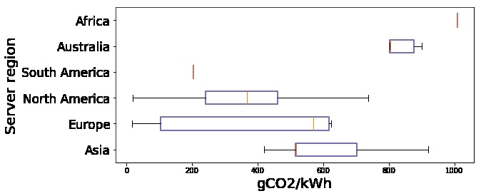

# What is the environmental impact of large language models (LLMs), and how can these same models be leveraged to reduce global carbon footprints?

# Introduction 

Climate change is among the most pressing challenges facing the global community today, requiring immediate and coordinated responses across all sectors of society. Digital technology, notably artificial intelligence (AI), is simultaneously recognized as both a significant contributor to greenhouse gas emissions and as a powerful tool for addressing environmental challenges. Within the field of AI, Large Language Models (LLMs)—advanced computational models trained on vast datasets to understand and generate human-like text—have risen dramatically in prominence and application, influencing countless aspects of modern life, from digital communication to industrial optimization.

The environmental impact of these models, however, remains poorly understood by the broader public and even within many sectors of the technology industry. Their training and operation demand immense computational resources, translating into considerable energy consumption and, consequently, substantial carbon emissions. Yet paradoxically, these same technologies hold potential for significant positive environmental impacts, capable of optimizing energy use, enhancing sustainability initiatives, and supporting climate change mitigation efforts.

This thesis aims to critically analyze the dual role of Large Language Models in the context of climate change. Specifically, it addresses the central question: *"What is the environmental impact of large language models, and how can these same models be leveraged to reduce global carbon footprints?"* By systematically examining both the negative impacts associated with their development and operation, as well as their capacity for positive environmental contributions, this work seeks to offer a balanced and insightful perspective on the role of LLMs in contemporary environmental challenges. Ultimately, this exploration aims to inform sustainable practices within the field of AI, highlighting pathways for developers, policymakers, and corporations to responsibly harness the power of large-scale computational models for a more sustainable future.


# 2.1 Large Language Models (LLMs)

## Definition and Core Architecture: 

Large Language Models (LLMs) are a category of advanced AI language models distinguished by their immense scale and broad capabilities. They are neural network models characterized by hundreds of millions to billions of parameters, trained on massive corpora of text. Crucially, LLMs learn using a self-supervised training paradigm: they are first trained on vast amounts of unlabeled text (for example, by predicting missing or next words in sentences), which allows them to learn linguistic patterns without manual annotation. This pre-training is typically followed by task-specific fine-tuning on labeled data, a two-stage process that leverages general language knowledge and then adapts it to particular tasks. The core architecture enabling modern LLMs is the Transformer – an architecture introduced in 2017 that relies on a self-attention mechanism to model relationships between words in a sequence. Unlike earlier recurrent neural networks, the Transformer’s self-attention allows it to capture long-range context and dependencies in text more effectively and to be trained in parallel, which has been pivotal for scaling models to unprecedented sizes. In fact, the Transformer’s excellent parallelizability and capacity have made it the de facto backbone of today’s LLMs, making it feasible to build models with tens or even hundreds of billions of parameters. Prominent LLMs such as BERT, GPT and others all adopt the Transformer architecture at their core. Once trained, an LLM can generate human-like text by sequentially predicting the most probable next word, enabling it to produce coherent sentences and paragraphs in response to a given prompt.

## Evolution and Key Milestones: 
LLMs did not emerge in isolation but evolved from decades of progress in language modeling. Early language models in the late 20th century were mainly statistical n-gram models that predicted text based on a fixed-length context, but these had difficulty handling long-term context and complex language structure. The shift to neural network approaches in the 1980s and 90s (e.g. recurrent neural networks and the Long Short-Term Memory (LSTM) architecture) improved the ability to model sequential data, yet even these struggled with long-range dependencies in text. A major turning point came with the introduction of the Transformer architecture by (Ashish Vaswani, Noam Shazeer, Niki Parmar, Jakob Uszkoreit, Llion Jones, Aidan N. Gomez, Łukasz Kaiser, Illia Polosukhin, *"Attention is all you Need"*), which overcame many limitations of RNN/LSTM models and enabled much deeper and larger networks. This breakthrough paved the way for a new generation of pre-trained language models. In 2018 Google researchers introduced BERT (Bidirectional Encoder Representations from Transformers), a large transformer-based model that demonstrated the power of pre-training on unlabeled text and fine-tuning for NLP tasks. Around the same time, OpenAI released the first Generative Pre-Trained Transformer (GPT) model. Subsequent milestones saw an explosive growth in model size and capabilities: GPT-2 (2019) contained 1.5 billion parameters and showed remarkably fluent text generation, and GPT-3 (2020) expanded to 175 billion parameters, exhibiting emergent abilities such as few-shot learning (the capacity to perform tasks with just a few examples or instructions) that were not observed in smaller models. The launch of user-friendly LLM-driven systems like ChatGPT in late 2022 further demonstrated the practical potential of LLMs and brought them into widespread public awareness. Throughout these developments, numerous other LLMs have been introduced by both academia and industry, for example, the T5 text-to-text model, XLNet, RoBERTa, and more recently large open-source models like GPT-Neo and LLaMA they collectively pushing the boundaries of language understanding and generation. This rapid technical evolution of LLMs is seen as transformative for AI at large, significantly influencing how AI systems are built and applied.

## Capabilities and Applications: 
One defining feature of LLMs is their general-purpose language ability. Thanks to training on diverse, Internet-scale data, LLMs acquire a broad knowledge base and the ability to perform a wide array of language tasks. They can comprehend context and generate human-like text, enabling applications such as text generation (e.g. writing essays or articles), summarization of documents, machine translation between languages, question-answering and conversational agents, and even reasoning over information given in textual form. In contrast to earlier specialized models, a single LLM can be adapted (through fine-tuning or prompting) to succeed in many different tasks, often with minimal task-specific training data, it is a property that has led researchers to dub them “foundation models” for AI applications. Moreover, at very large scales, LLMs have demonstrated emergent capabilities: for instance, they can perform in-context learning, meaning the model can learn to do a new task simply by being given instructions or examples in the prompt, without additional training, a behavior not seen in smaller models. This versatility makes LLMs powerful tools across numerous domains.

LLMs are already being applied across industry and academia, driving innovation in various sectors. For example, in healthcare, LLMs can assist in analyzing and summarizing medical records or literature, and even support diagnostic decision-making by interpreting clinical notes. In finance, LLMs are used to automate report generation, analyze financial news, and detect fraudulent transactions by understanding anomalous language patterns in communication. Education stands to benefit through intelligent tutoring systems and automated grading assistants that can evaluate or even personalize feedback on student writing. In the legal domain, LLMs can help in parsing and summarizing legal documents or in supporting legal research by quickly extracting relevant precedents from large text corpora. Customer service and e-commerce have embraced LLM-driven chatbots and virtual assistants to handle queries, provide product recommendations, and personalize the user experience. Even specialized fields like automotive engineering utilize LLMs for enhancing in-car voice assistants, enabling natural language navigation commands and real-time language translation for drivers.

Across these and other domains, LLMs serve as powerful engines for automation and insight, often matching or surpassing human-level performance on specialized language tasks. By leveraging their ability to understand context and generate relevant responses, organizations are using LLMs to streamline workflows, enhance customer interactions, and unlock data-driven insights in ways that were not previously possible.

## Toward Environmental Impact:

While LLMs offer remarkable capabilities, their development introduces significant sustainability challenges. The performance gains from scaling up model size come at the cost of extraordinarily high computational and energy requirements. Training a single large model (with billions of parameters) demands enormous processing power and electricity. For example, a 2019 analysis found that training one large language model could emit over 626,000 pounds of CO2 (equivalent to the lifetime emissions of five cars). More recently, training OpenAI’s GPT-3 (a 175-billion-parameter model) was estimated to consume about 1,287 MWh of electricity, producing roughly 500 metric tons of CO2 emissions. Even larger modern models (such as the more advanced GPT-4) presumably require comparable or greater resources, further exacerbating the carbon footprint of training.

Deploying and using LLMs at scale (serving millions of users) adds to ongoing energy and hardware demands. In fact, inference is the process of running the trained model for user queries that can account for a substantial share of overall energy usage. Each interaction with an LLM draws on power-intensive hardware; for instance, researchers estimate that a single ChatGPT query consumes about five times more electricity than a typical web search. Meeting the needs of countless such queries (and continuously fine-tuning models) means continuous electricity usage and cooling demands in data centers. These environmental and sustainability concerns have become a growing topic of research and debate. As we transition to the next section, we will examine the environmental impact of LLMs in more detail, considering how the pursuit of ever-larger models can be balanced with responsible and sustainable AI development.


# Section 2.2: Current Methods and Standards for Measuring the Environmental Impact of Computing

In this section, we review how the environmental footprint of computing is assessed, focusing on energy use and greenhouse gas (GHG) emissions. As Large Language Models (LLMs) demand massive computation, understanding these measurement methods is crucial to quantify their environmental impact. We cover how energy consumption is measured, how it is translated into CO₂-equivalent emissions, the tools and frameworks available, and the relevant standards (e.g. GHG Protocol, ISO 14064) for reporting such impacts. 

## 2.2.1 Measuring Energy Consumption in Computing

**Power Monitoring and Energy Use Metrics** The first step in assessing environmental impact is measuring the energy consumed by computing hardware. This is typically done by monitoring power draw (in watts) of CPUs, GPUs, memory, and other components over time Researchers often use on-board sensors or tools (e.g. NVIDIA’s nvidia-smi for GPUs, Intel’s RAPL for CPUs) to sample power usage during computation. By integrating power over the runtime of a task, one obtains the total energy usage in kilowatt-hours (kWh). For example, Strubell et al. measured GPU/CPU power during model training to estimate energy required for NLP models. Summing the energy of all devices involved (and accounting for any idle or overhead energy) provides the total electricity consumption of a computing task.

**Data Center Overhead – PUE** In large-scale computing (e.g. cloud data centers), not all drawn power goes to computation; cooling and infrastructure consume a share. A standard metric used is Power Usage Effectiveness (PUE), defined as the ratio of total data center power to IT equipment power. A PUE of 1.58 (the 2018 global average) means 58% extra energy overhead for cooling and facilities. Thus, to get the true energy footprint, the IT energy should be multiplied by PUE. For instance, if a server’s components consume 100 kWh, a PUE of 1.5 implies ~150 kWh were drawn from the grid in total. Incorporating PUE ensures we measure total energy used (including overhead) for computing operations.

**Life-Cycle Considerations** While operational energy is the main focus, a comprehensive assessment may also consider the embedded or embodied energy in hardware manufacturing and end-of-life. Life Cycle Assessment (LCA) frameworks (ISO 14040/14044) provide a holistic approach. An LCA of computing equipment accounts for the production phase (raw material extraction, chip fabrication, transport), the use phase (operational energy), and end-of-life (disposal/recycling). For example, studies have noted that manufacturing can contribute a large fraction of ICT carbon emissions (e.g. ~40% of a CPU-based data center’s GHG emissions came from production of equipment). However, obtaining precise hardware manufacturing data is challenging due to proprietary information. In practice, most current measurements focus on use-phase energy

## 2.2.2 Converting Energy Use to CO₂-Equivalent Emissions
**Emission Factors and CO₂e Calculation** Once energy consumption is known, it is converted into carbon dioxide-equivalent (CO₂e) emissions. This is done by multiplying the energy (in kWh) by an appropriate emissions factor (kg CO₂e per kWh). Emission factors depend on the energy source mix of the electricity used. For example, a grid predominantly using coal has a high emissions factor, whereas renewable energy yields a lower factor. In 2018 the global average was about 0.43 kg CO₂ per kWh (0.954 lb/kWh), but values vary by region and provider. Researchers use regional data or cloud-provider disclosures to select emission factors: e.g., Strubell et al. used U.S. averages and cloud-specific energy mixes to estimate carbon from training NLP models. If the computation is powered by a known mix (say 50% renewable, 50% gas), the weighted emission factor is applied. The formula integrating these elements is:
```math
\text{Emissions (CO₂e)} = \text{Energy (kWh)} \times \text{Emission Factor (kg CO₂e/kWh)}.
```
When accounting for data center overhead and multiple components, a more detailed formulation is used (from Stanford’s CS324 course ):
```math
\text{CO₂e} = R_{\text{power}\to\text{emit}} \times \text{PUE} \times \sum_{\text{devices}} (P_{\text{device}} \times t)
```
where 
```math
P_{\text{device}} 
```
is device power, t is runtime, and 
```math
R_{\text{power}\to\text{emit}}
```
 is the emission factor. This equation multiplies the energy used (power $\times$ time) by PUE and by the emission factor to yield CO₂ emissions.


*Google’s Emissions Factors Table, showing regional and energy source-specific factors.*

**Scope 1, 2, and 3 Emissions** In GHG accounting, emissions are categorized by scope under the Greenhouse Gas Protocol. Scope 1 covers direct emissions from owned sources (not usually applicable to electricity use in computing, but would include on-site generators, etc.), Scope 2 covers indirect emissions from purchased energy (electricity, steam, etc.), and Scope 3 covers other indirect emissions like supply chain and product use. For computing, the electricity used to run servers is a Scope 2 emission for an organization, whereas manufacturing of chips or cloud services purchased would fall under Scope 3 (as part of supply chain or outsourced activities). Current analyses of AI models primarily focus on Scope 2 emissions from electricity consumption during training and inference. Some recent studies attempt to include parts of Scope 3, such as embodied emissions of hardware or the downstream emissions from user devices during model inference, but these are harder to quantify. In summary, converting energy to CO₂e provides a common metric (usually reported in kilograms or tons of CO₂e) to compare environmental impacts.


*Schema of the GHG Protocol, showing Scope 1, 2 and 3 emissions.*

**Beyond Carbon** While CO₂ is the main focus due to climate change, other environmental impact metrics can be relevant. For instance, water usage is increasingly noted as an impact of computing; large AI model training can consume water for cooling and in electricity generation. Some frameworks now encourage reporting water and even electronic waste, though standards for these are less mature than for carbon. Still, the CO₂-equivalent remains the standard composite metric for GHG impact, often used as the primary indicator in computing sustainability studies.

## 2.2.3 Tools and Frameworks for Carbon Accounting in Computing

Researchers and organizations have developed various tools to measure and report the energy and carbon footprint of computing workloads:

**Software Instrumentation Libraries** One approach is to instrument code to monitor energy use in real time. CodeCarbon is a popular open-source Python library that tracks CPU/GPU energy consumption and estimates emissions based on the geographical location of the compute (using region-specific emission factors). It integrates with ML frameworks (TensorFlow, PyTorch) to provide fine-grained measurements, enabling developers to identify which part of a model pipeline is most energy-intensive. Such libraries use hardware power APIs and look-up tables of carbon intensity, simplifying the process for researchers to log the CO₂e emitted by their experiments. CodeCarbon is even part of the French Government toolbox for AI sustainability, showing its adoption in practice.

**Carbon Calculators** Tools like the ML CO2 Impact Calculator (by Victor Schmidt, Alexandra Luccioni, Alexandre Lacoste and Thomas Dandres) provide a user-friendly way to estimate emissions. Users input details such as the type of hardware (CPU/GPU model), total runtime, and cloud region or energy source, and the tool returns an approximate carbon footprint. 



*Variation of the Average Carbon Intensity of Servers Worldwide, by Region. (Vertical bars represent regions with a single available data point.)*

These calculators leverage published data on hardware TDP (thermal design power) and grid emission factors. They often output both raw emissions and “offset” emissions (accounting for any renewable energy credits from cloud providers). While convenient, their estimates rely on assumptions about average hardware utilization and may not capture dynamic power scaling, hence they are best used for rough estimates.

**Cloud Provider Sustainability Tools** Major cloud providers have introduced dashboards for clients to track the footprint of their cloud usage. For example, Microsoft Azure’s Sustainability Calculator (a Power BI application) helps organizations measure the carbon impact of their Azure cloud services. It aggregates a company’s cloud resource usage and applies Microsoft’s data on data center PUE and energy sourcing to estimate emissions. These tools leverage internal telemetry and “industry-standard emission factors” to give relatively accurate reports. Google and Amazon have similarly provided carbon footprint tools for their cloud platforms. Such tools are particularly useful for companies to track Scope 2 emissions of their cloud-based AI workloads as part of corporate GHG reporting (aligning with GHG Protocol and sustainability goals).

**Experiment Tracking and Reporting Frameworks** Within the AI research community, frameworks have emerged to encourage reporting of energy and emissions. For instance, Experiment Impact Tracker (Peter Henderson) is a toolkit that logs energy use of ML training runs and produces a report of carbon impact, integrating with training scripts. Some academic conferences now suggest or require submitting energy usage alongside model performance. The Green Software Foundation has even proposed a Software Carbon Intensity (SCI) score, which quantifies emissions per unit of software function. 


*Green Software Foundation’s principles.*

## 2.2.4 Standards and Protocols for Environmental Impact Measurement

The field of computing sustainability borrows from general environmental accounting standards, ensuring that measurements are credible and comparable:

**ISO 14064 Series**  ISO 14064-1:2018 is an international standard that specifies principles and requirements for quantifying and reporting an organization’s GHG emissions and removals. It aligns closely with GHG Protocol and adds a layer of formal verification. Academic and industry studies on computing impact sometimes reference ISO 14064 to demonstrate rigor in carbon accounting. For instance, a white paper might claim compliance with ISO 14064 to ensure the carbon footprint of an AI service was quantified following accepted principles (e.g. completeness, transparency). The ISO 14064-2 standard focuses on project-level emissions reductions, and could be relevant if a new AI model or data center design is claimed to reduce emissions, it guides how to calculate that reduction. ISO 14064-3 covers third-party validation of emissions reports, which becomes important as companies publishing AI models may seek independent assurance of their environmental claims. In summary, ISO 14064 provides a structured, internationally recognized approach to measuring GHG emissions, and is the go-to standard for ensuring consistency and credibility in emission numbers.

**ISO 14040/14044 (Life Cycle Assessment Standards)** These ISO standards outline how to conduct a Life Cycle Assessment, which, as noted above, is crucial for evaluating environmental impacts beyond just electricity use. (*"Unraveling the Hidden Environmental Impacts of AI Solutions for Environment Life Cycle Assessment of AI Solutions"* by Anne-Laure Ligozat, Julien Lefèvre, Aurélie Bugeau and Jacques Combaz) emphasize using LCA to capture full impacts of ML models. The standards guide practitioners to define system boundaries, inventory all relevant emissions (from manufacturing to disposal), and assess multiple impact categories. In applying ISO 14040 to computing, one must consider the lifecycle of IT equipment and infrastructure supporting AI. While comprehensive, performing a full LCA for each new LLM is often impractical, but the standard serves as an aspirational framework to identify otherwise “hidden” impacts (like hardware production or coolant chemicals) that purely operational metrics might miss.

**Emerging Software-Specific Standards** Recognizing the need for IT-specific guidance, new standards are being developed. A notable example is ISO/IEC 21031:2024, a fresh standard focusing on the carbon footprint of software systems. It introduces the concept of a Software Carbon Intensity (SCI) score as a standardized measure of how much CO₂ is emitted per unit of software function. This standard essentially formalizes the methodology for calculating emissions attributable to software, covering steps like defining the software boundary (what parts of the software/hardware stack to include), measuring energy consumption, and determining the carbon intensity of the energy source. The SCI framework, developed in part by the Green Software Foundation, aligns with GHG Protocol/ISO 14064 principles but tailors them to software and cloud services. As AI applications (like LLM-driven services) are essentially software delivered at scale, ISO 21031 could soon provide a consistent way to report the carbon footprint per 1000 queries of an LLM service, for example. This represents a move toward standardizing “green software” metrics to complement traditional hardware-focused metrics.
	
**Other Relevant Metrics and Certifications** In practice, several industry metrics help evaluate computing efficiency which indirectly relate to environmental impact. For example, PUE (discussed above) is promoted by The Green Grid consortium and is widely adopted by data center operators as a key environmental efficiency metric. There are also certifications like ENERGY STAR, and data center sustainability certifications (LEED, ISO 50001 for energy management) which, while not specific to AI, ensure that infrastructure meets certain energy efficiency criteria. These standards and certifications create a context in which the environmental impact of LLMs should be interpreted – e.g., an AI lab running models in an ENERGY STAR-certified data center with a low PUE and 100% renewable energy procurement will have a much smaller GHG footprint than one using older, inefficient facilities.

## 2.2.5 Application of These Methods and Standards to AI and LLMs

Having outlined general methods, we now connect them to AI/LLM-specific scenarios. The energy and carbon footprint of Large Language Models are typically assessed at two key stages: **training and inference (deployment)**.

**Training Phase Footprint** Training a state-of-the-art LLM involves running tens of thousands of GPU hours, making energy usage enormous. Researchers apply the measurement techniques above to quantify this. For example, a landmark study by Emma Strubell, Ananya Ganesh, Andrew McCallum. (2019) measured the energy consumed in training several NLP models and estimated their CO₂ emissions. 


*Estimated cost of training a model in terms of CO2 emissions (lbs) and cloud compute cost (USD).7 Power and carbon footprint are omitted for TPUs due to lack of public information on power draw for this hardware.*

They found that training a large transformer with hyperparameter tuning emitted on the order of hundreds of thousands of pounds of CO₂ (over 280 metric tons), roughly equivalent to five cars’ lifetime emissions. The procedure included monitoring GPU power draw, summing total kWh, and multiplying by a carbon factor. More recent LLM training reports (for models like GPT-3, Llama, etc.) similarly calculate emissions by recording total energy used. Notably, Meta’s Llama model reports listed the electricity consumed and then converted to emissions using region-specific factors (though early versions used rough averages). In a comprehensive 2025 study, Jacob Morrison, Clara Na, Jared Fernandez, Tim Dettmers, Emma Strubell, Jesse Dodge. measured the training of a series of language models and explicitly followed GHG Protocol Scope 2 methods, determining that training their 13-billion-parameter model consumed hundreds of MWh and emitted 493 metric tons of CO₂e (assuming typical U.S. grid mix). These examples illustrate how standard energy-to-emission conversion is applied to quantify the climate impact of training LLMs.


*(from ["Holistically Evaluating the Environmental Impact of Creating Language Models."])Models are ordered by their total water consumption and associated CO₂ emissions. Sub-billion-parameter systems were trained on 1.7 trillion tokens; OLMo 1B on 3 trillion; OLMo 2-7B on 4 trillion; OLMoE on 5 trillion; and OLMo 2-13B on 5.6 trillion. The data show that environmental impact rises sharply as both model size and training-data volume increase.*

**Inference and Deployment Footprint** Once deployed, LLMs can be used millions or billions of times, so the per-query energy becomes critical. Methods for measuring inference energy mirror those for training: instrument the model serving hardware to measure power per query, or estimate via benchmarked power usage. Some works use a functional unit like “per 1000 queries” to report emissions, aligning with the SCI approach of emissions per operation. For instance, an online inference energy tool by Hugging Face reports how many watt-hours each API call uses. By multiplying that by the carbon intensity of the host server’s electricity, one obtains CO₂e per query. A study by Alexandra Sasha Luccioni, Sylvain Viguier, Anne-Laure Ligozat. *"Estimating the carbon footprint of bloom, a 176B parameter language model"* evaluated the footprint of serving NLP models and emphasized considering the potentially vast number of inferences, which can quickly match or exceed training emissions. Indeed, if an LLM is very popular, the cumulative electricity for inference (across all user queries) can rival the training cost within months. This highlights the need to measure environmental impact across the model lifecycle, training (one-time, but intensive) and inference (continuous). Standards like the GHG Protocol would count both under the service provider’s Scope 2 emissions, and recent research encourages reporting both stages.

**Using Standards in Practice** The methodologies and standards described are not just theoretical, they are increasingly being adopted by AI practitioners. For example, when OpenAI or Google report on their models’ sustainability, they often cite compliance with carbon accounting standards (or at least use standard units and methods). The GHG Protocol’s scope definitions have been explicitly referenced in academic work to clarify what is included in AI emission calculations. By doing so, a paper can state it calculated emissions “in accordance with Scope 2 accounting”, signaling that only electricity use was counted and using a location-based emission factor from an authoritative source (e.g., EPA or IEA data for grid emissions). Similarly, if a study includes manufacturing impact of AI hardware, it may cite LCA standards or prior LCAs of semiconductors to estimate that portion. In short, the community is moving toward standardized reporting: for each new model, report energy (in MWh), carbon emissions (in tons CO₂e with method described), possibly water usage, and assumptions (PUE, emission factor, etc.). This mirrors how other industries report environmental impact and allows comparisons and tracking of improvements over time.
	
**Challenges and Evolving Practices** Despite the tools and standards available, measuring LLM environmental impact still faces challenges. One issue is transparency: many AI companies do not disclose full details (e.g., exact energy use, locations, hardware manufacturing data). This makes third-party estimates uncertain. Another challenge is incorporating Scope 3 emissions (like chip manufacturing) reliably, current studies often have to use proxy data or broad assumptions. Nonetheless, the trend in research is to be ever more comprehensive. The BLOOM language model effort in 2022 was noted for providing an extensive environmental impact appendix, covering training energy by region and even inferring the impact of model development (experiments before final training). Following that, the latest works (e.g., Morrison et al. 2025) measure not only training and inference, but also water consumption and encourage using renewable energy or better cooling to mitigate those impacts. 


# 2.3 Carbon Footprint of ChatGPT vs. LLaMA Models

The development and deployment of large language models (LLMs) like OpenAI’s ChatGPT (based on GPT-3/GPT-4) and Meta AI’s LLaMA family carry a significant carbon footprint. This section compares their energy consumption and CO₂-equivalent emissions, drawing on published metrics for both the one-time training phase and the ongoing inference (serving) phase. We also highlight how differences in model architecture, training methodology, hardware, and infrastructure influence the carbon impact.

## 2.3.1 Training Phase: Energy Use and CO₂ Emissions

**GPT-series (OpenAI)** Training state-of-the-art models requires massive computational resources. OpenAI’s original GPT-3 model (175 billion parameters, 2020) consumed on the order of ~1.3 GWh of electricity for a single full training run, resulting in an estimated 552 metric tons of CO₂ emissions. This was computed assuming training on cloud GPUs (NVIDIA V100) in a U.S. data center with average grid mix and Power Usage Effectiveness (PUE) near 1.1. The newer GPT-4 model (2023), which is significantly larger and more computationally intensive, required dramatically more energy, on the order of 50–60 GWh of electricity for training. 


*Graph comparing the estimated electricity consumption from training GPT-3 and GPT-4*

Estimates of GPT-4’s training footprint range widely based on assumptions about hardware and datacenter efficiency. A recent analysis by Stanford (*Artificial Intelligence Index Report 2025*) reported GPT-4’s training emitted ~5,100 tCO₂, roughly 10× the emissions of GPT-3. (Notably, independent calculations suggest it could have been as high as 12,000–15,000 tCO₂ if run on a typical fossil-fueled grid, whereas training on a cleaner-energy datacenter could cut this down to ~1,100 t.) 


*Graph showing the difference if GPT-4 was trained in the Azure cloud region Canada East its training carbon footprint would have been smaller by a factor of 13.*


OpenAI has not publicly disclosed GPT-4’s exact energy use or carbon emissions, but these estimates make clear that GPT-4’s training phase likely released on the order of thousands of tons of CO₂e. Contributing factors include its larger model size (reportedly an order of magnitude more parameters than GPT-3) and longer training duration. In practice, OpenAI partnered with Microsoft Azure for training; Azure’s modern facilities have a low PUE (~1.18) and options for renewable energy, which can mitigate emissions. Still, without full transparency from OpenAI, current figures for GPT-4 remain estimates derived from leaked hardware usage and reasonable assumptions.


**LLaMA-series (Meta)** In contrast to OpenAI’s secrecy, Meta has published detailed carbon accounting for its LLM training. LLaMA-2 (2023) – with model sizes of 7B, 13B, and 70B parameters, was trained on Meta’s Research SuperCluster using approximately 3.3 million GPU-hours on NVIDIA A100 80GB GPUs.

| Model Size | Time (GPU hours) | Carbon Emitted(tCO2eq) |
|------------|-------------------------------|-------------------------|
| 7B         | 184320                   | 31.22 |
| 13B        | 368640                 | 62.44|
| 70B        | 	1720320                 | 291.42 |
|Total	   | 3311616                 | 539.00 |

 Meta reports that the total electricity usage for LLaMA-2’s training corresponds to ~539 tCO₂e emissions. This figure encompasses all LLaMA-2 model variants and was 100% offset by Meta’s sustainability program (Meta purchased renewable energy or credits to neutralize these emissions) Notably, LLaMA-2’s carbon footprint is of the same order as GPT-3’s, despite LLaMA-2 having fewer parameters (70B vs 175B). This is due to its training on an extremely large dataset of 2 trillion tokens. (By comparison, GPT-3 was trained on ~300 billion tokens.) The larger training corpus for LLaMA-2 increased the compute requirements, effectively offsetting the advantages of its smaller size. However, Meta’s use of efficient hardware (A100 GPUs are more energy-efficient than the older V100s used for GPT-3) and a modern datacenter powered by 100% renewable energy matching helped contain the net emissions. Meta’s transparency stands in contrast to OpenAI’s approach: the LLaMA-2 model card explicitly lists the training compute and emissions, and emphasizes that others can use the open model rather than re-train new models from scratch, preventing duplicate carbon costs.


**Scaling to newer models** Both organizations scaled up their models in 2023–2024, with significant implications for carbon footprint. OpenAI’s GPT-4, as noted, likely emitted several thousand tons of CO₂. Meta’s follow-up LLaMA-3 (2024) was also compute-intensive. While Meta had not publicly released LLaMA-3’s full details as of this writing, analyses suggest its training emissions were substantially higher than LLaMA-2. In fact, the Stanford AI Index 2025 reports a 405B-parameter “LLaMA 3.1” model with an estimated 8,930 tCO₂ from training, a reflection of how dramatically emissions rise with model size. This would make LLaMA-3’s largest variant about 1.7× more carbon-intensive than GPT-4’s training. Even a more modest version of LLaMA-3 (in the 70B parameter range) was estimated to emit roughly 4× the CO₂ of GPT-3. 


*Image showing the comparison of the carbon footprint of one passenger flight from New York to San Francisco with the carbon footprint of training LLaMA-3, GPT-3 and the average car lifetime emissions.*


Meta has indicated it continues to offset 100% of training emissions for its models, and it benefits from a strategy of running data centers on renewable power since 2020 (achieving net-zero operations). By contrast, OpenAI leverages Azure’s sustainability initiatives; Microsoft’s cloud aims for 100% renewable energy by 2025, which should help reduce the effective carbon intensity of training and serving models. Still, the absolute energy demand of cutting-edge models remains enormous. In summary, GPT-3 and LLaMA-2 each consumed on the order of 500–600 tCO₂ for training, whereas GPT-4 and LLaMA-3 pushed into the thousands of tons, underscoring the exponential increase in carbon footprint with model scale.


*Carbon emissions from training various AI models (in metric tons CO₂e). Early models like AlexNet (2012) were negligible in emissions, whereas modern LLMs are several orders of magnitude higher.*

## 2.3.2 Inference Phase: Energy Consumption and Life-Cycle Impact

While training is a one-time (if expensive) event, the operational energy usage of an LLM during deployment (inference) can dominate its lifetime carbon footprint. Serving millions of user queries on ChatGPT or similar services requires data centers running clusters of GPUs 24/7, ready to generate text on demand. Studies by Meta, AWS, and Google indicate that 60–90% of an LLM’s total life-cycle emissions often come from inference usage, not training (*"Carbon Emissions and Large Neural Network Training"*). In other words, a model that is heavily used will burn far more energy over its deployed life than during its initial training. For ChatGPT, which reached 100+ million users, the aggregate computational load is enormous. Each query to ChatGPT involves running the model’s forward pass on specialized hardware. OpenAI’s public statements note that they “work closely with Microsoft to improve efficiency and footprint” in running these models, but the scale of usage means emissions add up rapidly. A recent analysis estimated that each ChatGPT prompt (query) consumes roughly 4.3 grams of CO₂ on average. This is an order of magnitude more per query than a typical Google web search (∼0.2 g CO₂), due to the greater computing required to generate several paragraphs of text. Although 4–5 grams of CO₂ per chat query may sound small, one must consider the volume: for example, 1 million queries would correspond to ~4.3 tons of CO₂. Indeed, at ChatGPT’s global usage scale, the model may be responsible for tens of tons of CO₂ emissions per day from inference alone.


**Architecture and hardware factors** The energy cost of inference is highly sensitive to model size, model design, and the hardware/platform optimizations. OpenAI’s latest GPT-4 model (which powers ChatGPT’s most advanced version) is believed to have hundreds of billions of parameters, making it computationally heavy for each inference. By contrast, Meta’s LLaMA family often emphasizes smaller models (e.g. 7B or 13B parameters for certain use-cases) or efficient architectures, which can be deployed at lower cost. In practice, using a smaller model or more efficient hardware drastically cuts per-query energy. For example, running a 70B-parameter model on a current NVIDIA A100 GPU in FP16 precision consumes on the order of 15 milligrams of CO₂ per output token generated. 

| Model scale    | Hardware + precision  | Carbon per output token                                            |   |   |
|----------------|-----------------------|--------------------------------------------------------------------|---|---|
| 288+ B params  | NVIDIA H100 @ FP16    | ~30 mg CO₂ (estimated for models like GPT-o3 and Llama 4 Behemoth) |   |   |
| 70 B params    | NVIDIA A100 @ FP16    | ~15 mg CO₂                                                         |   |   |
| 70 B params    | NVIDIA H100 @ FP8     | ~7.5 mg CO₂ (≈ 2 × better;)              						  |   |   |
| 70 B params    | Google TPU v5e @ INT8 | ~3 mg CO₂ (TPU v5e launch)                                         |   |   |
| 13-27 B params | NVIDIA A100 @ FP16    | ~3 mg CO₂ (applicable to models like Gemma 3 and LLaMA variants)   |   |   |
| 2 B params     | NVIDIA A100 @ FP16    | ~0.5 mg CO₂                                                        |   |   |

If we instead use a model one-fifth that size (e.g. ~13B parameters) on the same hardware, the carbon per token is about 3 mg, a 5× reduction. Advanced hardware and optimizations can further improve this: the NVIDIA H100 (2022) offers ~2× better efficiency than the A100, and techniques like 8-bit quantization can cut the energy per token by half again. For instance, a 70B model running on an H100 with INT8/FP8 precision might emit only ~7.5 mg of CO₂ per token; Google’s TPU v5e, using int8 precision, has been reported to generate as little as ~3 mg CO₂ per token for similar model sizes. These differences mean that Meta’s LLaMA models, when deployed at smaller scale or with optimization (e.g. quantization, distillation), can be significantly more carbon-efficient in serving. In fact, Meta has explored model distillation and mixture-of-experts (MoE) architectures for efficiency: an MoE model effectively activates only subsets of the network’s parameters for a given query, which can reduce the required compute per inference. OpenAI’s GPT-4 architecture is not publicly detailed, but it is suspected to be a dense model running fully for each prompt; thus, its per-token energy use is inherently high. This puts a premium on scalable infrastructure: OpenAI serves GPT-4 via Azure data centers with thousands of GPUs, whereas an open model like LLaMA-2 can be deployed by third-parties on smaller clusters or even on single machines (for the smaller 7B/13B versions), potentially with higher utilization efficiency for specific tasks.


**Infrastructure and deployment differences** Another factor in carbon impact is where and how the models are hosted. Microsoft Azure (hosting ChatGPT) and Meta’s own facilities both boast energy-efficient data centers with high cooling and power efficiency (PUE ~1.1–1.2) and increasing use of renewable energy sources. Meta achieved 100% renewable energy matching for its global operations in 2020, meaning that the electricity used for LLaMA training and inference is effectively compensated with renewables. Microsoft has similarly committed to 100% renewable energy for Azure by 2025. These measures reduce the carbon intensity (kg CO₂ per kWh) of the electricity powering the GPUs. For example, if a model is served from a data center in a coal-heavy region, its emissions per query will be much higher than if served from a region powered by hydro or solar. OpenAI’s GPT-4 training analysis showed a 13× difference in CO₂ emissions depending on training location (West US vs. Eastern Canada) due to grid cleanliness. The same principle applies to inference: deploying models in regions or facilities with cleaner energy can dramatically cut operational emissions. Both OpenAI and Meta appear aware of this; however, transparency differs. OpenAI has not released real-time data on ChatGPT’s energy consumption or carbon footprint, and observers have relied on external calculations (and Microsoft’s cloud sustainability reports) to estimate its impact. Meta, on the other hand, publishes sustainability reports and included emissions info in LLaMA model cards, explicitly acknowledging the environmental cost and offsets.


ChatGPT and Meta’s LLaMA exemplify two approaches to large-scale AI deployment, one as a closed API service and the other as an open model family, but both face the reality that inference energy use eclipses training over the long run. ChatGPT’s immense popularity translates into a significant ongoing carbon footprint, partially mitigated by efficient hardware and cloud infrastructure, yet still a cause for concern in aggregate (on the order of thousands of tons of CO₂ yearly for heavy usage). LLaMA-based models, by being open-source, enable users to opt for smaller, task-specific models that are cheaper and greener to run. For instance, an organization could fine-tune a 7B or 13B LLaMA-2 model for a particular application, achieving similar accuracy to GPT-3.5 on that task at a ~10× lower energy cost in inference. Such strategies – model right-sizing, efficient hardware utilization, and renewable-powered deployment are increasingly important for reducing the carbon footprint of AI. In conclusion, ChatGPT (GPT-3/4) and LLaMA (2/3) both require substantial energy, but Meta’s models have an edge in transparency and potential for community-led efficiency improvements. The carbon impact of these LLMs can be measured in thousands of tons of CO₂, so optimizing both the training process and the serving infrastructure (e.g. using cleaner energy, better cooling, and more efficient model designs) is critical to making large-scale AI more sustainable. All available data reinforce that bigger models come with disproportionately higher emissions, and going forward, researchers are challenged to “green” the AI lifecycle by adopting the best practices (efficient models, hardware, and hosting) to bend the emissions curve even as model capabilities grow.


## Key Academic Sources and White Papers (with Annotations)


Sources:
	1.	Vaswani, A., et al. (2017). Attention is All You Need. Advances in Neural Information Processing Systems.
	2.	Devlin, J., et al. (2019). BERT: Pre-training of Deep Bidirectional Transformers for Language Understanding. NAACL.
	3.	Brown, T., et al. (2020). Language Models are Few-Shot Learners. NeurIPS.
	4.	Zhao, W. X., et al. (2023). A Survey of Large Language Models. arXiv preprint arXiv:2303.18223  .
	5.	Khan, A., et al. (2025). Industrial Applications of Large Language Models. Scientific Reports 15, 12345  .
	6.	Bommasani, R., et al. (2021). On the Opportunities and Risks of Foundation Models. Stanford CRFM.
	7.	MIT News (2025). Explained: Generative AI’s environmental impact .


	•	Strubell et al. (2019) – “Energy and Policy Considerations for Deep Learning in NLP.” This influential study from UMass Amherst provides one of the first quantifications of the environmental cost of modern AI models . The authors measured the GPU/CPU energy consumption for training several NLP models and then computed the CO₂ emissions using standard conversion factors. They famously found that a large Transformer with neural architecture search emitted ~626,000 lbs of CO₂ (284 metric tons) . This paper is relevant as it exemplifies how to apply energy measurement tools and emission calculations to AI, and it argues for reporting energy costs in academic research . It establishes baseline methods (power monitoring, use of average emission factors) that are built upon by later works.
	•	Lannelongue et al. (2021) – “Green Algorithms: Quantifying the Carbon Footprint of Computation.” An academic article (Advanced Science) led by researchers at Cambridge University, it introduces a general framework and tool for calculating the carbon footprint of any computational task  . The authors distilled the problem to a few key parameters: hardware type, runtime, and location (energy grid mix), and provided an open-source online calculator . The paper is highly relevant as it presents a standardized method to estimate energy and emissions, which can be directly applied to AI workloads. It also discusses the importance of transparency and includes strategies to reduce carbon footprint (e.g. using more efficient hardware or greener energy)  . This source demonstrates an academic approach to codifying measurement practices and has influenced subsequent tools like CodeCarbon.
	•	Wu et al. (2022) – “Sustainable AI: Environmental Implications, Challenges and Opportunities.” A comprehensive survey paper (from Facebook AI Research, presented at MLSys 2022) that examines the environmental impact of AI from a holistic perspective  . It spans the entire machine learning lifecycle – data, model training, hardware – and explicitly characterizes the carbon footprint of AI computing, including operational and manufacturing emissions . The paper’s relevance lies in its discussion of measurement challenges: it highlights the need for better data on hardware manufacturing and advocates for industry-wide adoption of measurement standards. It also provides insights into optimizing hardware/software for efficiency and calls out the role of lifecycle assessment by examining hardware production and end-of-life  . In our context, this source supports the view that measuring LLM impact requires a broad systems approach and validates the importance of standards like LCA and holistic reporting.
	•	Morrison et al. (2025) – “Holistically Evaluating the Environmental Impact of Creating Language Models.” A recent (2025) study by researchers from Allen Institute for AI and CMU (including Emma Strubell) that sets a new bar for detailed LLM impact analysis. This work is notable for applying GHG Protocol standards (Scope 2) in calculating emissions for training a series of LLMs , and for going further to measure previously under-reported aspects: development-phase energy, embodied carbon of hardware, and water usage  . They reported that even training relatively small LLMs (up to 13B parameters) in a efficient data center resulted in ~493 tCO₂ and consumed 2.8 million liters of water . The paper’s methodology section (using power meters at sub-second intervals, region-specific emission factors, etc.) exemplifies current best practices . This source is highly relevant as it demonstrates how the methods and standards discussed in Section 2.2 are concretely implemented to produce a thorough environmental assessment of LLMs, reinforcing the section’s points about comprehensive measurement and transparency.
	•	OECD (2022) – “Measuring the Environmental Impacts of AI: The AI Footprint.” An OECD policy paper that, while not solely academic, aggregates research and proposes directions for standardizing AI impact measurement  . It distinguishes direct impacts (compute energy, e-waste) from indirect effects and recommends the establishment of measurement standards specific to AI . This report is included for its authoritative overview and its emphasis on looking beyond operational emissions (e.g., considering lifecycle and indirect impacts) . It supports the thesis section by providing a high-level validation that measuring AI’s environmental impact is a recognized priority, and it cites many of the academic works above as evidence. The OECD’s recommendations underscore why the methods and standards in this outline are critical – to enable policymakers and stakeholders to reliably track the sustainability of AI development.

	
	
	The Real Carbon Cost of an AI Token by Cam Pedersen 

	Meta Documentation on LLaMA-2 https://huggingface.co/meta-llama/Llama-2-70b

	Artificial Intelligence Index Report 2025 Stanford University 

	David Patterson et al. - "Carbon Emissions and Large Neural Network Training"